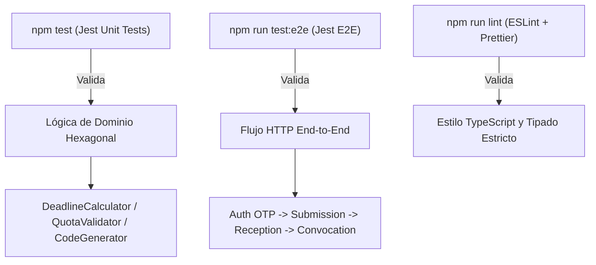

# Plan de Arquitectura y Diseño Técnico: Backend CEISH-ESPOCH

**Código de Especificación Activa:** `specs/001-flujo-mvp/spec.md` (v3.2.0)  
**Ubicación del Plan:** `specs/001-flujo-mvp/plan.md`  
**Estado:** Aprobado  

---

## 1. Estructura de Módulos (Arquitectura Hexagonal)

El sistema se estructura estrictamente en módulos limpios dentro de `src/modules/` y utilidades globales en `src/shared/`, respetando los principios 3 y 6 de la Constitución (`docs/doc_base/constitution.md`):

```text
src/
├── config/                         # Configuración centralizada (DB, Auth, Throttler)
├── shared/                         # Cross-cutting concerns
│   ├── db/                         # BaseOrmEntity (id, createdAt, updatedAt)
│   ├── decorators/                 # @Roles, @Permissions, @Audit, @Encrypt
│   ├── encryption/                 # EncryptionService (AES-256-CBC) & EncryptionTransformer
│   ├── enums/                      # Permission, Role, StudyType, ProtocolStatus
│   └── guards/                     # JwtAuthGuard, RolesGuard, PermissionsGuard
└── modules/
    ├── auth/                       # [RF-01, RF-10] Autenticación RBAC, JWT, OTP
    │   ├── domain/                 # Users, Roles, OTP Tokens
    │   ├── application/            # AuthService, UsersService, OtpService
    │   └── infrastructure/         # AuthController, UserOrmEntity, JwtStrategy
    ├── protocols/                  # [RF-02, RF-03, RF-06, RF-14, RF-19.1] Protocolos, Código Único, Versiones (v1.0->v2.0)
    │   ├── domain/                 # ProtocolEntity, VersionHistory, ThesisMetadata
    │   ├── application/            # ProtocolService, VersioningService, AtomicCodeGenerator
    │   └── infrastructure/         # ProtocolController, ProtocolOrmEntity
    ├── reception/                  # [RF-04, RF-05, RF-07, RF-08, RF-13, RF-18] Checklist, Subsanación 15d, Aceptación Explícita
    │   ├── domain/                 # ChecklistItem, ObservationalItem, AcceptanceRecord
    │   ├── application/            # ReceptionService, ChecklistService, DeadlineCalculator
    │   └── infrastructure/         # ReceptionController, ChecklistOrmEntity
    ├── documents/                  # [RF-04, RF-18.1] Gestión de Archivos y Plantillas
    │   ├── domain/                 # DocumentFile, TemplateUrl
    │   ├── application/            # DocumentService, StorageAdapter
    │   └── infrastructure/         # DocumentController, DocumentOrmEntity
    ├── evaluations/                # [RF-12, RF-19.2] Cuotas Evaluadores, Anexos 9/10, Informe Narrativo
    │   ├── domain/                 # EvaluationAssignment, RiskStratification, NarrativeReport
    │   ├── application/            # EvaluationService, QuotaValidatorService
    │   └── infrastructure/         # EvaluationController, EvaluationOrmEntity
    ├── resolutions/                # [RF-09, RF-17, RF-19.3] Convocatorias Pleno 001-2026, Oficios Quipux, Suspensión
    │   ├── domain/                 # PlenarySession, Resolution, QuipuxReference
    │   ├── application/            # ResolutionService, PlenaryService
    │   └── infrastructure/         # ResolutionController, PlenaryOrmEntity
    ├── notifications/              # [RF-08.1, RF-09.3, RF-15, RF-16.2] Envíos Email, Notificación EAG
    │   ├── domain/                 # NotificationLog, TemplateRenderer
    │   ├── application/            # MailerService, AlertService
    │   └── infrastructure/         # MailerAdapter, NotificationOrmEntity
    ├── follow-up/                  # [RF-15, RF-16, RF-17] Informes Avance/Final, Enmiendas, Eventos Adversos
    │   ├── domain/                 # FollowUpReport, AmendmentRequest, AdverseEvent
    │   ├── application/            # FollowUpService, AdverseEventAlertService
    │   └── infrastructure/         # FollowUpController, FollowUpOrmEntity
    └── ai-assistant/               # [RF-11] Asistente Virtual RAG sobre PET 2023
        ├── domain/                 # QueryContext, RAGResponse
        ├── application/            # AiAssistantService, VectorSearchAdapter
        └── infrastructure/         # AiAssistantController
```

---

## 2. Modelo de Datos (Esquema JSON & Ejemplo)

Representación del modelo de dominio serializado para un Protocolo de Investigación completo con su historial de versión v2.0, Aceptación Explícita con IP, Asignación de Evaluadores con Cuotas, y Referencia Quipux:

```json
{
  "protocol": {
    "id": "e9b1a5c2-8f1d-4e3a-9b7c-1f5a8b3c4d5e",
    "uniqueCode": "CEISH-ESPOCH-IO-001-2026",
    "title": "Evaluación del impacto neurobiológico en pacientes expuestos a plaguicidas",
    "studyTypeId": "IO",
    "isThesis": true,
    "thesisMetadata": {
      "topicApprovalActNumber": "ACTA-FAC-SALUD-2026-014",
      "advisorFullName": "Dr. Carlos Mendoza",
      "advisorCertificateUrl": "/documents/thesis/cert-advisor-001.pdf"
    },
    "principalInvestigator": {
      "userId": "usr-8812-espoch",
      "fullName": "Dra. María Isabel Salazar",
      "email": "maria.salazar@espoch.edu.ec",
      "isExternal": false
    },
    "currentVersion": "v2.0",
    "status": "EN_EVALUACION_PLENO",
    "isAffidavitAccepted": true,
    "explicitAcceptance": {
      "isAccepted": true,
      "acceptedAt": "2026-09-22T09:15:30.000Z",
      "ipAddress": "190.15.142.10"
    },
    "quipuxReferenceNumber": "ESPOCH-CEISH-2026-0089-O",
    "createdAt": "2026-09-20T10:00:00.000Z"
  },
  "checklistRequirements": [
    {
      "requirementId": "REQ-01",
      "name": "Formulario de Solicitud de Evaluación (Anexo 1)",
      "status": "APPROVED",
      "fileUrl": "/documents/protocols/v1/anexo1.pdf",
      "templateUrl": "/templates/anexo1_oficial.docx",
      "isLocked": true,
      "observation": null
    },
    {
      "requirementId": "REQ-THESIS-01",
      "name": "Acta de Aprobación de Tema de Tesis",
      "status": "APPROVED",
      "fileUrl": "/documents/protocols/v1/acta_tema.pdf",
      "templateUrl": null,
      "isLocked": true,
      "observation": null
    },
    {
      "requirementId": "REQ-05",
      "name": "Consentimiento Informado (Anexo 5)",
      "status": "OBSERVED",
      "fileUrl": "/documents/protocols/v2/anexo5_v2.pdf",
      "templateUrl": "/templates/anexo5_oficial.docx",
      "isLocked": false,
      "observation": "El apartado de riesgos de confidencialidad debe detallar la encriptación PII."
    }
  ],
  "evaluatorAssignments": [
    {
      "assignmentId": "asg-001",
      "evaluatorId": "eval-101",
      "evaluatorRole": "ETICA_METODOLOGICO_SALUD",
      "assignedAt": "2026-09-22T11:00:00.000Z",
      "status": "SUBMITTED",
      "annex9Status": "CON_OBSERVACIONES",
      "annex10RiskLevel": "RIESGO_MAYOR_QUE_EL_MINIMO",
      "narrativeReportUrl": "/documents/evaluations/narrative_report_eval101.docx"
    },
    {
      "assignmentId": "asg-002",
      "evaluatorId": "eval-102",
      "evaluatorRole": "SOCIEDAD_CIVIL",
      "assignedAt": "2026-09-22T11:05:00.000Z",
      "status": "PENDING",
      "annex9Status": null,
      "annex10RiskLevel": null,
      "narrativeReportUrl": null
    }
  ]
}
```

*Cobertura de Requisitos*: `[RF-01, RF-02, RF-03, RF-04, RF-06, RF-08.2, RF-12, RF-14, RF-18.1, RF-19.1, RF-19.2, RF-19.3]`.

---

## 3. Algoritmo de Cálculo de Tiempo de Finalización de Evaluaciones

### Especificación Formal del Algoritmo

Para garantizar el cumplimiento de los 15 días hábiles de subsanación documental (`RF-07.1`) y los 30 días hábiles para subsanación mayor tras dictamen del Pleno (`RF-14.1`), se implementa un algoritmo puro en la capa de `domain` que calcula la fecha de vencimiento omitiendo fines de semana y días feriados parametrizados.

$$\text{DeadlineDate} = f(\text{StartDate}, \text{TargetBusinessDays}, \text{HolidaysSet})$$

### Pseudocódigo en TypeScript Puro (`src/modules/reception/domain/services/deadline-calculator.service.ts`)

```typescript
export interface CalculateDeadlineInput {
  startDate: Date;
  businessDaysToAdd: number;
  holidays: string[]; // Formato YYYY-MM-DD
}

export class BusinessDayCalculator {
  public static calculateDeadline(input: CalculateDeadlineInput): Date {
    const { startDate, businessDaysToAdd, holidays } = input;
    const holidaySet = new Set(holidays);
    const currentDate = new Date(startDate);
    
    // Normalizar a medianoche UTC
    currentDate.setUTCHours(0, 0, 0, 0);
    
    let addedDays = 0;
    while (addedDays < businessDaysToAdd) {
      currentDate.setUTCDate(currentDate.getUTCDate() + 1);
      const dayOfWeek = currentDate.getUTCDay(); // 0 = Domingo, 6 = Sábado
      const dateString = currentDate.toISOString().split('T')[0];

      const isWeekend = dayOfWeek === 0 || dayOfWeek === 6;
      const isHoliday = holidaySet.has(dateString);

      if (!isWeekend && !isHoliday) {
        addedDays++;
      }
    }
    
    // El vencimiento se fija a las 23:59:59.999 UTC del día hábil resultante
    currentDate.setUTCHours(23, 59, 59, 999);
    return currentDate;
  }
}
```

*Cobertura de Requisitos*: `[RF-07.1, RF-07.2, RF-09.1, RF-14.1]`.

---

## 4. Contrato de la CLI (Comandos, Salidas y Códigos de Salida)

De acuerdo a `AGENTS.md` y la Constitución, el sistema expone comandos de consola para migración, seed y ejecuciones periódicas de Cron Jobs (como el archivado extemporáneo `RF-07.2` y notificaciones de entregables `RF-15.1`).

### Comandos de Consola Autorizados

#### 1. **Ejecución del Archivado Automático por Vencimiento (Cron Job)**
- **Comando:** `npm run cli:archive-expired`
- **Descripción:** Evalúa los trámites en estado `INCOMPLETO_REQUIERE_SUBSANACION` (15 días) y `SUBSANACION_PLENO_PENDIENTE` (30 días). Si `current_date > deadline_date`, actualiza el estado a `ARCHIVADO_POR_VENCIMIENTO`.
- **Salida Exito (Código Exit: 0):**
  ```json
  {
    "status": "success",
    "timestamp": "2026-09-22T00:00:00.000Z",
    "processedCount": 14,
    "archivedProtocols": [
      { "code": "CEISH-ESPOCH-IO-002-2026", "reason": "15_DAYS_EXCEEDED" }
    ]
  }
  ```
- **Salida Error (Código Exit: 1):**
  ```json
  {
    "status": "error",
    "message": "Error al conectar con la base de datos PostgreSQL en localhost:3100",
    "code": "DB_CONNECTION_FAILED"
  }
  ```

#### 2. **Notificación de Vencimiento de Entregables Periódicos**
- **Comando:** `npm run cli:notify-deliverables`
- **Descripción:** Revisa la agenda de Informes de Avance (`RF-15.1`) y envía alertas preventivas por correo electrónico.
- **Salida Exito (Código Exit: 0):**
  ```json
  {
    "status": "success",
    "notificationsSent": 5,
    "recipients": ["investigador1@espoch.edu.ec"]
  }
  ```

*Cobertura de Requisitos*: `[RF-07.2, RF-15.1]`.

---

## 5. Decisiones Técnicas Justificadas

### 1. **Encriptación Transparente de PII mediante AES-256-CBC**
- **Decisión:** Utilizar `EncryptionTransformer` de TypeORM respaldado por `EncryptionService` (`aes-256-cbc`) para columnas con datos personales sensibles (cédula/pasaporte de investigadores, correos personales de externos y nombres de pacientes en reportes de Eventos Adversos).
- **Alternativa Descartada:** Encriptar datos manualmente en los servicios de aplicación. Se descartó porque introduce código repetitivo y riesgo de fuga de datos si un desarrollador olvida aplicar la función antes de guardar en la DB.
- **Justificación:** Garantiza cumplimiento estricto del **Principio 5 de la Constitución**.

### 2. **Asignación Atómica de Códigos Correlativos y Convocatorias**
- **Decisión:** Emplear secuencias de PostgreSQL con transacciones atómicas `SERIALIZABLE` para generar códigos únicos (`CEISH-ESPOCH-IO-001-2026`) y convocatorias (`001-2026`).
- **Alternativa Descartada:** Contar filas en la tabla (`SELECT COUNT(*) FROM protocols`) y sumar 1. Se descartó debido a condiciones de carrera (race conditions) bajo peticiones concurrentes simultáneas.
- **Justificación:** Cumple con `RF-06.1` y `RF-09.1` garantizando inmutabilidad y cero duplicados.

### 3. **Gestión de Sesión Passwordless vía OTP de 6 dígitos para Externos**
- **Decisión:** Autenticación por token OTP numérico con expiración estricta de 15 minutos guardado con hash bcrypt en la tabla `otp_tokens`.
- **Alternativa Descartada:** Obligar a crear contraseñas a investigadores externos. Se descartó para agilizar el registro simplificado y evitar almacenamiento innecesario de credenciales externas.
- **Justificación:** Cumple con `RF-10.1` e innegociables de seguridad.

### 4. **Aislamiento Tolerante a Fallos del Asistente Virtual IA / RAG**
- **Decisión:** Interceptor HTTP decorado en `AiAssistantService` que captura fallos de conexión o falta de `GEMINI_API_KEY`, retornando una respuesta amigable `553 Service Unavailable` en Español sin tumbar el servidor NestJS.
- **Alternativa Descartada:** Bloquear el guardado de protocolos si el asistente virtual falla. Se descartó porque el asistente es un módulo de apoyo normativo no bloqueante.
- **Justificación:** Cumple con `RF-11.1` y la sección de Casos Límite de `spec.md`.

---

## 6. Estrategia de Tests

Respetando el **Principio 4 de la Constitución**, la suite de pruebas se divide en 3 capas de verificación obligatoria:



### 1. **Pruebas Unitarias (`npm test`)**
- **Módulos Críticos:**
  - `deadline-calculator.spec.ts`: Verifica el salto exacto de feriados y fines de semana para los 15 y 30 días hábiles (`RF-07.1`, `RF-14.1`).
  - `quota-validator.spec.ts`: Verifica que se rechace la asignación si se intenta registrar 2 evaluadores de `SOCIEDAD_CIVIL` o `JURIDICO` (`RF-12.1`).
  - `atomic-code-generator.spec.ts`: Formateo correcto del código `CEISH-ESPOCH-[SIGLA]-[SECUENCIAL]-[AÑO]` (`RF-06.1`).

### 2. **Pruebas End-to-End (`npm run test:e2e`)**
- **Flujo Principal Completo:**
  1. Login de Investigador Externo mediante OTP (`RF-10.1`).
  2. Registro de protocolo borrador + Declaración Jurada (`RF-02.1`).
  3. Carga de checklist con requerimientos de Tesis (`RF-03.1`, `RF-19.1`).
  4. Auditoría de Secretaria con observaciones multilínea (`RF-05.1`, `RF-13.1`).
  5. Generación de Constancia PDF y Aceptación Explícita con registo de IP (`RF-08.1`, `RF-08.2`).
  6. Convocatoria a Pleno con referencia Quipux (`RF-09.1`, `RF-19.3`).

### 3. **Verificación Estática (`npm run lint`)**
- Garantiza strict type hints en TypeScript (Node.js 20+), prohiibiendo el uso indiscriminado de `any`.

*Cobertura de Requisitos*: `[Todos los RFs: RF-01 a RF-19]`.
