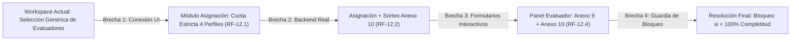
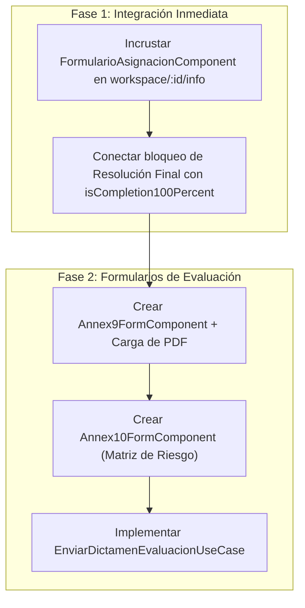

# Informe de Análisis de Brecha (Gap Analysis): Módulo de Asignación y Evaluación Par CEISH-ESPOCH

**Fecha:** 2026-09-25  
**Proyecto:** CEISH-ESPOCH (Frontend Angular)  
**Especificación Base:** `specs/002-flujo-mvp/spec.md` (v1.0.0)  
**Tareas Implementadas:** `specs/002-flujo-mvp/tasks-frontend-asignacion.md` (100% Completadas - 80 Tests)  
**Ubicación del Workspace Existente:** `https://localhost:4200/dashboard/protocols/workspace/:id/info`  

---

## 1. Resumen Ejecutivo

Este informe evalúa el estado del flujo de **Asignación y Evaluación Par** en el sistema CEISH-ESPOCH, comparando:
1. Lo construido en el módulo independiente [`src/app/features/asignacion-evaluadores/`](file:///D:/Frontend-CEISH/ceish-espoch-frontend/src/app/features/asignacion-evaluadores/).
2. Lo que actualmente visualiza la Secretaría en el Workspace del Protocolo (`/dashboard/protocols/workspace/:id/info`) tras la validación documental y sometimiento.



---

## 2. Matriz Comparativa de Cobertura

| Requisito / Funcionalidad | Estado en Workspace Existente (`workspace/:id/info`) | Estado en Módulo Implementado (`asignacion-evaluadores`) | Diagnóstico de la Brecha |
| :--- | :--- | :--- | :--- |
| **RF-12.1: Cuota de 4 Evaluadores** | Mensaje informativo general ("Mínimo 4 evaluadores"). Selector no valida perfiles requeridos. | Validador reactivo estricto (`CuotaPerfilesVO`, `FormularioAsignacionComponent`) que exige 1 Jurídico, 1 Sociedad Civil, 1 Metodológico y 1 Salud, bloqueando duplicados. | 🟡 **Brecha de Integración UI**: Sustituir el selector básico del workspace por el componente reactivo validado. |
| **RF-12.2: Selección Anexo 10** | Texto estático ("El sistema elegirá 2 aleatoriamente"). | Modelo de datos con bandera `isAssignedForAnnex10`, badge visual en tarjeta (`TarjetaEvaluadorComponent`) y banner informativo de obligatoriedad (`BannerAnexo10Component`). | 🟢 **Listo en el feature**, requiere consumo de la respuesta del backend. |
| **RF-12.3: Reasignación Trazable** | No disponible en la vista inicial del workspace. | Modal con filtro estricto al mismo perfil saliente (`ModalReasignacionComponent`), motivos `VENCIMIENTO` / `CONFLICTO_INTERES` y tabla inmutable de auditoría (`TablaHistorialReasignacionesComponent`). | 🟢 **100% Implementado y probado**. |
| **RF-12.4: Completitud del 100%** | El botón de resolución final no evalúa si todos los dictámenes fueron recibidos. | Entidad de estado (`ProtocoloAsignacionEstado`) con cálculo dinámico de porcentaje y bandera `isCompletion100Percent`. | 🟡 **Brecha de Integración UI**: Conectar la bandera para deshabilitar el botón "Emitir Resolución Final". |
| **RF-12.6: Deep-Linking del Evaluador** | No existe acceso directo al expediente sin navegar por el dashboard general. | Ruta dedicada `/evaluacion/:assignmentId/panel` con `EvaluadorDeepLinkGuard` y vista `PanelEvaluadorPageComponent`. | 🟢 **100% Implementado y probado**. |
| **Diligenciamiento de Anexo 9 y 10** | No implementado. | El panel del evaluador renderiza el resumen, plazos y banners, pero no contiene los formularios interactivos de preguntas ni carga del PDF. | 🔴 **Brecha Funcional**: Falta implementar los formularios de captura de dictamen y calificación de riesgo. |

---

## 3. Detalle de las 4 Brechas Identificadas

### 📌 Brecha 1: Conexión del Componente Reactivo en el Workspace
- **Contexto:** En el tab de asignación del Workspace (`/dashboard/protocols/workspace/164/info`), la interfaz actual presenta un selector genérico sin control de perfiles.
- **Solución:** Reemplazar dicho selector incrustando directamente:
  ```html
  <app-formulario-asignacion
    [protocolId]="protocolId"
    [candidateEvaluators]="availableEvaluators"
    (assignSuccess)="onAssignSuccess($event)">
  </app-formulario-asignacion>
  ```

### 📌 Brecha 2: Formularios Interactivos de Evaluación (Anexo 9 y Anexo 10)
- **Contexto:** El módulo actual resuelve la **asignación, reasignación, deep-linking y panel base**. Falta la capa interactiva donde el evaluador diligencia su informe técnico.
- **Componentes Faltantes:**
  1. `Annex9FormComponent`: Formulario de preguntas éticas/metodológicas + selector de veredicto (`APROBADO`, `OBSERVADO`, `RECHAZADO`) + carga de archivo PDF del Informe Narrativo.
  2. `Annex10FormComponent`: Matriz de preguntas de Estratificación del Riesgo (visible exclusivamente para los 2 evaluadores con `isAssignedForAnnex10 = true`).

### 📌 Brecha 3: Caso de Uso de Envío del Dictamen (`submitEvaluation`)
- **Contexto:** El evaluador necesita registrar formalmente su evaluación una vez completados los formularios.
- **Requerimiento:** Crear el caso de uso `EnviarDictamenEvaluacionUseCase` y su método en `AsignacionRepositoryPort`:
  ```typescript
  submitEvaluation(payload: {
    assignmentId: string;
    annex9Data: any;
    narrativeReportFile: File;
    annex10Data?: any;
  }): Observable<AsignacionEvaluador>;
  ```

### 📌 Brecha 4: Guardia de Bloqueo de Resolución Final (`RF-12.4`)
- **Contexto:** Según la normativa PET 2026, la Secretaría o Presidente no pueden cerrar el protocolo ni emitir resolución si falta al menos un dictamen de los 4 evaluadores.
- **Solución:** En el Workspace del protocolo:
  ```html
  <button 
    class="btn btn-primary" 
    [disabled]="!protocolState?.isCompletion100Percent"
    [title]="!protocolState?.isCompletion100Percent ? 'Debe recibir el 100% de los dictámenes de los 4 evaluadores para continuar.' : ''">
    Emitir Resolución Final del CEISH
  </button>
  ```

---

## 4. Plan de Acción Recomendado (Roadmap de Cierre de Brecha)



1. **Fase 1 (Integración en Workspace):**
   - Incrustar [`FormularioAsignacionComponent`](file:///D:/Frontend-CEISH/ceish-espoch-frontend/src/app/features/asignacion-evaluadores/presentation/components/formulario-asignacion/formulario-asignacion.component.ts) en la pantalla de gestión del protocolo (`workspace/:id/info`).
   - Conectar la barra de porcentaje de completitud y el bloqueo del botón de resolución.

2. **Fase 2 (Diligenciamiento de Evaluaciones):**
   - Implementar los componentes `Annex9FormComponent` y `Annex10FormComponent`.
   - Implementar el envío de dictámenes con archivo adjunto (`multipart/form-data`) hacia la API del backend.
