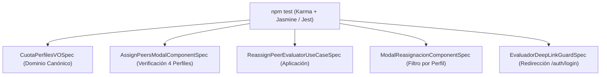

# Plan de Arquitectura y Diseño Técnico Frontend Delta (Brownfield SDD)

**Código de Especificación Activa:** `specs/002-flujo-mvp/spec.md` (v1.0.0 — Flujo 002: Asignación y Evaluación Par)  
**Ubicación del Plan Frontend:** `specs/002-flujo-mvp/plan-frontend-asignacion.md`  
**Documento de Referencia de Reconciliación:** `specs/002-flujo-mvp/reconciliation-frontend-asignacion.md`  
**Base Arquitectónica Canónica:** `src/domain/`, `src/infrastructure/`, `src/features/evaluations/`, `src/features/dashboard/`  
**Marco Metodológico:** Clean Architecture, DDD, SDD, Principio Brownfield First (Constitution v2).  
**Estado:** Plan Delta Brownfield Aprobado  

---

## 1. Objetivo

El objetivo de este plan técnico es **evolucionar e integrar el frontend existente** para cumplir con la totalidad de los requisitos de la especificación `specs/002-flujo-mvp/spec.md` (RF-12.1 a RF-12.6) **sin reconstruir funcionalidades ya implementadas ni duplicar capas arquitectónicas**.

El proyecto CEISH-ESPOCH ya cuenta con una base sólida en Angular 17+ (Standalone Components, Signals, Reactive Forms, Material Design, Clean Architecture canónica). Este documento define con precisión quirúrgica el **delta mínimo de cambio** requerido para:
1. Reutilizar la asignación de cuota estricta de 4 evaluadores (`AssignPeersModalComponent`).
2. Reutilizar la evaluación de estratificación del riesgo (`PeerRiskAssessmentPage` — Anexo 10) y el dictamen ético/metodológico (`EvaluationFormPage` — Anexo 9).
3. Adaptar e integrar los componentes de reasignación inmutable y bitácora de auditoría en el módulo canónico `@features/evaluations`.
4. Extender el puerto canónico `IEvaluationRepositoryPort` y el adaptador `EvaluationApiAdapter` para soportar la reasignación trazable con IDs numéricos reales.
5. Corregir el guard de deep-linking para asegurar la redirección fluida a `/auth/login` con retorno al panel del evaluador.

---

## 2. Estado Actual de la Base de Código

El frontend implementa una arquitectura modular estratificada por Bounded Contexts:
- **`src/domain/`**: Entidades canónicas (`peer-evaluation.entity.ts`, `evaluation.entity.ts`, `evaluator.entity.ts`), puertos (`IEvaluationRepositoryPort`), enums y catálogos.
- **`src/infrastructure/`**: Adaptador HTTP canónico (`evaluation-api.adapter.ts`), cliente HTTP base (`api-client.service.ts`, `endpoints.constant.ts`), guards globales (`auth.guard.ts`, `role.guard.ts`) y servicios de almacenamiento (`s3-storage.service.ts`).
- **`src/features/evaluations/`**: Módulo canónico de evaluación con páginas operativas (`assignment.page.ts`, `peer-risk-assessment.page.ts`, `evaluation-form.page.ts`, `evaluation-consolidation.page.ts`, `subsanacion.page.ts`) y casos de uso en `application/`.
- **`src/features/dashboard/`**: Paneles de control por rol y modal operativo de asignación (`assign-peers-modal.component.ts`).
- **`src/app/features/asignacion-evaluadores/`**: Subárbol prototipo SDD que contiene componentes de reasignación (`ModalReasignacionComponent`, `TablaHistorialReasignacionesComponent`), Value Objects (`CuotaPerfilesVO`, `CodigoProtocoloVO`) y use cases.

---

## 3. Principios Brownfield y Reglas de Evolución

De acuerdo con la **Constitución del Proyecto (v2 — Brownfield SDD)**:
1. **Reutilizar antes que crear**: Si un componente, servicio, validador o formulario ya existe y funciona, se reutiliza.
2. **Modificar antes que duplicar**: Si un artefacto canónico requiere nuevos métodos o campos, se extiende in-place.
3. **Adaptar antes que reemplazar**: Los artefactos desarrollados en el subárbol prototipo se adaptan e integran en la arquitectura canónica.
4. **No romper funcionalidad existente**: Todo cambio debe preservar los contratos, rutas y consumidores actuales.
5. **No eliminar sin evidencia**: La eliminación de artefactos redundantes solo se planifica como una acción futura condicionada al 100% de migración y verificación sin regresiones.
6. **Respetar contratos reales y tipos**: Los identificadores (`protocolId`, `evaluatorId`, `assignmentId`) operan con tipo `number` (INTEGER en PostgreSQL).
7. **Cero Mocks en Producción**: La comunicación con el backend se realiza exclusivamente a través de `EvaluationApiAdapter`.

---

## 4. Estado Reconciliado (Hallazgos Principales)

| Requisito | Estado en Sistema Real | Decisión del Plan Delta |
| :--- | :--- | :--- |
| **RF-12.1 (Cuota de 4 Evaluadores: Jurídico, Sociedad Civil, Metodológico, Salud)** | Implementado en `AssignPeersModalComponent` con validación de 4 perfiles y semáforo de carga. | **REUTILIZAR** `AssignPeersModalComponent`. Incorporar `CuotaPerfilesVO` en `@domain/value-objects/`. |
| **RF-12.2 (Sorteo Anexo 10 excluyendo Sociedad Civil)** | Backend ejecuta sorteo Fisher-Yates excluyendo de forma estricta e innegociable al evaluador con perfil `SOCIEDAD_CIVIL` (sorteo entre `JURIDICO`, `METODOLOGICO` y `SALUD`). `AssignPeersModalComponent` muestra seleccionados y `PeerRiskAssessmentPage` implementa el formulario. | **REUTILIZAR** flujo existente de Anexo 10. |
| **RF-12.3 (Reasignación Inmutable por Vencimiento / COI)** | Lógica en backend; componentes UI en prototipo SDD (`ModalReasignacionComponent`, `TablaHistorialReasignacionesComponent`). | **ADAPTAR** e integrar en `src/features/evaluations/` conectando a `IEvaluationRepositoryPort`. |
| **RF-12.4 (Completitud 100% de Evaluaciones)** | Implementado en `EvaluationConsolidationPage`. | **MODIFICAR** para filtrar asignaciones inactivas (`REASIGNED_*`). |
| **RF-12.5 (Continuidad en Versiones v2.0)** | Backend maneja herencia mediante `InheritEvaluatorsUseCase`. | **VERIFICAR** visualización en dashboard/workspace del protocolo. |
| **RF-12.6 (Notificaciones y Deep-Linking)** | Rutas operativas en `/dashboard/evaluations/evaluate/:id` y `evaluate-risk/:id`. `EvaluadorDeepLinkGuard` tiene URL errónea. | **MODIFICAR** `EvaluadorDeepLinkGuard` para redirigir a `/auth/login` con `returnUrl`. |

---

## 5. Arquitectura Objetivo Integrada

```text
ceish-espoch-frontend/src/
├── domain/                                    # Capa Canónica de Dominio
│   ├── entities/
│   │   ├── peer-evaluation.entity.ts          # [MODIFICAR] Extender con ReassignmentHistoryEntity y DTOs de reasignación
│   │   ├── evaluation.entity.ts               # [REUTILIZAR] Entidad de evaluación y dictámenes
│   │   └── evaluator.entity.ts                # [REUTILIZAR] EvaluatorEntity con perfiles normalizados
│   ├── ports/
│   │   └── IEvaluationRepositoryPort.ts       # [MODIFICAR] Declarar reassignPeerEvaluator() y getAssignmentHistory()
│   └── value-objects/
│       ├── cuota-perfiles.vo.ts               # [ADAPTAR] Trasladar desde prototipo a dominio canónico
│       └── protocol-code.vo.ts                # [ADAPTAR] Validador de formato de código CEISH
│
├── infrastructure/                            # Capa Canónica de Infraestructura
│   ├── adapters/
│   │   └── evaluation-api.adapter.ts          # [MODIFICAR] Implementar reassignPeerEvaluator() y getAssignmentHistory()
│   ├── api/
│   │   └── endpoints.constant.ts              # [MODIFICAR] Registrar endpoint de reasignación e historial
│   └── guards/
│       └── evaluador-deep-link.guard.ts       # [ADAPTAR/MODIFICAR] Guard con redirección correcta a /auth/login
│
└── features/                                  # Capa Canónica de Features
    ├── dashboard/
    │   └── presentation/components/
    │       └── assign-peers-modal/            # [REUTILIZAR] Modal canónico de asignación de 4 perfiles (RF-12.1)
    │
    └── evaluations/                           # Módulo Canónico de Evaluaciones
        ├── application/
        │   ├── reassign-peer-evaluator.use-case.ts # [ADAPTAR] Use case de reasignación conectado a puerto canónico
        │   ├── load-assignment-history.use-case.ts # [ADAPTAR] Use case de historial inmutable
        │   ├── submit-evaluation.use-case.ts       # [REUTILIZAR]
        │   └── load-pending-peer-assignments.use-case.ts # [REUTILIZAR]
        ├── presentation/
        │   ├── components/
        │   │   ├── modal-reasignacion/        # [ADAPTAR] Modal de cambio con filtro por mismo perfil (RF-12.3)
        │   │   ├── tabla-historial-reasignaciones/ # [ADAPTAR] Tabla de auditoría inmutable
        │   │   └── tarjeta-evaluador/         # [ADAPTAR] Card de evaluador activo con botón de reasignar
        │   ├── pages/
        │   │   ├── assignment/                # [MODIFICAR] Soportar :protocolId directo abriendo modal
        │   │   ├── reassignment/              # [ADAPTAR] Página de gestión de sustituciones
        │   │   ├── evaluation-form/           # [REUTILIZAR] Formulario Anexo 9/11
        │   │   ├── peer-risk-assessment/      # [REUTILIZAR] Formulario Anexo 10
        │   │   └── evaluation-consolidation/  # [MODIFICAR] Validación de completitud 100%
        │   └── routes.ts                      # [MODIFICAR] Registrar ruta de reasignación y deep-links
```

---

## 6. Componentes a Reutilizar (Sin Reconstrucción)

| Componente | Ubicación Canónica | Acción | Motivo |
| :--- | :--- | :--- | :--- |
| **`AssignPeersModalComponent`** | `src/features/dashboard/presentation/components/assign-peers-modal/` | **REUTILIZAR** | Cumple 100% con la selección estricta de 4 perfiles obligatorios (`JURIDICO`, `SOCIEDAD_CIVIL`, `METODOLOGICO`, `SALUD`), semáforo de carga y visualización de sorteo Anexo 10 (`RF-12.1`, `RF-12.2`). |
| **`PeerRiskAssessmentPage`** | `src/features/evaluations/presentation/pages/peer-risk-assessment/` | **REUTILIZAR** | Página completa para calificación de riesgo Anexo 10 con carga de PDF firmado a R2/S3 y justificación (`RF-12.2`). |
| **`EvaluationFormPage`** | `src/features/evaluations/presentation/pages/evaluation-form/` | **REUTILIZAR** | Formulario robusto de Anexo 9 y 11 con generación de borradores oficiales en PDF/DOCX y carga del definitivo (`RF-12.4`). |
| **`EvaluationConsolidationPage`** | `src/features/evaluations/presentation/pages/evaluation-consolidation/` | **REUTILIZAR** | Vista para consolidación de dictámenes y detección de discrepancias (`RF-12.4`). |
| **`AuthGuard` y `RoleGuard`** | `src/infrastructure/guards/` | **REUTILIZAR** | Guards canónicos de autenticación y autorización PBAC/RBAC. |
| **`S3StorageService`** | `src/infrastructure/services/s3-storage.service.ts` | **REUTILIZAR** | Servicio de subida directa con URLs prefirmadas a Cloudflare R2 / S3. |

---

## 7. Componentes a Modificar

| Componente | Ubicación | Cambio Necesario | Motivo |
| :--- | :--- | :--- | :--- |
| **`IEvaluationRepositoryPort`** | `src/domain/ports/IEvaluationRepositoryPort.ts` | Agregar firmas: `reassignPeerEvaluator(payload)` y `getAssignmentHistory(protocolId)`. | Conectar el flujo de reasignación al contrato de repositorio canónico (`RF-12.3`). |
| **`EvaluationApiAdapter`** | `src/infrastructure/adapters/evaluation-api.adapter.ts` | Implementar las llamadas HTTP a `POST /evaluations/reassign` y `GET /evaluations/protocol/:id/reassignment-history`. | Proveer la persistencia real contra el backend NestJS. |
| **`ENDPOINTS`** | `src/infrastructure/api/endpoints.constant.ts` | Agregar endpoints para reasignación e historial dentro de `EVALUATIONS`. | Centralizar la configuración de rutas de API. |
| **`EVALUATION_ROUTES`** | `src/features/evaluations/routes.ts` | Registrar `{ path: 'reassignment/:protocolId', component: ReassignmentPage, canActivate: [AuthGuard] }`. | Exponer la página de reasignación en el shell del dashboard. |
| **`EvaluationConsolidationPage`** | `src/features/evaluations/presentation/pages/evaluation-consolidation/evaluation-consolidation.page.ts` | Filtrar asignaciones activas (excluir `REASIGNED_*`) al calcular completitud del 100%. | Evitar bloqueos indebidos por evaluadores sustituidos (`RF-12.4`). |

---

## 8. Componentes a Adaptar (Integración desde Prototipo SDD)

| Componente | Ubicación Actual (Prototipo) | Integración Objetivo (Canónica) | Motivo y Ajustes Requeridos |
| :--- | :--- | :--- | :--- |
| **`ModalReasignacionComponent`** | `src/app/features/asignacion-evaluadores/presentation/components/modal-reasignacion/` | `src/features/evaluations/presentation/components/modal-reasignacion/modal-reasignacion.component.ts` | Convertir en diálogo `MatDialog` estándar, inyectar datos del evaluador saliente con tipado `number` y filtrar candidatos por el mismo perfil (`RF-12.3`). |
| **`TablaHistorialReasignacionesComponent`** | `src/app/features/asignacion-evaluadores/presentation/components/tabla-historial-reasignaciones/` | `src/features/evaluations/presentation/components/tabla-historial-reasignaciones/tabla-historial-reasignaciones.component.ts` | Adaptar para renderizar `AssignmentHistoryEntry[]` con tipado canónico y fechas formateadas con `DatePipe`. |
| **`TarjetaEvaluadorComponent`** | `src/app/features/asignacion-evaluadores/presentation/components/tarjeta-evaluador/` | `src/features/evaluations/presentation/components/tarjeta-evaluador/tarjeta-evaluador.component.ts` | Adaptar para mostrar estado de asignación, perfil profesional y botón de acción "Reasignar". |
| **`ReasignacionPageComponent`** | `src/app/features/asignacion-evaluadores/presentation/pages/reasignacion-page/` | `src/features/evaluations/presentation/pages/reassignment/reassignment.page.ts` | Adaptar para cargar protocolo desde route param `:protocolId`, renderizar las 4 tarjetas activas y la tabla de auditoría al pie. |
| **`ReasignarEvaluadorUseCase`** | `src/app/features/asignacion-evaluadores/application/use-cases/reasignar-evaluador.use-case.ts` | `src/features/evaluations/application/reassign-peer-evaluator.use-case.ts` | Adaptar para inyectar `IEvaluationRepositoryPort` y operar con IDs tipo `number`. |
| **`ObtenerHistorialReasignacionesUseCase`** | `src/app/features/asignacion-evaluadores/application/use-cases/obtener-historial-reasignaciones.use-case.ts` | `src/features/evaluations/application/load-assignment-history.use-case.ts` | Adaptar para inyectar `IEvaluationRepositoryPort` canónico. |
| **`CuotaPerfilesVO`** | `src/app/features/asignacion-evaluadores/domain/value-objects/cuota-perfiles.vo.ts` | `src/domain/value-objects/cuota-perfiles.vo.ts` | Trasladar a la capa de dominio canónica. |
| **`EvaluadorDeepLinkGuard`** | `src/app/features/asignacion-evaluadores/presentation/guards/evaluador-deep-link.guard.ts` | `src/infrastructure/guards/evaluador-deep-link.guard.ts` | Corregir redirección a `/auth/login` con `queryParams: { returnUrl: state.url }`. |

---

## 9. Componentes Realmente Nuevos

> [!NOTE]
> **Evaluación Brownfield**: **NO se requiere CREAR componentes desde cero**. Toda la funcionalidad faltante se cubre mediante la **ADAPTACIÓN** e **INTEGRACIÓN** de los componentes desarrollados en el subárbol prototipo hacia la arquitectura canónica de `src/features/evaluations/`.

---

## 10. Cambios de Dominio (`src/domain/`)

### 10.1 Entidades e Interfaces Canónicas (`src/domain/entities/peer-evaluation.entity.ts`)
Extender el archivo con los contratos de reasignación:

```typescript
// src/domain/entities/peer-evaluation.entity.ts (Adición Delta)

export interface ReassignPeerEvaluatorPayload {
  protocolId: number;
  outgoingAssignmentId: number;
  replacementEvaluatorId: number;
  reason: 'VENCIMIENTO' | 'CONFLICTO_INTERES';
  reasonDescription: string;
}

export interface ReassignPeerEvaluatorResponse {
  message: string;
  previousAssignmentId: number;
  newAssignmentId: number;
  newEvaluatorId: number;
  newEvaluatorName: string;
  deadlineDate: string;
  auditHistoryId: number;
}

export interface AssignmentHistoryEntry {
  id: number;
  assignmentId: number;
  previousEvaluatorId: number;
  previousEvaluatorName: string;
  newEvaluatorId: number;
  newEvaluatorName: string;
  evaluatorProfile: 'JURIDICO' | 'SOCIEDAD_CIVIL' | 'METODOLOGICO' | 'SALUD';
  reassignmentReason: 'VENCIMIENTO' | 'CONFLICTO_INTERES';
  reasonDescription: string;
  executedByUserId: number;
  executedByUserName?: string;
  executedAt: string;
}
```

### 10.2 Value Objects (`src/domain/value-objects/`)
- **`cuota-perfiles.vo.ts`**: Validador estático puro para certificar que una lista de evaluadores contenga la cuota exacta de 1 miembro por perfil (`JURIDICO`, `SOCIEDAD_CIVIL`, `METODOLOGICO`, `SALUD`).

---

## 11. Cambios de Aplicación (`src/features/evaluations/application/`)

### 11.1 Caso de Uso: `ReassignPeerEvaluatorUseCase`
- **Archivo:** `src/features/evaluations/application/reassign-peer-evaluator.use-case.ts`
- **Responsabilidad:** Orquestar la sustitución inmutable de un evaluador validando el motivo normativo y delegando la persistencia a `IEvaluationRepositoryPort.reassignPeerEvaluator()`.

### 11.2 Caso de Uso: `LoadAssignmentHistoryUseCase`
- **Archivo:** `src/features/evaluations/application/load-assignment-history.use-case.ts`
- **Responsabilidad:** Consultar la bitácora inmutable de sustituciones de un protocolo específico mediante `IEvaluationRepositoryPort.getAssignmentHistory(protocolId)`.

---

## 12. Cambios de Infraestructura (`src/infrastructure/`)

### 12.1 Puerto de Repositorio (`src/domain/ports/IEvaluationRepositoryPort.ts`)
Adición de firmas al contrato abstracto:
```typescript
abstract reassignPeerEvaluator(payload: ReassignPeerEvaluatorPayload): Observable<ReassignPeerEvaluatorResponse>;
abstract getAssignmentHistory(protocolId: string | number): Observable<AssignmentHistoryEntry[]>;
```

### 12.2 Adaptador HTTP (`src/infrastructure/adapters/evaluation-api.adapter.ts`)
Implementación de métodos:
```typescript
reassignPeerEvaluator(payload: ReassignPeerEvaluatorPayload): Observable<ReassignPeerEvaluatorResponse> {
  return this.apiClient.post<ApiEnvelope<ReassignPeerEvaluatorResponse>>(
    ENDPOINTS.EVALUATIONS.PEER_ASSIGNMENTS.REASSIGN,
    payload
  ).pipe(map(res => res.data || (res as unknown as ReassignPeerEvaluatorResponse)));
}

getAssignmentHistory(protocolId: string | number): Observable<AssignmentHistoryEntry[]> {
  return this.apiClient.get<ApiEnvelope<AssignmentHistoryEntry[]>>(
    ENDPOINTS.EVALUATIONS.PEER_ASSIGNMENTS.HISTORY(protocolId.toString())
  ).pipe(map(res => {
    const raw = res.data || (res as unknown as AssignmentHistoryEntry[]);
    return Array.isArray(raw) ? raw : [];
  }));
}
```

### 12.3 Constantes de Endpoints (`src/infrastructure/api/endpoints.constant.ts`)
```typescript
PEER_ASSIGNMENTS: {
  PENDING_ASSIGNMENT: '/evaluations/protocols/pending-peer-assignment',
  ASSIGN_PEERS: (id: string) => `/evaluations/protocols/${id}/assign-peer-evaluators`,
  REASSIGN: '/evaluations/reassign',
  HISTORY: (protocolId: string) => `/evaluations/protocol/${protocolId}/reassignment-history`,
  MY_PENDING: '/evaluations/peer-assignments/my-pending',
  SUBMIT_RISK: (id: string) => `/evaluations/peer-assignments/${id}/submit-risk`,
  ACTIVE_EVALUATORS: '/evaluations/evaluators/active'
}
```

---

## 13. Cambios de Presentación (`src/features/evaluations/presentation/`)

1. **`ModalReasignacionComponent`**:
   - Diálogo modal con selección obligatoria de motivo (`VENCIMIENTO` o `CONFLICTO_INTERES`), justificación técnica (mínimo 10 caracteres) y selector de reemplazo filtrado exclusivamente por el mismo perfil del evaluador saliente.
2. **`TablaHistorialReasignacionesComponent`**:
   - Tabla interactiva con columnas: Fecha/Hora, Evaluador Saliente, Perfil, Motivo, Justificación, Nuevo Evaluador, Usuario Responsable.
3. **`ReassignmentPage`**:
   - Vista en `/dashboard/evaluations/reassignment/:protocolId` que presenta el encabezado del protocolo, las 4 tarjetas activas con botón "Reasignar" y la tabla de auditoría.

---

## 14. Rutas y Navegación

En `src/features/evaluations/routes.ts`:

```typescript
export const EVALUATION_ROUTES: Routes = [
  {
    path: '',
    children: [
      {
        path: 'assignment',
        component: AssignmentPage,
        canActivate: [AuthGuard],
        data: { permissions: ['EVALUACION_ASIGNAR', 'EVALUATORS_ASSIGN'], permissionStrategy: 'any' }
      },
      {
        path: 'reassignment/:protocolId',
        loadComponent: () => import('./presentation/pages/reassignment/reassignment.page').then(m => m.ReassignmentPage),
        canActivate: [AuthGuard],
        data: { permissions: ['EVALUACION_ASIGNAR', 'EVALUATORS_ASSIGN'], permissionStrategy: 'any' }
      },
      {
        path: 'list',
        component: EvaluationListPage,
        canActivate: [AuthGuard],
        data: { permissions: ['EVALUACION_VER_PROPIAS', 'EVALUATION_VIEW_MINE'], permissionStrategy: 'any' }
      },
      {
        path: 'evaluate/:id',
        component: EvaluationFormPage,
        canActivate: [AuthGuard],
        data: { permissions: ['EVALUACION_COMPLETAR_FORMULARIO', 'EVALUATION_FILL'], permissionStrategy: 'any' }
      },
      {
        path: 'evaluate-risk/:id',
        component: PeerRiskAssessmentPage,
        canActivate: [AuthGuard],
        data: { permissions: ['EVALUACION_RIESGO'], permissionStrategy: 'any' }
      },
      {
        path: 'consolidation/:id',
        component: EvaluationConsolidationPage,
        canActivate: [AuthGuard],
        data: { permissions: ['RESOLUCION_CREAR', 'EVALUACION_INFORMES'], permissionStrategy: 'any' }
      }
    ]
  }
];
```

---

## 15. Seguridad y Control de Acceso

- **Rutas de Asignación y Reasignación**: Protegidas con `AuthGuard` y permisos `EVALUACION_ASIGNAR`, `EVALUATORS_ASSIGN` (restringidas a Secretaría y Presidenta).
- **Rutas de Evaluación Par**: Protegidas con permisos `EVALUACION_COMPLETAR_FORMULARIO`, `EVALUACION_RIESGO` (restringidas a Evaluadores asignados).
- **Deep-Linking**: El guard intercepta el acceso no autenticado a `/dashboard/evaluations/evaluate/:id`, almacena la URL en `AuthFacade` y redirige a `/auth/login`. Tras el login exitoso, el usuario es redirigido automáticamente a su panel de evaluación.

---

## 16. API y Contratos de Integración

| Acción | Método HTTP | Endpoint Real Backend | Payload Entrada | Respuesta Backend |
| :--- | :--- | :--- | :--- | :--- |
| **Asignar Cuota** | `POST` | `/evaluations/protocols/:id/assign-peer-evaluators` | `{ evaluatorIds: [1, 2, 3, 4] }` | `AssignEvaluatorsResponse` (con `riskEvaluators: [1, 3]`) |
| **Reasignar Evaluador** | `POST` | `/evaluations/reassign` | `ReassignPeerEvaluatorPayload` | `ReassignPeerEvaluatorResponse` |
| **Consultar Historial** | `GET` | `/evaluations/protocol/:id/reassignment-history` | N/A | `AssignmentHistoryEntry[]` |
| **Enviar Dictamen Anexo 9** | `POST` | `/evaluations/submit` | `SubmitEvaluationPayload` | `{ message: string, assignmentId: number }` |
| **Enviar Riesgo Anexo 10** | `POST` | `/evaluations/peer-assignments/:id/submit-risk` | `{ riskLevelId, observations, reportPath }` | `void` |

---

## 17. Estrategia de Pruebas Frontend Delta



1. **`cuota-perfiles.vo.spec.ts`**: Verificar que apruebe la combinación exacta de 4 perfiles y rechace listas de 3 perfiles o con duplicados.
2. **`assign-peers-modal.component.spec.ts`**: Verificar que el formulario bloquee submit si falta algún perfil y renderice los evaluadores seleccionados para Anexo 10.
3. **`reassign-peer-evaluator.use-case.spec.ts`**: Verificar que invoque el método del repositorio con los IDs numéricos y motivo normativo.
4. **`modal-reasignacion.component.spec.ts`**: Verificar que la lista desplegable filtre candidatos que compartan el mismo `evaluatorProfile` del saliente.
5. **`evaluador-deep-link.guard.spec.ts`**: Verificar la preservación de `returnUrl` y redirección a `/auth/login`.

---

## 18. Compatibilidad y No Regresión

Para garantizar que no se introduzcan regresiones:
1. **Verificación de Rutas Existentes**: Las rutas `/dashboard/evaluations/list`, `/dashboard/evaluations/evaluate/:id`, `/dashboard/evaluations/evaluate-risk/:id` y `/dashboard/evaluations/consolidation/:id` no sufren cambios estructurales.
2. **Verificación de Tipos Numéricos**: Toda comunicación hacia la API se tipa con `number` en lugar de `string`, evitando errores 400 de PostgreSQL.
3. **Validación de Suite Completa**: Ejecutar `npm test` garantizando que las suites existentes (incluyendo `user-management`, `resolutions`, `protocols`, `reports`) permanezcan en verde.

---

## 19. Gestión de Riesgos

| Riesgo Identificado | Probabilidad | Impacto | Mitigación Técnica en el Plan |
| :--- | :--- | :--- | :--- |
| **Duplicación de formularios de asignación** | Baja | Medio | Se reutiliza `AssignPeersModalComponent` como único formulario de asignación; no se crea `FormularioAsignacionComponent`. |
| **Desalineación de tipos UUID vs INTEGER** | Alta | Alta | Se estandarizan todas las interfaces a `number` en domain, use cases, DTOs y adaptadores. |
| **Deep-link roto por ruta incorrecta** | Media | Alta | Se corrige `EvaluadorDeepLinkGuard` para apuntar formalmente a `/auth/login` con `returnUrl`. |
| **Eliminación prematura del subárbol prototipo** | Media | Medio | El subárbol prototipo se mantiene hasta que los componentes adaptados estén 100% integrados y probados en `@features/evaluations`. |

---

## 20. Orden de Implementación Incremental (Paso a Paso)

```text
PASO 1: Dominio y Tipos Canónicos
        ↓
PASO 2: Contratos de Repositorio y Endpoints
        ↓
PASO 3: Adaptador HTTP Canónico (EvaluationApiAdapter)
        ↓
PASO 4: Casos de Uso de Reasignación e Historial
        ↓
PASO 5: Adaptación de Componentes UI (Modal, Tabla, Tarjeta)
        ↓
PASO 6: Página de Reasignación y Rutas (EVALUATION_ROUTES)
        ↓
PASO 7: Corrección de Deep-Link Guard
        ↓
PASO 8: Verificación Integral (Pruebas Unitarias y Linting)
```

---

### Detalle de los Pasos del Plan Delta

#### Paso 1: Dominio y Tipos Canónicos
- **ID:** `PLN-FE-01`
- **Requisito:** `RF-12.1`, `RF-12.3`
- **Acción:** `MODIFICAR` / `ADAPTAR`
- **Archivo/Componente:** `src/domain/entities/peer-evaluation.entity.ts`, `src/domain/value-objects/cuota-perfiles.vo.ts`
- **Estado actual:** Entidades básicas existentes; Value Object en prototipo.
- **Cambio necesario:** Extender `peer-evaluation.entity.ts` con `ReassignPeerEvaluatorPayload`, `ReassignPeerEvaluatorResponse` y `AssignmentHistoryEntry`. Trasladar `CuotaPerfilesVO` a dominio canónico con tipado `number`.
- **Dependencias:** Ninguna.
- **Pruebas:** `src/domain/value-objects/cuota-perfiles.vo.spec.ts`.
- **Criterio de finalización:** Compilación limpia de TypeScript con tipos numéricos.
- **Riesgo:** Bajo.

#### Paso 2: Contratos de Repositorio y Endpoints
- **ID:** `PLN-FE-02`
- **Requisito:** `RF-12.3`
- **Acción:** `MODIFICAR`
- **Archivo/Componente:** `src/domain/ports/IEvaluationRepositoryPort.ts`, `src/infrastructure/api/endpoints.constant.ts`
- **Estado actual:** El puerto canónico no incluye firmas de reasignación ni historial.
- **Cambio necesario:** Declarar `reassignPeerEvaluator()` y `getAssignmentHistory()` en el puerto abstracto y registrar las URLs en `ENDPOINTS.EVALUATIONS.PEER_ASSIGNMENTS`.
- **Dependencias:** `PLN-FE-01`.
- **Pruebas:** Verificación de tipos TypeScript.
- **Criterio de finalización:** Métodos abstractos expuestos en el puerto.
- **Riesgo:** Bajo.

#### Paso 3: Adaptador HTTP Canónico
- **ID:** `PLN-FE-03`
- **Requisito:** `RF-12.3`
- **Acción:** `MODIFICAR`
- **Archivo/Componente:** `src/infrastructure/adapters/evaluation-api.adapter.ts`
- **Estado actual:** Adaptador conectado a endpoints de asignación y evaluación; faltan reasignación e historial.
- **Cambio necesario:** Implementar `reassignPeerEvaluator` y `getAssignmentHistory` consumiendo `ApiClientService` con manejo de envelopes `ApiEnvelope<T>`.
- **Dependencias:** `PLN-FE-02`.
- **Pruebas:** Pruebas unitarias de adaptador HTTP con spies de `ApiClientService`.
- **Criterio de finalización:** Llamadas HTTP configuradas correctamente hacia `/evaluations/reassign` e `/evaluations/protocol/:id/reassignment-history`.
- **Riesgo:** Medio (formato del JSON retornado por backend).

#### Paso 4: Casos de Uso de Reasignación e Historial
- **ID:** `PLN-FE-04`
- **Requisito:** `RF-12.3`
- **Acción:** `ADAPTAR`
- **Archivo/Componente:** `src/features/evaluations/application/reassign-peer-evaluator.use-case.ts`, `src/features/evaluations/application/load-assignment-history.use-case.ts`
- **Estado actual:** Implementados en el subárbol prototipo SDD.
- **Cambio necesario:** Integrar en `@features/evaluations/application/` inyectando `IEvaluationRepositoryPort` canónico y operando con IDs numéricos.
- **Dependencias:** `PLN-FE-03`.
- **Pruebas:** `reassign-peer-evaluator.use-case.spec.ts`, `load-assignment-history.use-case.spec.ts`.
- **Criterio de finalización:** Casos de uso ejecutables y probados con spies del puerto.
- **Riesgo:** Bajo.

#### Paso 5: Adaptación de Componentes UI
- **ID:** `PLN-FE-05`
- **Requisito:** `RF-12.3`
- **Acción:** `ADAPTAR`
- **Archivo/Componente:** `src/features/evaluations/presentation/components/modal-reasignacion/`, `src/features/evaluations/presentation/components/tabla-historial-reasignaciones/`, `src/features/evaluations/presentation/components/tarjeta-evaluador/`
- **Estado actual:** Componentes en subárbol prototipo.
- **Cambio necesario:** Integrar en `src/features/evaluations/presentation/components/`, convertir el modal a `MatDialog` estándar, filtrar sustitutos estrictamente por el mismo perfil del saliente y mostrar la bitácora inmutable.
- **Dependencias:** `PLN-FE-04`.
- **Pruebas:** `modal-reasignacion.component.spec.ts`, `tabla-historial-reasignaciones.component.spec.ts`.
- **Criterio de finalización:** Componentes renderizables con Angular Material y SCSS del sistema.
- **Riesgo:** Bajo.

#### Paso 6: Página de Reasignación y Rutas
- **ID:** `PLN-FE-06`
- **Requisito:** `RF-12.3`
- **Acción:** `ADAPTAR` / `MODIFICAR`
- **Archivo/Componente:** `src/features/evaluations/presentation/pages/reassignment/reassignment.page.ts`, `src/features/evaluations/routes.ts`
- **Estado actual:** Página en prototipo; ruta no registrada en `EVALUATION_ROUTES`.
- **Cambio necesario:** Integrar `ReassignmentPage` en `src/features/evaluations/presentation/pages/reassignment/` y registrar la ruta `/dashboard/evaluations/reassignment/:protocolId` protegida con `AuthGuard`.
- **Dependencias:** `PLN-FE-05`.
- **Pruebas:** Pruebas de renderizado de página y navegación.
- **Criterio de finalización:** Navegación fluida hacia la pantalla de reasignación desde el dashboard.
- **Riesgo:** Bajo.

#### Paso 7: Corrección de Deep-Link Guard
- **ID:** `PLN-FE-07`
- **Requisito:** `RF-12.6`
- **Acción:** `MODIFICAR`
- **Archivo/Componente:** `src/infrastructure/guards/evaluador-deep-link.guard.ts`
- **Estado actual:** Redirige a `/security/login` (inexistente).
- **Cambio necesario:** Corregir para redirigir a `/auth/login` con `queryParams: { returnUrl: state.url, reason: 'DEEP_LINK_EVALUATION' }` y guardar URL intentada en `AuthFacade`.
- **Dependencias:** `AuthFacade`.
- **Pruebas:** `evaluador-deep-link.guard.spec.ts`.
- **Criterio de finalización:** Redirección comprobada al recibir deep-links sin sesión activa.
- **Riesgo:** Bajo.

#### Paso 8: Verificación Integral y No Regresión
- **ID:** `PLN-FE-08`
- **Requisito:** `RF-12.1` a `RF-12.6`
- **Acción:** `VERIFICAR`
- **Archivo/Componente:** Suite completa de pruebas frontend
- **Estado actual:** Suites unitarias ejecutándose.
- **Cambio necesario:** Ejecutar `npm test` y `npm run lint` validando cero regresiones en asignación, evaluación par, consolidación y dashboards.
- **Dependencias:** `PLN-FE-01` a `PLN-FE-07`.
- **Pruebas:** 100% suites en verde.
- **Criterio de finalización:** Cero errores de compilación, linter y pruebas.
- **Riesgo:** Bajo.

---

> [!NOTE]
> **Fin del Plan de Arquitectura Frontend Delta Brownfield**. Este documento establece la hoja de ruta definitiva para evolucionar el sistema CEISH-ESPOCH respetando estrictamente la arquitectura canónica existente.
