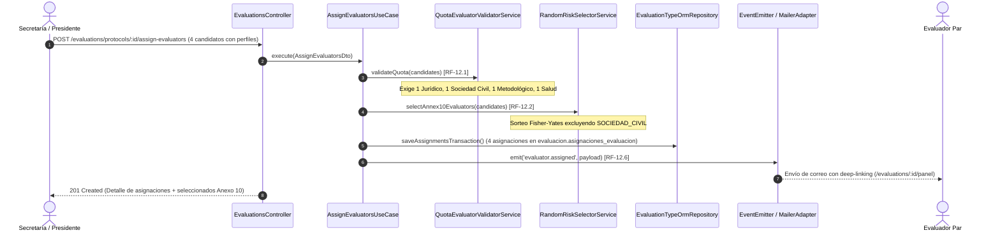
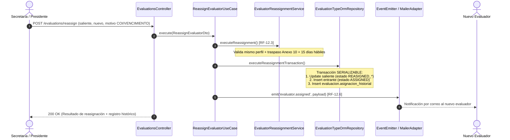
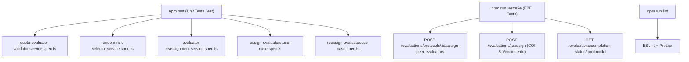

# Plan de Arquitectura y Diseño Técnico Brownfield: Flujo 002 — Asignación y Evaluación Par

**Código de Especificación:** `specs/002-flujo-mvp/spec.md` (v1.0.0)  
**Ubicación del Plan:** `specs/002-flujo-mvp/plan.md`  
**Estado:** Aprobado para Planificación Técnica  
**Documentos de Referencia:** `docs/doc_base/constitution_v2.md`, `specs/002-flujo-mvp/reconciliation.md`, Acta de Clarificación  
**Tipo de Plan:** PLAN DELTA (Evolución de Sistema Brownfield con Arquitectura Hexagonal y DDD)

---

## 1. Arquitectura Afectada

El módulo de evaluación (`src/modules/evaluations/`) y sus integraciones con `auth`, `protocols` y `notifications` constituyen el núcleo del flujo. Se preserva estrictamente la arquitectura hexagonal:

```text
src/
└── modules/
    ├── evaluations/
    │   ├── domain/                         # Lógica Pura y Reglas de Negocio
    │   │   ├── entities/                   # [ADAPTAR] EvaluationAssignmentEntity, AssignmentHistoryEntity
    │   │   ├── enums/                      # [MODIFICAR] AssignmentStatus (IDs numéricos de catalogos.estados)
    │   │   ├── ports/                      # [ADAPTAR] IEvaluationRepository (contratos transaccionales)
    │   │   └── services/                   # [REUTILIZAR] QuotaEvaluatorValidatorService, RandomRiskSelectorService
    │   │                                   # [ADAPTAR] EvaluatorReassignmentService
    │   ├── application/                    # Casos de Uso y Servicios Orquestadores
    │   │   ├── dtos/                       # [ADAPTAR] AssignEvaluatorsDto, ReassignEvaluatorDto (IDs numéricos)
    │   │   ├── use-cases/                  # [ADAPTAR] AssignEvaluatorsUseCase, ReassignEvaluatorUseCase,
    │   │   │                               #           SubmitEvaluationUseCase, InheritEvaluatorsUseCase
    │   │   └── services/                   # [MODIFICAR] EvaluationsService (delegación a casos de uso)
    │   └── infrastructure/                 # Adaptadores de Entrada/Salida y Persistencia
    │       ├── controllers/                # [ADAPTAR] EvaluationsController / EvaluationAssignmentController
    │       ├── database/                   # [MODIFICAR] EvaluationAssignmentOrmEntity
    │       │                               # [CREAR] AssignmentHistoryOrmEntity, Migración TypeORM Estados/Historial
    │       ├── repositories/               # [MODIFICAR] EvaluationTypeOrmRepository
    │       └── adapters/                   # [REUTILIZAR] MailerNotificationAdapter
    ├── notifications/                      # [REUTILIZAR] EmailServicePort y Dispatcher
    └── shared/                             # [REUTILIZAR] BusinessDayCalculator, Enums, Guards, Decoradores
```

---

## 2. Flujo Actual (As-Is)

1. La Secretaría consulta protocolos con recepción completa vía `GET /evaluations/protocols/pending-peer-assignment`.
2. Para asignar evaluadores, invoca `POST /evaluations/protocols/:id/assign-peer-evaluators` enviando un arreglo arbitrario de números (`evaluatorIds: number[]`).
3. El servicio `EvaluationsService.assignPeerEvaluators`:
   - Valida únicamente que haya al menos 4 evaluadores sin comprobar los perfiles requeridos (`JURIDICO`, `SOCIEDAD_CIVIL`, `METODOLOGICO`, `SALUD`).
   - Sortea 2 evaluadores aleatorios sin excluir al perfil `SOCIEDAD_CIVIL` y los guarda en `evaluacion.asignaciones_pares_riesgo`.
   - Crea registros en `evaluacion.asignaciones_evaluacion` con `estado_id = 5 (SUGERIDO)` o `6 (ASIGNADO)`.
   - No cuenta con mecanismo de sustitución/reasignación inmutable ni reinicio formal de plazos por `VENCIMIENTO` o `CONFLICTO_INTERES`. Si se reasignaba, se eliminaban físicamente los registros previos (`DELETE`).
4. Al evaluar, el evaluador envía el dictamen y se actualiza el estado a `7 (COMPLETADO)`.

---

## 3. Flujo Objetivo (To-Be Delta)





---

## 4. Cambios de Dominio

### Componentes de Dominio Reutilizables
* **[`QuotaEvaluatorValidatorService`](file:///C:/Users/Usuario/Desktop/8vo/API%20II/CEISH-ESPOCH/src/modules/evaluations/domain/services/quota-evaluator-validator.service.ts)**:
  * *Acción*: **REUTILIZAR**.
  * *Responsabilidad*: Valida que la lista contenga exactamente 4 evaluadores con la combinación única de 1 Jurídico, 1 Sociedad Civil, 1 Metodológico y 1 Salud.
* **[`RandomRiskSelectorService`](file:///C:/Users/Usuario/Desktop/8vo/API%20II/CEISH-ESPOCH/src/modules/evaluations/domain/services/random-risk-selector.service.ts)**:
  * *Acción*: **REUTILIZAR**.
  * *Responsabilidad*: Sorteo aleatorio Fisher-Yates de 2 evaluadores excluyendo estrictamente `SOCIEDAD_CIVIL`.

### Componentes de Dominio que Requieren Modificación / Adaptación
* **[`AssignmentStatus`](file:///C:/Users/Usuario/Desktop/8vo/API%20II/CEISH-ESPOCH/src/modules/evaluations/domain/enums/assignment-status.enum.ts)**:
  * *Acción*: **MODIFICAR**.
  * *Responsabilidad actual*: Enum numérico con valores `5, 6, 7, 8`.
  * *Cambio requerido*: Extender el enum con los valores numéricos correspondientes a `REASIGNED_VENCIMIENTO` (ej. `26`) y `REASIGNED_COI` (ej. `27`) que se insertarán en `catalogos.estados`.
  * *Motivo*: Soportar la persistencia de estados de reasignación inmutable con FK física a la base de datos (Opción A acordada).
* **[`EvaluatorReassignmentService`](file:///C:/Users/Usuario/Desktop/8vo/API%20II/CEISH-ESPOCH/src/modules/evaluations/domain/services/evaluator-reassignment.service.ts)**:
  * *Acción*: **ADAPTAR**.
  * *Responsabilidad actual*: Lógica pura de sustitución y reinicio de plazos.
  * *Cambio requerido*: Adaptar los tipos de identificadores de `string` a `number`, y referenciar los estados numéricos de `AssignmentStatus`.
  * *Motivo*: Alineación con el esquema de persistencia relacional.
* **[`EvaluationAssignmentEntity`](file:///C:/Users/Usuario/Desktop/8vo/API%20II/CEISH-ESPOCH/src/modules/evaluations/domain/entities/evaluation-assignment.entity.ts)** y **[`AssignmentHistoryEntity`](file:///C:/Users/Usuario/Desktop/8vo/API%20II/CEISH-ESPOCH/src/modules/evaluations/domain/entities/assignment-history.entity.ts)**:
  * *Acción*: **ADAPTAR**.
  * *Responsabilidad actual*: Entidades de dominio con tipado string/UUID.
  * *Cambio requerido*: Ajustar tipos a identificadores numéricos y métodos de dominio compatibles con el modelo relacional.
* **[`IEvaluationRepository`](file:///C:/Users/Usuario/Desktop/8vo/API%20II/CEISH-ESPOCH/src/modules/evaluations/domain/ports/evaluation.repository.port.ts)**:
  * *Acción*: **MODIFICAR**.
  * *Responsabilidad actual*: Puerto con métodos de consulta y guardado básico.
  * *Cambio requerido*: Declarar firmas para `saveAssignmentsTransaction(assignments: EvaluationAssignmentEntity[])`, `executeReassignmentTransaction(result: ReassignmentResult)` y `findActiveAssignmentsByVersionId(versionId: number)`.

---

## 5. Cambios de Aplicación

### Casos de Uso y DTOs
* **[`AssignEvaluatorsDto`](file:///C:/Users/Usuario/Desktop/8vo/API%20II/CEISH-ESPOCH/src/modules/evaluations/application/dtos/evaluator-dtos.ts)** y **[`ReassignEvaluatorDto`](file:///C:/Users/Usuario/Desktop/8vo/API%20II/CEISH-ESPOCH/src/modules/evaluations/application/dtos/evaluator-dtos.ts)**:
  * *Acción*: **ADAPTAR**.
  * *Responsabilidad actual*: DTOs con validaciones `class-validator`.
  * *Cambio requerido*: Ajustar campos `protocolId: number`, `evaluatorId: number`, `currentAssignmentId: number`, `replacementEvaluatorId: number`.
* **[`AssignEvaluatorsUseCase`](file:///C:/Users/Usuario/Desktop/8vo/API%20II/CEISH-ESPOCH/src/modules/evaluations/application/use-cases/assign-evaluators.use-case.ts)**:
  * *Acción*: **ADAPTAR**.
  * *Responsabilidad actual*: Orquestación de asignación atómica con UUIDs.
  * *Cambio requerido*: Conectar con `EvaluationTypeOrmRepository`, resolver `versionId` del protocolo, invocar `QuotaEvaluatorValidatorService` y `RandomRiskSelectorService`, calcular `deadlineDate` con `BusinessDayCalculator` (15 días hábiles), persistir y despachar evento `evaluator.assigned`.
* **[`ReassignEvaluatorUseCase`](file:///C:/Users/Usuario/Desktop/8vo/API%20II/CEISH-ESPOCH/src/modules/evaluations/application/use-cases/reassign-evaluator.use-case.ts)**:
  * *Acción*: **ADAPTAR**.
  * *Responsabilidad actual*: Orquestación de sustitución inmutable.
  * *Cambio requerido*: Conectar con `EvaluationTypeOrmRepository`, ejecutar `EvaluatorReassignmentService.executeReassignment`, ejecutar la transacción atómica y despachar evento de notificación.
* **[`SubmitEvaluationUseCase`](file:///C:/Users/Usuario/Desktop/8vo/API%20II/CEISH-ESPOCH/src/modules/evaluations/application/use-cases/submit-evaluation.use-case.ts)**:
  * *Acción*: **ADAPTAR**.
  * *Responsabilidad actual*: Validador de completitud del 100%.
  * *Cambio requerido*: Evaluar que las 4 asignaciones activas de la versión (`statusId === AssignmentStatus.COMPLETED`) hayan entregado su informe y anexos, ignorando las asignaciones en estado `REASIGNED_*`.
* **[`InheritEvaluatorsUseCase`](file:///C:/Users/Usuario/Desktop/8vo/API%20II/CEISH-ESPOCH/src/modules/evaluations/application/use-cases/inherit-evaluators.use-case.ts)**:
  * *Acción*: **ADAPTAR**.
  * *Responsabilidad actual*: Herencia de evaluadores para versiones v2.0.
  * *Cambio requerido*: Consultar los 4 evaluadores activos/vigentes de la versión $N-1$ y clonar sus asignaciones para la nueva versión $N$.
* **[`EvaluationsService`](file:///C:/Users/Usuario/Desktop/8vo/API%20II/CEISH-ESPOCH/src/modules/evaluations/application/services/evaluations.service.ts)**:
  * *Acción*: **MODIFICAR**.
  * *Responsabilidad actual*: Servicio monolítico con lógica procedural.
  * *Cambio requerido*: Delegar los flujos de asignación y reasignación hacia los use cases correspondientes.

---

## 6. Cambios de Infraestructura

* **[`EvaluationAssignmentOrmEntity`](file:///C:/Users/Usuario/Desktop/8vo/API%20II/CEISH-ESPOCH/src/modules/evaluations/infrastructure/database/evaluation-assignment.entity.orm.ts)**:
  * *Acción*: **MODIFICAR**.
  * *Responsabilidad actual*: Mapeo a `evaluacion.asignaciones_evaluacion`.
  * *Cambio requerido*: Añadir columna `@Column({ name: 'es_asignado_anexo_10', type: 'boolean', default: false }) isAssignedForAnnex10: boolean;`.
  * *Motivo*: Persistir directamente en la asignación si el evaluador fue seleccionado para la Estratificación del Riesgo (RF-12.2).
* **`AssignmentHistoryOrmEntity`** (`src/modules/evaluations/infrastructure/database/entities/assignment-history.orm-entity.ts`):
  * *Acción*: **ADAPTAR**.
  * *Responsabilidad actual*: Entidad TypeORM prototipo.
  * *Cambio requerido*: Mapear a la tabla real `evaluacion.asignacion_historial` con tipos relacionales `INTEGER` y claves foráneas correspondientes.
* **[`EvaluationTypeOrmRepository`](file:///C:/Users/Usuario/Desktop/8vo/API%20II/CEISH-ESPOCH/src/modules/evaluations/infrastructure/repositories/evaluation.typeorm.repository.ts)**:
  * *Acción*: **MODIFICAR**.
  * *Responsabilidad actual*: Repositorio TypeORM.
  * *Cambio requerido*: Implementar los métodos transaccionales usando `QueryRunner` para garantizar aislamiento `READ COMMITTED` / `SERIALIZABLE` en asignaciones y reasignaciones.
* **[`MailerNotificationAdapter`](file:///C:/Users/Usuario/Desktop/8vo/API%20II/CEISH-ESPOCH/src/modules/evaluations/infrastructure/adapters/mailer-notification.adapter.ts)**:
  * *Acción*: **REUTILIZAR**.
  * *Responsabilidad*: Despacho de notificaciones con formato de enlace directo (`/evaluations/:assignmentId/panel`).
* **[`EvaluationsModule`](file:///C:/Users/Usuario/Desktop/8vo/API%20II/CEISH-ESPOCH/src/modules/evaluations/evaluations.module.ts)**:
  * *Acción*: **MODIFICAR**.
  * *Responsabilidad actual*: Configuración del módulo de evaluaciones.
  * *Cambio requerido*: Declarar y exportar `AssignEvaluatorsUseCase`, `ReassignEvaluatorUseCase`, `SubmitEvaluationUseCase`, `InheritEvaluatorsUseCase`, `AssignmentHistoryOrmEntity`.

---

## 7. Cambios de Presentación (Frontend Integration)

Conforme a [`informe-brecha-evaluacion.md`](file:///C:/Users/Usuario/Desktop/8vo/API%20II/CEISH-ESPOCH/specs/002-flujo-mvp/informe-brecha-evaluacion.md):
1. **Workspace del Protocolo (`/dashboard/protocols/workspace/:id/info`)**:
   * Reemplazar selector genérico por el componente validado `FormularioAsignacionComponent` (exige 4 perfiles obligatorios).
   * Conectar la propiedad `isCompletion100Percent` para deshabilitar el botón "Emitir Resolución Final" si existen evaluaciones incompletas.
2. **Modal de Reasignación (`ModalReasignacionComponent`)**:
   * Consumir `POST /evaluations/reassign` enviando motivo (`VENCIMIENTO` / `CONFLICTO_INTERES`) y nuevo evaluador filtrado por el mismo perfil.
3. **Panel del Evaluador (`/evaluacion/:assignmentId/panel`)**:
   * Renderizar `BannerAnexo10Component` y `Annex10FormComponent` exclusivamente para evaluadores con `isAssignedForAnnex10 === true`.

---

## 8. Cambios de Base de Datos

### Archivo a Crear: Migración TypeORM
* **Ruta:** `src/migrations/1799000000000-AddReassignmentStatesAndHistoryTable.ts`
* **Responsabilidad:**
  1. Insertar en `catalogos.estados` (categoría `'EVALUACION'`):
     * `'REASIGNADO_VENCIMIENTO'` (Estado para evaluador sustituido por plazo expirado).
     * `'REASIGNADO_COI'` (Estado para evaluador sustituido por conflicto de interés).
  2. Agregar columna `es_asignado_anexo_10 BOOLEAN DEFAULT FALSE` en `evaluacion.asignaciones_evaluacion`.
  3. Crear tabla física `evaluacion.asignacion_historial`:
     ```sql
     CREATE TABLE evaluacion.asignacion_historial (
       id SERIAL PRIMARY KEY,
       asignacion_anterior_id INTEGER NOT NULL REFERENCES evaluacion.asignaciones_evaluacion(id),
       evaluador_anterior_id INTEGER NOT NULL REFERENCES auth.usuarios(id),
       perfil_id INTEGER REFERENCES catalogos.perfiles_evaluador(id),
       motivo VARCHAR(50) NOT NULL,
       justificacion TEXT,
       evaluador_nuevo_id INTEGER NOT NULL REFERENCES auth.usuarios(id),
       asignacion_nueva_id INTEGER REFERENCES evaluacion.asignaciones_evaluacion(id),
       ejecutado_por INTEGER NOT NULL REFERENCES auth.usuarios(id),
       creado_en TIMESTAMP DEFAULT CURRENT_TIMESTAMP
     );
     ```
* **Dependencias:** `catalogos.estados`, `evaluacion.asignaciones_evaluacion`, `auth.usuarios`.
* **Motivo de Creación:** No existe actualmente una tabla de historial de reasignaciones ni los estados extendidos en la BD de producción.

---

## 9. Cambios de API y Endpoints

### 1. Asignar 4 Evaluadores Pares
* **Ruta:** `POST /evaluations/protocols/:id/assign-peer-evaluators`
* **Seguridad:** `@Roles('SECRETARIA', 'PRESIDENTE')`, `@Permissions(Permission.EVALUATORS_ASSIGN)`, `@Audit('PEER_EVALUATORS_ASSIGNED')`.
* **Request Body:**
  ```json
  {
    "evaluators": [
      { "evaluatorId": 12, "profile": "JURIDICO" },
      { "evaluatorId": 15, "profile": "SOCIEDAD_CIVIL" },
      { "evaluatorId": 18, "profile": "METODOLOGICO" },
      { "evaluatorId": 22, "profile": "SALUD" }
    ]
  }
  ```
* **Respuesta (201 Created):** Lista de las 4 asignaciones con fechas límites (15 días hábiles) e indicación de los 2 designados para el Anexo 10.

### 2. Reasignar Evaluador (Inmutable por Vencimiento / COI)
* **Ruta:** `POST /evaluations/reassign`
* **Seguridad:** `@Roles('SECRETARIA', 'PRESIDENTE')`, `@Permissions(Permission.EVALUATORS_ASSIGN)`, `@Audit('EVALUATOR_REASSIGNED')`.
* **Request Body:**
  ```json
  {
    "currentAssignmentId": 101,
    "replacementEvaluatorId": 35,
    "replacementEvaluatorProfile": "METODOLOGICO",
    "reason": "CONFLICTO_INTERES",
    "observation": "Declaración voluntaria de cercanía académica con el coinvestigador."
  }
  ```
* **Respuesta (200 OK):** Detalle de la asignación saliente marcada, la nueva asignación creada con 15 días hábiles y el registro de bitácora generado.

### 3. Consultar Estado de Completitud
* **Ruta:** `GET /evaluations/completion-status/:protocolId`
* **Seguridad:** `@Roles('SECRETARIA', 'PRESIDENTE', 'EVALUADOR')`.
* **Respuesta (200 OK):**
  ```json
  {
    "protocolId": 164,
    "requiredEvaluators": 4,
    "submittedCount": 4,
    "isCompletion100Percent": true
  }
  ```

---

## 10. Estrategia de Pruebas



1. **Unit Tests (`npm test`)**:
   * Actualizar suites para verificar tipado numérico e IDs de estado numéricos.
   * Probar el rechazo si la cuota no contiene exactamente los 4 perfiles requeridos.
   * Probar que 100 sorteos consecutivos de Anexo 10 excluyan a `SOCIEDAD_CIVIL`.
   * Probar que la reasignación rechace un reemplazo con perfil heterogéneo.
2. **E2E Tests (`npm run test:e2e`)**:
   * Ejecución del ciclo completo sobre base de datos de pruebas (Asignar $\rightarrow$ Reasignar $\rightarrow$ Validar Completitud 100%).
3. **Linter & Formato (`npm run lint`, `npm run format`)**:
   * Cero advertencias ni tipos `any` en capas públicas.

---

## 11. Compatibilidad con Funcionalidades Existentes

* **Convocatorias y Sesiones:** La estructura de reuniones (`convocatorias`) y asignaciones se mantiene intacta.
* **Flujo de Recepción:** Se preserva la condición previa de que el protocolo tenga recepción `COMPLETO (10)` y términos de plazos aceptados.
* **Digitalización de Anexo 9:** El flujo de envío de evaluaciones (`submitEvaluation`) sigue persistiendo los detalles de checklist y subiendo los PDFs/DOCX a Cloudflare R2 sin alteraciones.
* **Consolidación de Dictámenes:** `EvaluationConsolidationService` sigue operando sobre `evaluacion.asignaciones_evaluacion`.

---

## 12. Matriz de Riesgos y Mitigación

| Riesgo Técnico | Impacto | Mitigación Arquitectónica |
| :--- | :--- | :--- |
| Violación de FK en `estado_id` | **ALTO** | Usar exclusivamente IDs numéricos sincronizados con `catalogos.estados` generados por migración. |
| Inconsistencia en reasignación concurrente | **ALTO** | Usar transacciones `SERIALIZABLE` con `QueryRunner` en `EvaluationTypeOrmRepository`. |
| Fallo en despacho SMTP bloqueando HTTP | **MEDIO** | Desacoplar el envío de correos mediante eventos asíncronos (`EventEmitter`). |
| Desalineación de IDs entre Frontend y Backend | **MEDIO** | Mantener los DTOs tipados en números y documentados en Swagger (`/docs`). |

---

## 13. Orden de Implementación Secuencial

```text
Fase 1: Persistencia y Migración (DB)
└── TSK-01: Crear migración TypeORM de estados y tabla de historial
    └── TSK-02: Actualizar AssignmentStatus y ORM entities

Fase 2: Dominio y Repositorio (Core)
└── TSK-03: Adaptar EvaluatorReassignmentService e interfaces de puerto
    └── TSK-04: Implementar métodos transaccionales en EvaluationTypeOrmRepository

Fase 3: Casos de Uso y Aplicación (Application)
└── TSK-05: Adaptar AssignEvaluatorsUseCase y DTOs
    └── TSK-06: Adaptar ReassignEvaluatorUseCase y DTOs
        └── TSK-07: Adaptar SubmitEvaluationUseCase e InheritEvaluatorsUseCase

Fase 4: Infraestructura y Controladores (Web API)
└── TSK-08: Configurar inyección de dependencias en EvaluationsModule
    └── TSK-09: Unificar endpoints en EvaluationsController con Guards y Auditoría

Fase 5: Validación y Verificación (QA)
└── TSK-10: Actualizar y ejecutar test suites unitarias (npm test)
    └── TSK-11: Ejecutar pruebas E2E y verificación de linter (npm run test:e2e, npm run lint)
```

---

## 14. Dependencias entre Tareas

* `TSK-01` y `TSK-02` bloquean a todas las demás tareas (fundamento de persistencia).
* `TSK-03` y `TSK-04` desbloquean la capa de aplicación (`TSK-05`, `TSK-06`, `TSK-07`).
* `TSK-08` y `TSK-09` requieren los use cases completados.
* `TSK-10` y `TSK-11` certifican el cierre bajo el **Definition of Done** de [`docs/doc_base/constitution_v2.md`](file:///C:/Users/Usuario/Desktop/8vo/API%20II/CEISH-ESPOCH/docs/doc_base/constitution_v2.md).
