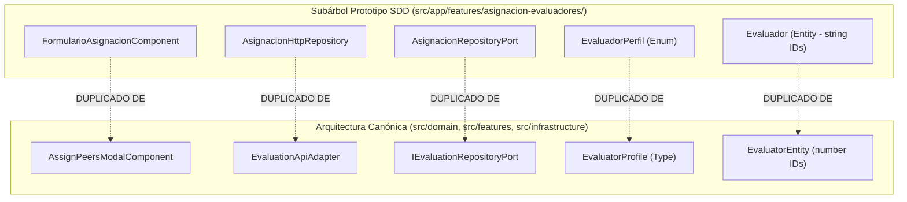

# Informe de Reconciliación Arquitectónica Frontend Brownfield (SDD)

**Código de Especificación:** `specs/002-flujo-mvp/spec.md` (v1.1.0 — Flujo 002: Asignación y Evaluación Par)  
**Ubicación del Documento:** `specs/002-flujo-mvp/reconciliation-frontend-asignacion.md`  
**Fecha:** 2026-09-28  
**Documentos de Referencia:** `specs/002-flujo-mvp/spec.md`, `specs/002-flujo-mvp/clarification.md`, `specs/002-flujo-mvp/plan-frontend-asignacion.md`, `specs/002-flujo-mvp/tasks-frontend-asignacion.md`, `specs/002-flujo-mvp/reconciliation.md`, `specs/002-flujo-mvp/informe-brecha-evaluacion.md`  
**Marco Metodológico:** Desarrollo Brownfield, Clean/Hexagonal Architecture, Domain-Driven Design (DDD), Spec-Driven Development (SDD).

---

## 1. Contexto

El sistema de gestión de protocolos y comités éticos **CEISH-ESPOCH** es un sistema **BROWNFIELD** en producción/desarrollo avanzado. Cuenta con una base de código frontend consolidada en Angular (v17+), estructurada mediante Standalone Components, Reactive Forms, Signals, RxJS, Angular Material y una arquitectura desacoplada por capas y Bounded Contexts (`domain/`, `features/`, `infrastructure/`, `shared/`).

La adopción de la especificación `specs/002-flujo-mvp/spec.md` introduce requerimientos estrictos para la asignación de evaluadores pares, control de cuotas por perfil profesional (`RF-12.1`), selección aleatoria automatizada para la Estratificación del Riesgo — Anexo 10 excluyendo de forma estricta e innegociable al evaluador con perfil `SOCIEDAD_CIVIL` (`RF-12.2`), mecanismo de reasignación inmutable y trazable por vencimiento o conflicto de interés (`RF-12.3`), validación de completitud del 100% (`RF-12.4`), herencia de evaluadores en resometimientos v2.0/v3.0 (`RF-12.5`) y notificaciones con deep-linking directo (`RF-12.6`).

El propósito de este informe es **reconciliar el estado real del frontend existente frente al plan y las tareas deseadas**, identificando qué elementos deben **REUTILIZARSE**, **MODIFICARSE**, **ADAPTARSE**, **CREARSE** o **VERIFICARSE**, previniendo la duplicación de código, desalineaciones de tipos (UUID vs INTEGER) y fragmentación de rutas.

---

## 2. Arquitectura Frontend Encontrada

### 2.1 Organización de Directorios Real
El proyecto real en `ceish-espoch-frontend/src/` implementa una arquitectura modular estratificada:

```text
ceish-espoch-frontend/src/
├── app/                                       # Shell principal de Angular
│   ├── app.component.ts                       # Componente raíz
│   ├── app.config.ts                          # Proveedores globales (HttpClient, Router, Animations)
│   ├── app.routes.ts                          # Enrutamiento raíz (/auth, /dashboard, redirects)
│   └── features/                              # [SUBÁRBOL SDD PROTOTIPO]
│       └── asignacion-evaluadores/            # Implementación aislada de 4 capas generada en SDD
│           ├── domain/                        # Entidades, Enums, Value Objects, Puertos
│           ├── application/                   # Casos de uso específicos
│           ├── infrastructure/                # DTOs, Mappers, Repositorios (HTTP y Mock)
│           └── presentation/                  # Páginas, Componentes, Guards, Rutas
│
├── domain/                                    # CAPA DE DOMINIO CANÓNICA / GLOBAL
│   ├── catalogs/                              # Catálogos maestros (dictamen, estados)
│   ├── entities/                              # Entidades de negocio (peer-evaluation, evaluation, evaluator, user)
│   ├── enums/                                 # Enums globales (protocol-status, protocol-type, evaluation-status)
│   ├── ports/                                 # Puertos de repositorio (IEvaluationRepositoryPort, IAuthRepositoryPort)
│   └── value-objects/                         # Value objects (protocol-code)
│
├── infrastructure/                            # CAPA DE INFRAESTRUCTURA CANÓNICA / GLOBAL
│   ├── adapters/                              # Adaptadores de API (evaluation-api.adapter.ts, protocol-api.adapter.ts)
│   ├── api/                                   # Cliente HTTP base y constantes (endpoints.constant.ts, api-client.service.ts)
│   ├── guards/                                # Guards globales (auth.guard.ts, role.guard.ts, verificado.guard.ts)
│   ├── interceptors/                          # Interceptores (jwt.interceptor.ts, error.interceptor.ts, audit.interceptor.ts)
│   ├── mappers/                               # Mappers DTO <-> Entity (evaluation.mapper.ts, user.mapper.ts)
│   ├── services/                              # Servicios auxiliares (s3-storage.service.ts, notification.service.ts)
│   └── storage/                               # Manejo de tokens y almacenamiento local cifrado
│
├── features/                                  # CAPA DE FEATURES CANÓNICA (Bounded Contexts)
│   ├── auth/                                  # Autenticación, login, registro, recuperación de clave
│   ├── dashboard/                             # Paneles por rol (Secretaría, Presidente, Evaluador, Investigador)
│   │   └── presentation/components/
│   │       └── assign-peers-modal/            # Modal real de asignación de 4 perfiles con cuota estricta
│   ├── evaluations/                           # Módulo funcional de evaluación y dictámenes
│   │   ├── application/                       # Casos de uso (submit-evaluation, load-pending-peers, etc.)
│   │   ├── presentation/                      # Páginas: assignment, evaluation-list, peer-risk-assessment,
│   │   │                                      # evaluation-form, evaluation-consolidation, subsanaciones
│   │   └── routes.ts                          # Rutas lazy-loaded del módulo de evaluación
│   ├── protocols/                             # Gestión documental y ciclo de vida de protocolos
│   ├── resolutions/                           # Emisión y firma de resoluciones y dictámenes
│   ├── amendments/                            # Enmiendas
│   ├── renewals/                              # Renovaciones
│   ├── reports/                               # Reportes e informes MSP
│   ├── audit/                                 # Pistas de auditoría y logs
│   ├── security/                              # Matriz de roles y permisos
│   └── notifications/                         # Bandeja y broker de notificaciones
│
└── shared/                                    # RECURSOS COMPARTIDOS
    ├── components/                            # File uploader, confirm dialog, loading, error banner
    ├── directives/                            # Permisos, auditoría
    ├── pipes/                                 # protocol-code.pipe.ts, date-format.pipe.ts
    ├── services/                              # date.service.ts
    └── utils/                                 # Resolutores de estados y etiquetas de UI
```

### 2.2 Patrones y Convenciones Arquitectónicas Reales
- **Aliases TypeScript (`tsconfig.json`)**: `@domain/*`, `@infrastructure/*`, `@features/*`, `@shared/*`, `@app/*`.
- **Inyección de Dependencias**: Uso sistemático de `inject()` de Angular 17+.
- **Gestión de Estado**: Angular Signals (`signal`, `computed`) complementado con Observables de RxJS para asincronía HTTP.
- **Formularios**: Reactive Forms (`FormGroup`, `FormControl`, `Validators`).
- **Seguridad y Control de Acceso**: `AuthGuard` con validación PBAC (`permissions: [...]`, `permissionStrategy: 'any' | 'all'`) y `RoleGuard` con validación RBAC multi-rol (`roles: [...]`).

---

## 3. Inventario de Funcionalidades Existentes

| Funcionalidad | Ubicación en Código Real | Descripción y Comportamiento Real |
| :--- | :--- | :--- |
| **Modal de Asignación de 4 Evaluadores (RF-12.1)** | `src/features/dashboard/presentation/components/assign-peers-modal/assign-peers-modal.component.ts` | Modal reactivo de Angular Material que permite a Secretaría asignar exactamente 1 evaluador por cada uno de los 4 perfiles requeridos (`JURIDICO`, `SOCIEDAD_CIVIL`, `METODOLOGICO`, `SALUD`). Valida duplicados, filtra listas de evaluadores disponibles con semáforo de carga activa, y muestra los 2 pares seleccionados aleatoriamente para Anexo 10 tras la respuesta del backend (excluyendo de forma estricta e innegociable al evaluador con perfil `SOCIEDAD_CIVIL`). |
| **Estratificación de Riesgo — Anexo 10 (RF-12.2)** | `src/features/evaluations/presentation/pages/peer-risk-assessment/peer-risk-assessment.page.ts` | Vista dedicada (`/dashboard/evaluations/evaluate-risk/:id`) para los evaluadores seleccionados para Anexo 10 (perfiles `JURIDICO`, `METODOLOGICO` o `SALUD`, excluyendo estrictamente `SOCIEDAD_CIVIL`). Permite calificar nivel de riesgo (PET 4.2.1), fundamentación técnica (mínimo 30 caracteres), carga de informe firmado a Cloudflare R2/S3 y envío mediante `SubmitPeerRiskAssessmentUseCase`. |
| **Formulario de Evaluación Par — Anexo 9 / Anexo 11 (RF-12.4)** | `src/features/evaluations/presentation/pages/evaluation-form/evaluation-form.page.ts` | Formulario extenso para dictamen ético/metodológico con checklist de criterios normativos, generación de borrador oficial (PDF y DOCX en tiempo real vía backend), carga del documento firmado y consolidación de dictámenes. |
| **Página de Redirección de Asignación** | `src/features/evaluations/presentation/pages/assignment/assignment.page.ts` | Componente standalone en `/dashboard/evaluations/assignment` que redirige a `/dashboard/home?tab=peers` para abrir el flujo de asignación. |
| **Consolidación de Evaluaciones (Anexo 12)** | `src/features/evaluations/presentation/pages/evaluation-consolidation/evaluation-consolidation.page.ts` | Vista administrativa para consolidar las 4 evaluaciones activas, detectar unanimidad o discrepancias y habilitar la fase de resolución. |
| **Dashboard de Secretaría con Radar y Carga** | `src/features/dashboard/presentation/pages/dashboard-secretaria/` | Panel operativo con radar de vencimientos, KPI panel y lista de protocolos pendientes de asignación. |
| **Módulo Prototipo SDD de Asignación y Reasignación** | `src/app/features/asignacion-evaluadores/` | Subárbol completo con Value Objects (`CuotaPerfilesVO`, `CodigoProtocoloVO`), Use Cases, DTOs, Mappers, Repositorios (`AsignacionHttpRepository`, `AsignacionMockRepository`), páginas (`AsignacionPageComponent`, `ReasignacionPageComponent`, `PanelEvaluadorPageComponent`), componentes (`ModalReasignacionComponent`, `TablaHistorialReasignacionesComponent`, `TarjetaEvaluadorComponent`, `BannerAnexo10Component`) y `EvaluadorDeepLinkGuard`. |

---

## 4. Inventario de Artefactos Reutilizables

1. **`AssignPeersModalComponent`** (`src/features/dashboard/presentation/components/assign-peers-modal/assign-peers-modal.component.ts`): Implementa el 100% de la UI del formulario de asignación de cuota estricta de 4 perfiles requerida por `RF-12.1`, con control de carga de trabajo y visualización de resultados del sorteo del Anexo 10 (`RF-12.2`, excluyendo de forma estricta e innegociable al perfil `SOCIEDAD_CIVIL`).
2. **`IEvaluationRepositoryPort`** (`src/domain/ports/IEvaluationRepositoryPort.ts`): Puerto canónico de evaluación que ya contiene firmas para `assignPeerEvaluators`, `getEvaluatorsDashboard`, `getPendingPeerAssignmentProtocols`, `getMyPendingPeerAssignments`, `submitPeerRiskProposed`.
3. **`EvaluationApiAdapter`** (`src/infrastructure/adapters/evaluation-api.adapter.ts`): Adaptador HTTP canónico conectado a `ENDPOINTS.EVALUATIONS.PEER_ASSIGNMENTS`.
4. **`CuotaPerfilesVO`** (`src/app/features/asignacion-evaluadores/domain/value-objects/cuota-perfiles.vo.ts`): Validador puro de dominio que comprueba la combinación exacta de los 4 perfiles profesionales sin duplicados.
5. **`CodigoProtocoloVO`** (`src/app/features/asignacion-evaluadores/domain/value-objects/codigo-protocolo.vo.ts`): Validador de formato de código institucional CEISH.
6. **`ModalReasignacionComponent`** (`src/app/features/asignacion-evaluadores/presentation/components/modal-reasignacion/modal-reasignacion.component.ts`): Componente modal que restringe los candidatos de reemplazo estrictamente al mismo perfil del evaluador saliente y exige justificación normativa (`RF-12.3`).
7. **`TablaHistorialReasignacionesComponent`** (`src/app/features/asignacion-evaluadores/presentation/components/tabla-historial-reasignaciones/tabla-historial-reasignaciones.component.ts`): Tabla de auditoría inmutable de sustituciones de evaluadores (`RF-12.3`).
8. **`BannerAnexo10Component`** (`src/app/features/asignacion-evaluadores/presentation/components/banner-anexo10/banner-anexo10.component.ts`): Banner visual informativo para alertar al evaluador cuando fue seleccionado para Anexo 10 (`RF-12.2`, `RF-12.6`).
9. **`AuthGuard` y `RoleGuard`** (`src/infrastructure/guards/`): Guards de seguridad y control de acceso robustos para PBAC y RBAC multi-rol.
10. **`S3StorageService`** (`src/infrastructure/services/s3-storage.service.ts`): Servicio centralizado de subida y generación de URLs firmadas en Cloudflare R2 / S3.

---

## 5. Matriz de Reconciliación Principal

| RF | Tarea Plan | Implementación Existente | Ubicación Real | Estado | Acción | Brecha / Justificación |
| :--- | :--- | :--- | :--- | :--- | :--- | :--- |
| **RF-12.1** (Cuota Estricta de 4 Evaluadores) | `TSK-FE-DOM-01`, `TSK-FE-DOM-05`, `TSK-FE-APP-01`, `TSK-FE-PRE-02` | `AssignPeersModalComponent` + `CuotaPerfilesVO` + `IEvaluationRepositoryPort.assignPeerEvaluators` | `src/features/dashboard/presentation/components/assign-peers-modal/`, `src/domain/ports/IEvaluationRepositoryPort.ts` | **COMPLETA** | **REUTILIZAR** | El modal de asignación ya existe, valida los 4 perfiles obligatorios (`JURIDICO`, `SOCIEDAD_CIVIL`, `METODOLOGICO`, `SALUD`) y consume la API canónica. No crear nuevo formulario ni duplicar vista. |
| **RF-12.2** (Selección Aleatoria Anexo 10 excluyendo Sociedad Civil) | `TSK-FE-DOM-03`, `TSK-FE-PRE-03`, `TSK-FE-PRE-06` | `AssignPeersModalComponent.successData` + `PeerRiskAssessmentPage` + `BannerAnexo10Component` | `src/features/dashboard/presentation/components/assign-peers-modal/`, `src/features/evaluations/presentation/pages/peer-risk-assessment/` | **COMPLETA** | **REUTILIZAR** | El backend ejecuta el sorteo Fisher-Yates excluyendo de forma estricta e innegociable al evaluador con perfil `SOCIEDAD_CIVIL` (la selección se realiza únicamente entre `JURIDICO`, `METODOLOGICO` y `SALUD`); el frontend renderiza los 2 evaluadores seleccionados y provee la vista de evaluación de riesgo para dichos perfiles técnicos. |
| **RF-12.3** (Reasignación Inmutable por Vencimiento o COI) | `TSK-FE-DOM-02`, `TSK-FE-APP-02`, `TSK-FE-PRE-04`, `TSK-FE-PRE-05`, `TSK-FE-PRE-09` | `ModalReasignacionComponent` + `TablaHistorialReasignacionesComponent` + `ReasignacionPageComponent` en `asignacion-evaluadores` | `src/app/features/asignacion-evaluadores/presentation/` | **PARCIAL** | **ADAPTAR** | La UI del modal y tabla de historial está desarrollada en el subárbol prototipo, pero debe trasladarse/integrarse al módulo canónico `@features/evaluations/` y conectarse con `IEvaluationRepositoryPort` y `EvaluationApiAdapter`. |
| **RF-12.4** (Completitud del 100% de Evaluaciones) | `TSK-FE-DOM-03`, `TSK-FE-PRE-07` | `EvaluationConsolidationPage` + `AsignacionPageComponent.completionPercentage` | `src/features/evaluations/presentation/pages/evaluation-consolidation/` | **PARCIAL** | **MODIFICAR** | `EvaluationConsolidationPage` ya comprueba que los 4 evaluadores hayan enviado su dictamen antes de emitir la resolución; se debe asegurar que ignore asignaciones inactivas (`REASIGNED_*`). |
| **RF-12.5** (Continuidad en Versiones Mayores v2.0) | `TSK-FE-INF-02` | `AsignacionMapper` + `InheritEvaluatorsUseCase` (Backend) | `src/infrastructure/mappers/` | **COMPLETA** (Backend) / **PARCIAL** (UI) | **VERIFICAR** | La herencia la gestiona el backend en la creación de la versión v2.0; el frontend solo requiere consultar la versión activa y mostrar los 4 evaluadores heredados. |
| **RF-12.6** (Notificaciones con Deep-Linking) | `TSK-FE-APP-03`, `TSK-FE-PRE-01`, `TSK-FE-PRE-08` | `EvaluadorDeepLinkGuard` + `EVALUATION_ROUTES` (`evaluate/:id`, `evaluate-risk/:id`) | `src/app/features/asignacion-evaluadores/presentation/guards/`, `src/features/evaluations/routes.ts` | **PARCIAL** | **MODIFICAR** | El guard de deep-linking existe en el prototipo pero redirige erróneamente a `/security/login` en lugar de `/auth/login` con `returnUrl`. Las rutas de evaluación ya existen bajo `/dashboard/evaluations/evaluate/:id`. |

---

## 6. Reconciliación por Dominio

| Elemento Propuesto | Existe | Ubicación Real | Equivalente / Coexistente | Estado | Acción | Justificación |
| :--- | :--- | :--- | :--- | :--- | :--- | :--- |
| **`AsignacionEvaluador`** | Sí | `src/app/features/asignacion-evaluadores/domain/entities/asignacion-evaluador.entity.ts` | `EvaluationAssignment` (`src/domain/ports/IEvaluationRepositoryPort.ts`) | Parcial / Duplicado | **ADAPTAR** | Unificar la interfaz en `@domain/entities/evaluation.entity.ts` agregando `isAssignedForAnnex10: boolean` y tipos numéricos de ID. |
| **`Evaluador`** | Sí | `src/app/features/asignacion-evaluadores/domain/entities/evaluador.entity.ts` | `EvaluatorEntity` (`src/domain/entities/evaluator.entity.ts`), `EvaluatorsDashboardEntry` | Duplicado | **ADAPTAR** | Reutilizar `EvaluatorEntity` canónica de `src/domain/entities/evaluator.entity.ts` asegurando compatibilidad con los 4 perfiles normalizados. |
| **`HistorialReasignacion`** | Sí | `src/app/features/asignacion-evaluadores/domain/entities/historial-reasignacion.entity.ts` | Ninguno en dominio canónico | Completo en prototipo | **ADAPTAR** | Mover la interfaz a `src/domain/entities/peer-evaluation.entity.ts` ajustando IDs a `number`. |
| **`ProtocoloAsignacionEstado`** | Sí | `src/app/features/asignacion-evaluadores/domain/entities/asignacion-evaluador.entity.ts` | `PendingPeerAssignmentProtocol` (`src/domain/entities/peer-evaluation.entity.ts`) | Parcial | **ADAPTAR** | Integrar los campos de progreso y asignaciones activas en `PendingPeerAssignmentProtocol`. |
| **`EvaluadorPerfil`** | Sí | `src/app/features/asignacion-evaluadores/domain/enums/evaluador-perfil.enum.ts` | `EvaluatorProfile` (`src/domain/entities/evaluator.entity.ts`) | Duplicado | **MODIFICAR** | Unificar el tipo/enum en `src/domain/entities/evaluator.entity.ts` con valores: `JURIDICO`, `SOCIEDAD_CIVIL`, `METODOLOGICO`, `SALUD`. |
| **`MotivoReasignacion`** | Sí | `src/app/features/asignacion-evaluadores/domain/enums/motivo-reasignacion.enum.ts` | Ninguno en dominio canónico | Completo en prototipo | **ADAPTAR** | Mover a `src/domain/enums/` con valores `VENCIMIENTO` y `CONFLICTO_INTERES`. |
| **`CodigoProtocoloVO`** | Sí | `src/app/features/asignacion-evaluadores/domain/value-objects/codigo-protocolo.vo.ts` | `ProtocolCodePipe` (`src/shared/pipes/protocol-code.pipe.ts`) | Completo en prototipo | **REUTILIZAR** | Trasladar a `src/domain/value-objects/protocol-code.vo.ts` como validador transversal. |
| **`CuotaPerfilesVO`** | Sí | `src/app/features/asignacion-evaluadores/domain/value-objects/cuota-perfiles.vo.ts` | Lógica inline en `AssignPeersModalComponent` | Completo en prototipo | **REUTILIZAR** | Trasladar a `src/domain/value-objects/cuota-perfiles.vo.ts` y usar en los componentes de asignación. |

---

## 7. Reconciliación por Aplicación (Use Cases)

| Caso de Uso Propuesto | Caso de Uso Existente | Ubicación | Estado | Acción | Justificación Técnica |
| :--- | :--- | :--- | :--- | :--- | :--- |
| **`AssignEvaluatorsUseCase`** (`AsignarEvaluadoresUseCase`) | `IEvaluationRepositoryPort.assignPeerEvaluators` consumido directamente por `AssignPeersModalComponent` | `src/features/dashboard/presentation/components/assign-peers-modal/`, `src/app/features/asignacion-evaluadores/application/use-cases/` | Completo | **ADAPTAR** | El modal en dashboard consume directamente el puerto de repositorio. Se puede formalizar `AssignPeerEvaluatorsUseCase` en `src/features/evaluations/application/` si se requiere pureza arquitectónica, o delegar al puerto. |
| **`ReassignEvaluatorUseCase`** (`ReasignarEvaluadorUseCase`) | `ReasignarEvaluadorUseCase` en prototipo SDD | `src/app/features/asignacion-evaluadores/application/use-cases/reasignar-evaluador.use-case.ts` | Prototipo | **ADAPTAR** | Mover a `src/features/evaluations/application/reassign-peer-evaluator.use-case.ts` inyectando `IEvaluationRepositoryPort`. |
| **`GetAssignmentPanelUseCase`** (`ObtenerPanelEvaluadorUseCase`) | `GetMyAssignmentsUseCase` + `LoadPendingPeerAssignmentsUseCase` | `src/features/evaluations/application/get-my-assignments.use-case.ts`, `src/features/evaluations/application/load-pending-peer-assignments.use-case.ts` | Completo | **REUTILIZAR** | Las páginas canónicas (`evaluation-form.page.ts` y `peer-risk-assessment.page.ts`) ya cargan la asignación y expediente mediante estos casos de uso canónicos. |
| **`GetAssignmentHistoryUseCase`** (`ObtenerHistorialReasignacionesUseCase`) | `ObtenerHistorialReasignacionesUseCase` en prototipo SDD | `src/app/features/asignacion-evaluadores/application/use-cases/obtener-historial-reasignaciones.use-case.ts` | Prototipo | **ADAPTAR** | Mover a `src/features/evaluations/application/load-assignment-history.use-case.ts` conectándolo al puerto canónico. |

---

## 8. Reconciliación por Infraestructura

### 8.1 Repositorios y Adaptadores HTTP
- **`EvaluationApiAdapter`** (`src/infrastructure/adapters/evaluation-api.adapter.ts`): Es el **adaptador HTTP principal y canónico** del frontend. Conectado a `ENDPOINTS.EVALUATIONS`.
- **`AsignacionHttpRepository`** (`src/app/features/asignacion-evaluadores/infrastructure/repositories/asignacion-http.repository.ts`): Repositorio creado en el subárbol prototipo que apunta a `/evaluations/assignments/*`.
- **`AsignacionMockRepository`** (`src/app/features/asignacion-evaluadores/infrastructure/repositories/asignacion-mock.repository.ts`): Mock en `localStorage`.

> [!IMPORTANT]
> **Decisión Brownfield**: **NO utilizar `AsignacionMockRepository`** en producción ni desarrollo integrado. La API NestJS backend ya cuenta con los endpoints reales implementados y probados. Toda la infraestructura debe consolidarse dentro de `EvaluationApiAdapter` implementando `IEvaluationRepositoryPort`.

### 8.2 DTOs y Mappers
- **DTOs canónicos existentes**: `src/domain/entities/peer-evaluation.entity.ts` (`AssignEvaluatorsResponse`, `PendingPeerAssignmentProtocol`, `PeerAssignmentEntity`), `src/domain/ports/IEvaluationRepositoryPort.ts` (`EvaluatorsDashboardResponse`, `SubmitEvaluationPayload`).
- **DTOs del prototipo**: `asignacion-request.dto.ts`, `asignacion-response.dto.ts`, `reasignacion-request.dto.ts`.
- **Acción**: Incorporar los DTOs de reasignación (`ReassignPeerEvaluatorDto`, `AssignmentHistoryResponseDto`) dentro de `src/infrastructure/` y mapearlos en `src/infrastructure/mappers/evaluation.mapper.ts`.

---

## 9. Reconciliación por Presentación (UI)

| Componente Propuesto | Componente Real Existente | Ubicación | Estado | Acción Reconciliatoria |
| :--- | :--- | :--- | :--- | :--- |
| **`FormularioAsignacionComponent`** | `AssignPeersModalComponent` | `src/features/dashboard/presentation/components/assign-peers-modal/assign-peers-modal.component.ts` | **EXISTE Y CUMPLE** | **REUTILIZAR**: El modal de asignación existente cumple 100% con los 4 perfiles, semáforo de carga, alertas de duplicidad y respuesta visual de Anexo 10. |
| **`TarjetaEvaluadorComponent`** | `TarjetaEvaluadorComponent` | `src/app/features/asignacion-evaluadores/presentation/components/tarjeta-evaluador/` | **EXISTE EN PROTOTIPO** | **ADAPTAR**: Mover a `src/features/evaluations/presentation/components/tarjeta-evaluador/` para usar en el panel de reasignación. |
| **`ModalReasignacionComponent`** | `ModalReasignacionComponent` | `src/app/features/asignacion-evaluadores/presentation/components/modal-reasignacion/` | **EXISTE EN PROTOTIPO** | **ADAPTAR**: Mover a `src/features/evaluations/presentation/components/modal-reasignacion/` y convertirlo en `MatDialog` estándar del sistema. |
| **`TablaHistorialReasignacionesComponent`** | `TablaHistorialReasignacionesComponent` | `src/app/features/asignacion-evaluadores/presentation/components/tabla-historial-reasignaciones/` | **EXISTE EN PROTOTIPO** | **ADAPTAR**: Mover a `src/features/evaluations/presentation/components/tabla-historial-reasignaciones/`. |
| **`BannerAnexo10Component`** | `BannerAnexo10Component` | `src/app/features/asignacion-evaluadores/presentation/components/banner-anexo10/` | **EXISTE EN PROTOTIPO** | **ADAPTAR**: Incorporar como banner informativo condicional en `src/features/evaluations/presentation/pages/evaluation-form/evaluation-form.page.ts`. |
| **`AsignacionPageComponent`** | `AssignmentPage` + `AssignPeersModalComponent` | `src/features/evaluations/presentation/pages/assignment/assignment.page.ts` | **EXISTE PARCIALMENTE** | **MODIFICAR**: `AssignmentPage` redirige actualmente al dashboard; debe permitir abrir directamente el modal de asignación para un `protocolId` específico si se navega directamente por URL. |
| **`PanelEvaluadorPageComponent`** | `EvaluationFormPage` + `PeerRiskAssessmentPage` | `src/features/evaluations/presentation/pages/evaluation-form/`, `src/features/evaluations/presentation/pages/peer-risk-assessment/` | **EXISTE Y CUMPLE** | **REUTILIZAR**: Las vistas completas de diligenciamiento de Anexo 9, Anexo 10 y Anexo 11 ya existen con subida de PDF firmado a R2 y descarga de borradores. |
| **`ReasignacionPageComponent`** | `ReasignacionPageComponent` | `src/app/features/asignacion-evaluadores/presentation/pages/reasignacion-page/` | **EXISTE EN PROTOTIPO** | **ADAPTAR**: Mover a `src/features/evaluations/presentation/pages/reassignment/reassignment.page.ts` y enlazar en `EVALUATION_ROUTES`. |

---

## 10. Reconciliación de Rutas

### 10.1 Comparativa de Rutas

| Ruta Propuesta en Plan | Ruta Canónica Real en Frontend | Guard Aplicado | Roles / Permisos Reales | Acción Necesaria |
| :--- | :--- | :--- | :--- | :--- |
| `/protocolo/:protocolId/asignar` | `/dashboard/evaluations/assignment` (o `/dashboard/evaluations/assignment/:protocolId`) | `AuthGuard` | `permissions: ['EVALUACION_ASIGNAR', 'EVALUATORS_ASSIGN']` | **MODIFICAR**: Permitir parámetro `:protocolId` opcional en la ruta de evaluación para abrir el modal directamente. |
| `/protocolo/:protocolId/reasignar` | `/dashboard/evaluations/reassignment/:protocolId` *(por registrar)* | `AuthGuard` | `permissions: ['EVALUACION_ASIGNAR', 'EVALUATORS_ASSIGN']` | **ADAPTAR**: Registrar la ruta `reassignment/:protocolId` dentro de `EVALUATION_ROUTES` (`src/features/evaluations/routes.ts`). |
| `/evaluacion/:assignmentId/panel` | `/dashboard/evaluations/evaluate/:id` y `/dashboard/evaluations/evaluate-risk/:id` | `AuthGuard` | `permissions: ['EVALUACION_COMPLETAR_FORMULARIO', 'EVALUACION_RIESGO']` | **MODIFICAR**: Añadir alias o redirección desde `/evaluacion/:assignmentId/panel` hacia `/dashboard/evaluations/evaluate/:id` para soportar deep-links de correos legacy. |

---

## 11. Reconciliación de Seguridad

### 11.1 Modelo de Seguridad Existente
El frontend implementa un esquema dual **RBAC** (Role-Based Access Control) y **PBAC** (Permission-Based Access Control) gestionado por `AuthFacade` (`src/features/auth/facades/auth.facade.ts`):
- **`AuthGuard`** (`src/infrastructure/guards/auth.guard.ts`):
  1. Verifica autenticación vía `TokenStoreAdapter` (JWT en localStorage).
  2. Si no está autenticado, redirige a `/auth/login`.
  3. Verifica permisos declarados en `route.data['permissions']` con estrategia `'any'` o `'all'`. Soporta bypass automático con permiso `'ADMIN_ALL'`.
- **`RoleGuard`** (`src/infrastructure/guards/role.guard.ts`):
  1. Verifica si el usuario cuenta con alguno de los roles declarados en `route.data['roles']` (ej: `['SECRETARIA', 'PRESIDENTA', 'EVALUADOR']`).
  2. Si no cumple, redirige a `/dashboard`.

### 11.2 Acceso por Rol según la SPEC
- **Secretaría / Presidenta**: Acceso a `/dashboard/evaluations/assignment` y `/dashboard/evaluations/reassignment/:protocolId` con permisos `EVALUACION_ASIGNAR`, `EVALUATORS_ASSIGN`.
- **Evaluador Par**: Acceso exclusivo a sus asignaciones en `/dashboard/evaluations/list`, `/dashboard/evaluations/evaluate/:id` y `/dashboard/evaluations/evaluate-risk/:id` con permisos `EVALUACION_COMPLETAR_FORMULARIO`, `EVALUACION_RIESGO`.
- **Investigador**: Bloqueado de toda ruta de asignación y evaluación par; acceso únicamente a `/dashboard/investigador/*`.

---

## 12. Reconciliación de API y Endpoints

| Método | Endpoint Backend Real | Adaptador / Servicio Frontend | DTO Request / Response | Consumidor UI | Estado |
| :--- | :--- | :--- | :--- | :--- | :--- |
| `GET` | `/evaluations/evaluators/dashboard` | `EvaluationApiAdapter.getEvaluatorsDashboard` | `EvaluatorsDashboardResponse` | `AssignPeersModalComponent`, `EvaluatorLoadComponent` | **Operativo** |
| `GET` | `/evaluations/protocols/pending-peer-assignment` | `EvaluationApiAdapter.getPendingPeerAssignmentProtocols` | `PendingPeerAssignmentProtocol[]` | `DashboardSecretariaPage` | **Operativo** |
| `POST` | `/evaluations/protocols/:id/assign-peer-evaluators` | `EvaluationApiAdapter.assignPeerEvaluators` | `{ evaluatorIds: number[] }` ➔ `AssignEvaluatorsResponse` | `AssignPeersModalComponent` | **Operativo** |
| `POST` | `/api/evaluations/reassign` | *(Pendiente en `EvaluationApiAdapter`)* | `ReassignEvaluatorDto` ➔ `ReassignEvaluatorResponse` | `ModalReasignacionComponent` | **Requiere Integración** |
| `GET` | `/evaluations/my-assignments` | `EvaluationApiAdapter.getMyAssignments` | `EvaluationAssignment[]` | `EvaluationListPage`, `EvaluationFormPage` | **Operativo** |
| `POST` | `/evaluations/submit` | `EvaluationApiAdapter.submitEvaluation` | `SubmitEvaluationPayload` ➔ `{ message, assignmentId }` | `EvaluationFormPage` | **Operativo** |
| `GET` | `/evaluations/peer-assignments/my-pending` | `EvaluationApiAdapter.getMyPendingPeerAssignments` | `PeerAssignmentEntity[]` | `PeerRiskAssessmentPage` | **Operativo** |
| `POST` | `/evaluations/peer-assignments/:id/submit-risk` | `EvaluationApiAdapter.submitPeerRiskProposed` | `{ riskLevelId, observations, reportPath }` | `PeerRiskAssessmentPage` | **Operativo** |
| `GET` | `/evaluations/consolidate/:id` | `EvaluationApiAdapter.consolidateEvaluation` | `ConsolidatedEvaluationResponse` | `EvaluationConsolidationPage` | **Operativo** |

---

## 13. Reconciliación de Tipos (Frontend vs Backend)

| Campo / Identificador | Tipo en Prototipo SDD | Tipo Canónico Backend y BD | Tipo en Frontend Real | Diagnóstico e Impacto |
| :--- | :--- | :--- | :--- | :--- |
| `protocolId` / `protocol.id` | `string` (UUID) | `INTEGER` (`number`) | `number` / `string` (vía route param) | Requiere parseo explícito `Number(protocolId)` al enviar payloads a la API. |
| `evaluatorId` / `evaluador_id` | `string` (UUID) | `INTEGER` (`number`) | `number` (en `AssignPeersModalComponent`) | Perfectamente alineado en el modal real; el prototipo usaba strings. |
| `assignmentId` / `id` | `string` (UUID) | `INTEGER` (`number`) | `number` / `string` | Rutas aceptan string de URL; llamadas a API requieren `Number(assignmentId)`. |
| `profile` / `perfil` | `EvaluadorPerfil` (Enum) | `catalogos.perfiles_evaluador` (`VARCHAR`/`INT`) | `'JURIDICO' \| 'SOCIEDAD_CIVIL' \| 'METODOLOGICO' \| 'SALUD'` | Alineado. La normalización en `AssignPeersModalComponent` mapea variaciones textuales a los 4 perfiles canónicos. |
| `status` / `estado_id` | `AsignacionEstado` (String) | `catalogos.estados` (`INTEGER` FK) | `number` (FK) / `string` (etiqueta UI) | Resuelto mediante `estado.resolver.ts` y DTOs del backend. |
| `deadlineDate` / `fecha_limite` | `Date` | `TIMESTAMP WITH TIME ZONE` (`string` ISO) | `string` (ISO) / `Date` | Mapeado correctamente con `new Date()` o pipes de fecha de Angular. |

---

## 14. Reconciliación de Tests

### 14.1 Suites Existentes en el Frontend
El frontend cuenta con más de **45 suites de pruebas unitarias** (`.spec.ts`) en verde:
1. `src/features/dashboard/presentation/components/assign-peers-modal/assign-peers-modal.component.spec.ts`: Prueba validación de 4 perfiles, detección de duplicados y asignación.
2. `src/features/evaluations/presentation/pages/peer-risk-assessment/peer-risk-assessment.page.ts`: Cobertura de la evaluación de riesgo.
3. `src/features/evaluations/application/submit-evaluation.use-case.spec.ts`: Cobertura del envío de dictámenes.
4. `src/app/features/asignacion-evaluadores/**/*.spec.ts`: 25 suites unitarias que cubren `CuotaPerfilesVO`, `CodigoProtocoloVO`, Use Cases, Repositorios Mock/HTTP y componentes del subárbol prototipo.

---

## 15. Tareas ya Completadas

| Tarea | Estado en `tasks-frontend-asignacion.md` | Estado Real | Evidencia en Código | Acción |
| :--- | :--- | :--- | :--- | :--- |
| **`TSK-FE-DOM-01`** (Enums de perfiles y estados) | `[x]` | **COMPLETA** | `src/app/features/asignacion-evaluadores/domain/enums/evaluador-perfil.enum.ts` y `src/domain/entities/evaluator.entity.ts`. | **REUTILIZAR** |
| **`TSK-FE-DOM-04`** (`CodigoProtocoloVO`) | `[x]` | **COMPLETA** | `src/app/features/asignacion-evaluadores/domain/value-objects/codigo-protocolo.vo.ts`. | **REUTILIZAR** |
| **`TSK-FE-DOM-05`** (`CuotaPerfilesVO`) | `[x]` | **COMPLETA** | `src/app/features/asignacion-evaluadores/domain/value-objects/cuota-perfiles.vo.ts`. | **REUTILIZAR** |
| **`TSK-FE-PRE-02`** (Formulario de Asignación) | `[x]` | **COMPLETA** | `src/features/dashboard/presentation/components/assign-peers-modal/assign-peers-modal.component.ts`. | **REUTILIZAR** |
| **`TSK-FE-TST-01`** (Test de `CuotaPerfilesVO`) | `[x]` | **COMPLETA** | `src/app/features/asignacion-evaluadores/domain/value-objects/cuota-perfiles.vo.spec.ts`. | **REUTILIZAR** |
| **`TSK-FE-TST-05`** (Test del Formulario de Asignación) | `[x]` | **COMPLETA** | `src/features/dashboard/presentation/components/assign-peers-modal/assign-peers-modal.component.spec.ts`. | **REUTILIZAR** |

---

## 16. Tareas Parciales

| Tarea | Estado en `tasks` | Estado Real | Brecha Detectada | Acción |
| :--- | :--- | :--- | :--- | :--- |
| **`TSK-FE-DOM-02`** (`Evaluador` e `HistorialReasignacion`) | `[x]` | **PARCIAL** | Las entidades están creadas en `src/app/features/asignacion-evaluadores/domain/` con IDs tipo `string`. Deben trasladarse a `src/domain/entities/` con IDs numéricos. | **ADAPTAR** |
| **`TSK-FE-DOM-03`** (`AsignacionEvaluador` y `ProtocoloAsignacionEstado`) | `[x]` | **PARCIAL** | Coexisten con `EvaluationAssignment` y `PendingPeerAssignmentProtocol` en `src/domain/`. Requiere unificación. | **ADAPTAR** |
| **`TSK-FE-APP-02`** (`ReasignarEvaluadorUseCase`) | `[x]` | **PARCIAL** | Implementado en el prototipo; requiere conectarse a `IEvaluationRepositoryPort` canónico. | **ADAPTAR** |
| **`TSK-FE-APP-04`** (`ObtenerHistorialReasignacionesUseCase`) | `[x]` | **PARCIAL** | Implementado en el prototipo; requiere conectarse a `IEvaluationRepositoryPort` canónico. | **ADAPTAR** |
| **`TSK-FE-INF-01`** (DTOs de API Backend) | `[x]` | **PARCIAL** | DTOs de reasignación existen en prototipo; falta agregarlos a la API canónica. | **ADAPTAR** |
| **`TSK-FE-PRE-01`** (`EvaluadorDeepLinkGuard`) | `[x]` | **PARCIAL** | Redirige a `/security/login` (ruta inexistente) en vez de `/auth/login`. | **MODIFICAR** |
| **`TSK-FE-PRE-04`** (`ModalReasignacionComponent`) | `[x]` | **PARCIAL** | Creado en prototipo; debe adaptarse como `MatDialog` e integrarse al módulo canónico. | **ADAPTAR** |
| **`TSK-FE-PRE-05`** (`TablaHistorialReasignacionesComponent`) | `[x]` | **PARCIAL** | Creado en prototipo; debe integrarse en la página de reasignación canónica. | **ADAPTAR** |
| **`TSK-FE-PRE-09`** (`ReasignacionPageComponent`) | `[x]` | **PARCIAL** | Creado en prototipo; debe registrarse en `EVALUATION_ROUTES`. | **ADAPTAR** |

---

## 17. Tareas Pendientes

| Tarea | Descripción | Estado Real | Requisito Relacionado |
| :--- | :--- | :--- | :--- |
| **Integración de Reasignación en `IEvaluationRepositoryPort`** | Agregar métodos `reassignPeerEvaluator` y `getReassignmentHistory` a `IEvaluationRepositoryPort` y `EvaluationApiAdapter`. | **PENDIENTE** | `RF-12.3` |
| **Registro de Ruta de Reasignación en `EVALUATION_ROUTES`** | Registrar la ruta `/dashboard/evaluations/reassignment/:protocolId` en `src/features/evaluations/routes.ts`. | **PENDIENTE** | `RF-12.3` |
| **Corrección de Deep-Link Guard** | Ajustar `EvaluadorDeepLinkGuard` para redirigir a `/auth/login` con `returnUrl` y soportar `evaluate/:id` y `evaluate-risk/:id`. | **PENDIENTE** | `RF-12.6` |

---

## 18. Duplicaciones Detectadas



1. **Formulario de Asignación:**
   - *Ubicación A:* `src/app/features/asignacion-evaluadores/presentation/components/formulario-asignacion/`
   - *Ubicación B:* `src/features/dashboard/presentation/components/assign-peers-modal/assign-peers-modal.component.ts`
   - *Responsabilidad:* Asignar la cuota de 4 evaluadores.
   - *Riesgo:* Tener dos formularios desincronizados. La ubicación B es la que está conectada al dashboard operativo.
2. **Adaptador de Repositorio:**
   - *Ubicación A:* `src/app/features/asignacion-evaluadores/infrastructure/repositories/asignacion-http.repository.ts`
   - *Ubicación B:* `src/infrastructure/adapters/evaluation-api.adapter.ts`
   - *Responsabilidad:* Comunicación HTTP con el backend de evaluaciones.
   - *Riesgo:* Fragmentación de endpoints y headers de autorización.

---

## 19. Incompatibilidades Detectadas

1. **Tipado de Identificadores (UUID `string` vs `number` INTEGER):**
   - El subárbol prototipo SDD modeló `protocolId`, `evaluatorId` y `assignmentId` como `string`. La base de datos real PostgreSQL y los adaptadores canónicos operan con `number` (INTEGER autoincremental).
2. **Ruta de Login en Deep-Linking:**
   - `EvaluadorDeepLinkGuard` redirige a `/security/login` (inexistente). La ruta real de autenticación es `/auth/login`.
3. **Estructura de Rutas y Menú:**
   - `ASIGNACION_EVALUADORES_ROUTES` declara rutas en la raíz `/protocolo/:protocolId/asignar`, mientras que el layout principal opera bajo `/dashboard/*` protegido por el shell de navegación.

---

## 20. Brechas contra la SPEC

1. **Flujo de Reasignación en el Menú Principal (RF-12.3):**
   - El backend ya cuenta con `ReassignEvaluatorUseCase` y la tabla `evaluacion.asignacion_historial`, y el frontend tiene los componentes `ModalReasignacionComponent` y `TablaHistorialReasignacionesComponent`, pero **no están expuestos en las rutas de `@features/evaluations`**.
2. **Visualización de la Bandera Anexo 10 en la Lista de Evaluaciones (RF-12.2, RF-12.6):**
   - En `EvaluationListPage`, los evaluadores asignados al Anexo 10 deben contar con una insignia distintiva que los dirija a `evaluate-risk/:id`.

---

## 21. Riesgos

1. **Riesgo de Ruptura de Tipos en Runtime:** Si se envían IDs como cadenas UUID a endpoints que esperan integers en backend, PostgreSQL lanzará excepciones `invalid input syntax for type integer`.
2. **Riesgo de Desorientación por Deep-Link Roto:** Si el evaluador hace clic en el enlace del correo y es redirigido a `/security/login`, recibirá un error 404 / redirección infinita.
3. **Riesgo de Deuda Técnica por Doble Módulo:** Mantener código duplicado en `src/app/features/asignacion-evaluadores/` y `src/features/evaluations/` confundirá a los desarrolladores y duplicará el costo de mantenimiento.

---

## 22. Recomendaciones para `plan-frontend-asignacion.md`

1. **Ajustar la Ruta Base del Feature:**
   - Cambiar la ubicación objetivo de `src/app/features/asignacion-evaluadores/` a la estructura canónica:
     - Componentes y páginas en `src/features/evaluations/presentation/` y `src/features/dashboard/presentation/`.
     - Casos de uso en `src/features/evaluations/application/`.
     - Puertos y entidades en `src/domain/`.
     - Adaptadores en `src/infrastructure/adapters/`.
2. **Reutilizar `AssignPeersModalComponent` como Fuente de Verdad para Asignación:**
   - No crear un nuevo `FormularioAsignacionComponent`. Utilizar y extender `AssignPeersModalComponent`.
3. **Unificar Repositorios en `EvaluationApiAdapter`:**
   - Extender `IEvaluationRepositoryPort` y `EvaluationApiAdapter` con los métodos de reasignación e historial, eliminando la necesidad de `AsignacionHttpRepository` y `AsignacionMockRepository`.
4. **Corregir Deep-Linking en `EvaluadorDeepLinkGuard`:**
   - Actualizar la redirección hacia `/auth/login` con queryParam `returnUrl`.

---

## 23. Recomendaciones para `tasks-frontend-asignacion.md`

1. **Reclasificar Tareas según el Enfoque Brownfield:**
   - Marcar tareas de formulario de asignación como **REUTILIZADAS** contra `AssignPeersModalComponent`.
   - Enfocar las tareas pendientes exclusivamente en la **adaptación e integración de la reasignación**, el **historial de auditoría** y la **corrección del deep-linking**.
2. **Actualizar Rutas de Archivos en las Tareas:**
   - Modificar las rutas de `ceish-espoch-frontend/src/app/features/asignacion-evaluadores/...` para apuntar a las carpetas canónicas `@features/evaluations/`, `@domain/` e `@infrastructure/`.
3. **Ajustar Tipos en Tareas:**
   - Garantizar que todas las interfaces y DTOs utilicen `number` para identificadores de protocolo, asignación y evaluador.

---

## 24. Componentes que Realmente Deben Crearse / Adaptarse

Conforme al principio **Brownfield First**, únicamente deben crearse o trasladarse formalmente los siguientes artefactos:

1. **Artefactos a Adaptar e Integrar en `@features/evaluations`:**
   - **`reassign-peer-evaluator.use-case.ts`** (`src/features/evaluations/application/`): Caso de uso para reasignación inmutable.
   - **`load-assignment-history.use-case.ts`** (`src/features/evaluations/application/`): Caso de uso para consultar el historial inmutable.
   - **`modal-reasignacion.component.ts`** (`src/features/evaluations/presentation/components/modal-reasignacion/`): Diálogo modal para seleccionar motivo (`VENCIMIENTO` o `CONFLICTO_INTERES`) y filtrar evaluadores del mismo perfil.
   - **`tabla-historial-reasignaciones.component.ts`** (`src/features/evaluations/presentation/components/tabla-historial-reasignaciones/`): Tabla de auditoría inmutable.
   - **`reassignment.page.ts`** (`src/features/evaluations/presentation/pages/reassignment/`): Página que integra las tarjetas de los 4 evaluadores activos y la tabla de auditoría.
2. **Métodos a Agregar en Infraestructura Canónica:**
   - Extender **`IEvaluationRepositoryPort`** y **`EvaluationApiAdapter`** con `reassignPeerEvaluator(payload)` y `getAssignmentHistory(protocolId)`.
3. **Ruta a Registrar:**
   - Agregar `{ path: 'reassignment/:protocolId', component: ReassignmentPage, canActivate: [AuthGuard], data: { permissions: ['EVALUACION_ASIGNAR'] } }` en `src/features/evaluations/routes.ts`.

---

> [!NOTE]
> **Fin del Documento de Reconciliación Frontend**. Este análisis proporciona la hoja de ruta exacta para alinear el plan y las tareas sin generar duplicaciones ni alterar la arquitectura canónica del sistema CEISH-ESPOCH.
