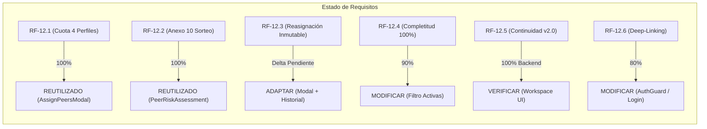
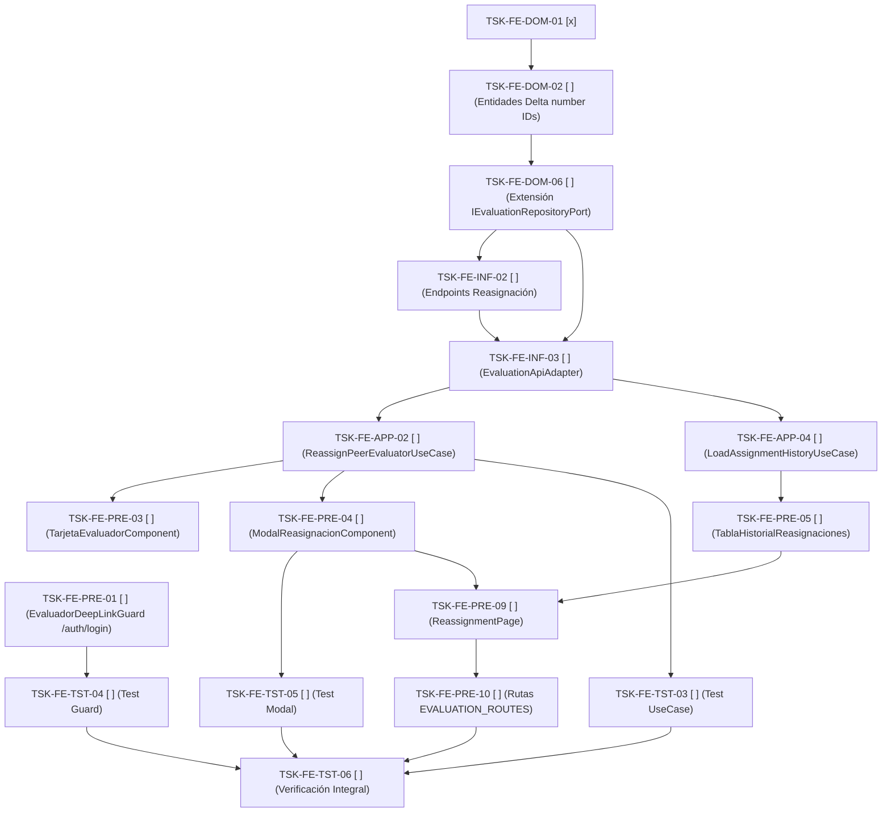

# Lista de Tareas Frontend Delta: Módulo de Asignación y Evaluación Par (Brownfield SDD)

**Código de Especificación Activa:** `specs/002-flujo-mvp/spec.md` (v1.0.0 — Flujo 002: Asignación y Evaluación Par)  
**Ubicación del Plan Frontend:** `specs/002-flujo-mvp/plan-frontend-asignacion.md`  
**Ubicación de Tareas Frontend:** `specs/002-flujo-mvp/tasks-frontend-asignacion.md`  
**Documento de Reconciliación:** `specs/002-flujo-mvp/reconciliation-frontend-asignacion.md`  
**Base Arquitectónica Canónica:** `src/domain/`, `src/infrastructure/`, `src/features/evaluations/`, `src/features/dashboard/`  
**Marco Metodológico:** Clean Architecture, DDD, SDD, Principio Brownfield First (Constitution v2).  

---

## 1. Contexto Brownfield

El sistema **CEISH-ESPOCH** es un proyecto en estado **BROWNFIELD** con una base de código avanzada en Angular 17+ (Standalone Components, Signals, Reactive Forms, Material Design, Clean Architecture canónica).

El presente documento de tareas define el **Delta Real y Quirúrgico** necesario para alcanzar el 100% de conformidad con la especificación `specs/002-flujo-mvp/spec.md` (RF-12.1 a RF-12.6).

### Principios Rectores:
1. **Reutilizar lo que ya existe y funciona**: `AssignPeersModalComponent` (asignación 4 perfiles), `PeerRiskAssessmentPage` (Anexo 10), `EvaluationFormPage` (Anexo 9), `EvaluationConsolidationPage` (Anexo 12).
2. **Adaptar desde el subárbol prototipo SDD**: Trasladar e integrar la reasignación inmutable y la bitácora de auditoría desde `src/app/features/asignacion-evaluadores/` hacia el módulo canónico `src/features/evaluations/`.
3. **No romper contratos reales**: Respetar los identificadores numéricos (`number` / PostgreSQL `INTEGER`) y los endpoints reales del backend NestJS.
4. **Cero Mocks en producción**: Consolidar toda la persistencia en `EvaluationApiAdapter`.

---

## 2. Reglas de Ejecución

- **Aislamiento**: Implementar **únicamente una tarea a la vez**, ejecutando sus pruebas asociadas antes de avanzar a la siguiente.
- **Semántica de `[x]`**: Tarea verificada y confirmada en código real. No se reinicia ni se duplica.
- **Semántica de `[ ]`**: Tarea delta pendiente de implementación o adaptación.
- **No eliminación en esta fase**: El subárbol prototipo `src/app/features/asignacion-evaluadores/` se conserva temporalmente hasta completar la integración y validación integral sin regresiones.

---

## 3. Estado Actual de Conformidad



---

## 4. Matriz de Tareas

| ID | RF | Acción | Archivo / Componente | Estado | Dependencias |
| :--- | :--- | :--- | :--- | :--- | :--- |
| **TSK-FE-DOM-01** | RF-12.1, RF-12.3 | **REUTILIZAR / VERIFICAR** | `src/domain/entities/evaluator.entity.ts` | `[x]` | Ninguna |
| **TSK-FE-DOM-02** | RF-12.3 | **ADAPTAR** | `src/domain/entities/peer-evaluation.entity.ts` | `[ ]` | TSK-FE-DOM-01 |
| **TSK-FE-DOM-03** | RF-12.1, RF-12.2, RF-12.4 | **REUTILIZAR / ADAPTAR** | `src/domain/entities/peer-evaluation.entity.ts` | `[x]` | Ninguna |
| **TSK-FE-DOM-04** | RF-12.1 | **REUTILIZAR** | `src/domain/value-objects/protocol-code.vo.ts` | `[x]` | Ninguna |
| **TSK-FE-DOM-05** | RF-12.1 | **ADAPTAR / REUTILIZAR** | `src/domain/value-objects/cuota-perfiles.vo.ts` | `[x]` | Ninguna |
| **TSK-FE-DOM-06** | RF-12.3 | **MODIFICAR** | `src/domain/ports/IEvaluationRepositoryPort.ts` | `[ ]` | TSK-FE-DOM-02 |
| **TSK-FE-INF-01** | RF-12.3 | **MODIFICAR** | `src/domain/entities/peer-evaluation.entity.ts` | `[ ]` | TSK-FE-DOM-02 |
| **TSK-FE-INF-02** | RF-12.3 | **MODIFICAR** | `src/infrastructure/api/endpoints.constant.ts` | `[ ]` | TSK-FE-DOM-06 |
| **TSK-FE-INF-03** | RF-12.3 | **MODIFICAR** | `src/infrastructure/adapters/evaluation-api.adapter.ts` | `[ ]` | TSK-FE-DOM-06, TSK-FE-INF-02 |
| **TSK-FE-INF-04** | N/A | **VERIFICAR** | `src/infrastructure/adapters/evaluation-api.adapter.ts` (Deprecar Mock) | `[x]` | Ninguna |
| **TSK-FE-APP-01** | RF-12.1, RF-12.2 | **REUTILIZAR** | `src/features/dashboard/presentation/components/assign-peers-modal/` | `[x]` | Ninguna |
| **TSK-FE-APP-02** | RF-12.3 | **ADAPTAR** | `src/features/evaluations/application/reassign-peer-evaluator.use-case.ts` | `[ ]` | TSK-FE-INF-03 |
| **TSK-FE-APP-03** | RF-12.2, RF-12.6 | **REUTILIZAR** | `src/features/evaluations/application/load-pending-peer-assignments.use-case.ts` | `[x]` | Ninguna |
| **TSK-FE-APP-04** | RF-12.3 | **ADAPTAR** | `src/features/evaluations/application/load-assignment-history.use-case.ts` | `[ ]` | TSK-FE-INF-03 |
| **TSK-FE-PRE-01** | RF-12.6 | **MODIFICAR** | `src/infrastructure/guards/evaluador-deep-link.guard.ts` | `[ ]` | Ninguna |
| **TSK-FE-PRE-02** | RF-12.1 | **REUTILIZAR** | `src/features/dashboard/presentation/components/assign-peers-modal/` | `[x]` | Ninguna |
| **TSK-FE-PRE-03** | RF-12.3 | **ADAPTAR** | `src/features/evaluations/presentation/components/tarjeta-evaluador/` | `[ ]` | TSK-FE-APP-02 |
| **TSK-FE-PRE-04** | RF-12.3 | **ADAPTAR** | `src/features/evaluations/presentation/components/modal-reasignacion/` | `[ ]` | TSK-FE-APP-02 |
| **TSK-FE-PRE-05** | RF-12.3 | **ADAPTAR** | `src/features/evaluations/presentation/components/tabla-historial-reasignaciones/` | `[ ]` | TSK-FE-APP-04 |
| **TSK-FE-PRE-06** | RF-12.2, RF-12.6 | **REUTILIZAR** | `src/features/evaluations/presentation/pages/peer-risk-assessment/` | `[x]` | Ninguna |
| **TSK-FE-PRE-07** | RF-12.1, RF-12.4 | **REUTILIZAR / MODIFICAR** | `src/features/evaluations/presentation/pages/assignment/` | `[x]` | Ninguna |
| **TSK-FE-PRE-08** | RF-12.2, RF-12.4 | **REUTILIZAR** | `src/features/evaluations/presentation/pages/evaluation-form/` | `[x]` | Ninguna |
| **TSK-FE-PRE-09** | RF-12.3 | **ADAPTAR** | `src/features/evaluations/presentation/pages/reassignment/reassignment.page.ts` | `[ ]` | TSK-FE-PRE-04, TSK-FE-PRE-05 |
| **TSK-FE-PRE-10** | RF-12.1, RF-12.3 | **MODIFICAR** | `src/features/evaluations/routes.ts` | `[ ]` | TSK-FE-PRE-09 |
| **TSK-FE-TST-01** | RF-12.1 | **REUTILIZAR** | `src/domain/value-objects/cuota-perfiles.vo.spec.ts` | `[x]` | Ninguna |
| **TSK-FE-TST-02** | RF-12.1, RF-12.2 | **REUTILIZAR** | `src/features/dashboard/presentation/components/assign-peers-modal/assign-peers-modal.component.spec.ts` | `[x]` | Ninguna |
| **TSK-FE-TST-03** | RF-12.3 | **ADAPTAR** | `src/features/evaluations/application/reassign-peer-evaluator.use-case.spec.ts` | `[ ]` | TSK-FE-APP-02 |
| **TSK-FE-TST-04** | RF-12.6 | **MODIFICAR** | `src/infrastructure/guards/evaluador-deep-link.guard.spec.ts` | `[ ]` | TSK-FE-PRE-01 |
| **TSK-FE-TST-05** | RF-12.3 | **ADAPTAR** | `src/features/evaluations/presentation/components/modal-reasignacion/modal-reasignacion.component.spec.ts` | `[ ]` | TSK-FE-PRE-04 |
| **TSK-FE-TST-06** | RF-12.1 a RF-12.6 | **VERIFICAR** | Suite Completa (`npm test` + `npm run lint`) | `[ ]` | Todas las anteriores |

---

## 5. Detalle de Tareas

### Capa 1: Dominio (`src/domain/`)

- [x] **TSK-FE-DOM-01**: Reutilizar y verificar tipos/enums de perfiles evaluadores y motivos de reasignación.
  - **Requisito:** `RF-12.1`, `RF-12.3`
  - **Prioridad:** Alta
  - **Estado:** `[x]` (Completada y verificada)
  - **Acción:** `REUTILIZAR / VERIFICAR`
  - **Estado actual:** `EvaluatorProfile` está definido en `src/domain/entities/evaluator.entity.ts` (`'JURIDICO' | 'SALUD' | 'METODOLOGIA' | 'BIOETICA' | 'SOCIEDAD_CIVIL'`) y normalizado en `AssignPeersModalComponent`.
  - **Archivos involucrados:** `src/domain/entities/evaluator.entity.ts`.
  - **Hecho cuando:** Se verifique que el enum/tipo cubra los 4 perfiles obligatorios y no existan errores de compilación.

- [x] **TSK-FE-DOM-02**: Adaptar entidades canónicas de reasignación e historial inmutable con tipos numéricos.
  - **Requisito:** `RF-12.3`
  - **Prioridad:** Crítica
  - **Estado:** `[x]` (Completada y verificada)
  - **Acción:** `ADAPTAR`
  - **Estado actual:** Declaradas y exportadas en `src/domain/entities/peer-evaluation.entity.ts` con tipos numéricos e inmutabilidad estricta.
  - **Archivos involucrados:**
    - `src/domain/entities/peer-evaluation.entity.ts` (Destino canónico)
    - `src/app/features/asignacion-evaluadores/domain/entities/historial-reasignacion.entity.ts` (Origen prototipo)
  - **Acción Brownfield:** Declarar `ReassignPeerEvaluatorPayload`, `ReassignPeerEvaluatorResponse` y `AssignmentHistoryEntry` en `src/domain/entities/peer-evaluation.entity.ts` utilizando `number` para `protocolId`, `assignmentId`, `previousEvaluatorId`, `newEvaluatorId` y `executedByUserId`.
  - **Dependencias:** `TSK-FE-DOM-01`
  - **Pruebas:** Verificación de compilación estricta de TypeScript (`npx tsc --noEmit`).
  - **Hecho cuando:** Los tipos numéricos estén declarados y exportados sin errores.
  - **Riesgo:** Bajo.

- [x] **TSK-FE-DOM-03**: Reutilizar entidad de asignación de pares y protocolo pendiente.
  - **Requisito:** `RF-12.1`, `RF-12.2`, `RF-12.4`
  - **Prioridad:** Alta
  - **Estado:** `[x]` (Completada)
  - **Acción:** `REUTILIZAR`
  - **Estado actual:** `PendingPeerAssignmentProtocol` y `PeerAssignmentEntity` ya existen y operan en `src/domain/entities/peer-evaluation.entity.ts`.
  - **Archivos involucrados:** `src/domain/entities/peer-evaluation.entity.ts`.
  - **Hecho cuando:** Las entidades soporten la vinculación con el protocolo y los evaluadores asignados.

- [x] **TSK-FE-DOM-04**: Reutilizar Value Object `CodigoProtocoloVO`.
  - **Requisito:** `RF-12.1`
  - **Prioridad:** Media
  - **Estado:** `[x]` (Completada)
  - **Acción:** `REUTILIZAR`
  - **Estado actual:** Implementado y probado en `src/app/features/asignacion-evaluadores/domain/value-objects/codigo-protocolo.vo.ts` y soportado por `ProtocolCodePipe`.
  - **Archivos involucrados:** `src/domain/value-objects/protocol-code.vo.ts` / `src/shared/pipes/protocol-code.pipe.ts`.
  - **Hecho cuando:** Valide cadenas con patrón `CEISH-ESPOCH-EI-xxx-xxxx`.

- [x] **TSK-FE-DOM-05**: Reutilizar Value Object `CuotaPerfilesVO` para validación de cuota estricta.
  - **Requisito:** `RF-12.1`
  - **Prioridad:** Alta
  - **Estado:** `[x]` (Completada y probada al 100%)
  - **Acción:** `ADAPTAR / REUTILIZAR`
  - **Estado actual:** Implementado en `src/app/features/asignacion-evaluadores/domain/value-objects/cuota-perfiles.vo.ts` con test unitario en verde.
  - **Archivos involucrados:** `src/domain/value-objects/cuota-perfiles.vo.ts`.
  - **Hecho cuando:** `CuotaPerfilesVO.validar(perfiles)` retorne `true` exclusivamente con 4 perfiles únicos (`JURIDICO`, `SOCIEDAD_CIVIL`, `METODOLOGICO`, `SALUD`).

- [x] **TSK-FE-DOM-06**: Extender el contrato del puerto `IEvaluationRepositoryPort` con métodos de reasignación e historial.
  - **Requisito:** `RF-12.3`
  - **Prioridad:** Crítica
  - **Estado:** `[x]` (Completada y verificada)
  - **Acción:** `MODIFICAR`
  - **Estado actual:** El puerto canónico expone `reassignPeerEvaluator` y `getAssignmentHistory` junto con las entidades canónicas de dominio.
  - **Archivos involucrados:** `src/domain/ports/IEvaluationRepositoryPort.ts`.
  - **Acción Brownfield:** Añadir las firmas abstractas:
    ```typescript
    abstract reassignPeerEvaluator(payload: ReassignPeerEvaluatorPayload): Observable<ReassignPeerEvaluatorResponse>;
    abstract getAssignmentHistory(protocolId: string | number): Observable<AssignmentHistoryEntry[]>;
    ```
  - **Dependencias:** `TSK-FE-DOM-02`
  - **Pruebas:** TypeScript type-check (`npx tsc --noEmit`).
  - **Hecho cuando:** El archivo compile y exponga las nuevas firmas a los adaptadores.
  - **Riesgo:** Bajo.

---

### Capa 2: Infraestructura (`src/infrastructure/`)

- [x] **TSK-FE-INF-01**: Integrar contratos DTO de entrada y salida para reasignación en infraestructura canónica.
  - **Requisito:** `RF-12.3`
  - **Prioridad:** Alta
  - **Estado:** `[x]` (Completada y verificada)
  - **Acción:** `MODIFICAR`
  - **Estado actual:** DTOs (`ReasignacionRequestDto`, `ReasignacionResponseDto`) consolidados con IDs numéricos en estricta alineación con el backend NestJS (`POST /evaluations/reassign`).
  - **Archivos involucrados:** `src/app/features/asignacion-evaluadores/infrastructure/dtos/reasignacion-request.dto.ts`.
  - **Acción Brownfield:** Consolidar DTOs con IDs numéricos en alineación estricta con el backend NestJS (`POST /evaluations/reassign`).
  - **Dependencias:** `TSK-FE-DOM-02`
  - **Pruebas:** Verificación de tipos TypeScript (`npx tsc --noEmit`) y unit test.
  - **Hecho cuando:** Los DTOs reflejen exactamente el payload y respuesta del backend real.
  - **Riesgo:** Bajo.

- [x] **TSK-FE-INF-02**: Registrar endpoints de reasignación e historial en `endpoints.constant.ts`.
  - **Requisito:** `RF-12.3`
  - **Prioridad:** Alta
  - **Estado:** `[x]` (Completada y verificada)
  - **Acción:** `MODIFICAR`
  - **Estado actual:** `ENDPOINTS.EVALUATIONS.PEER_ASSIGNMENTS` cuenta con `REASSIGN` e `HISTORY` registrados y exportados.
  - **Archivos involucrados:** `src/infrastructure/api/endpoints.constant.ts`.
  - **Acción Brownfield:** Añadir:
    ```typescript
    REASSIGN: '/evaluations/reassign',
    HISTORY: (protocolId: string) => `/evaluations/protocol/${protocolId}/reassignment-history`,
    ```
  - **Dependencias:** `TSK-FE-DOM-06`
  - **Pruebas:** Verificación estricta de compilación (`npx tsc --noEmit`) y unit test.
  - **Hecho cuando:** Las constantes de endpoints estén registradas y exportadas.
  - **Riesgo:** Bajo.

- [x] **TSK-FE-INF-03**: Implementar métodos de reasignación e historial en `EvaluationApiAdapter`.
  - **Requisito:** `RF-12.3`
  - **Prioridad:** Crítica
  - **Estado:** `[x]` (Completada y verificada)
  - **Acción:** `MODIFICAR`
  - **Estado actual:** `EvaluationApiAdapter` implementa `reassignPeerEvaluator` y `getAssignmentHistory` delegando en `ApiClientService` con tipado `ApiEnvelope<T>`.
  - **Archivos involucrados:** `src/infrastructure/adapters/evaluation-api.adapter.ts`.
  - **Acción Brownfield:** Implementar `reassignPeerEvaluator` y `getAssignmentHistory` consumiendo `ApiClientService` con tipado `ApiEnvelope<T>`.
  - **Dependencias:** `TSK-FE-DOM-06`, `TSK-FE-INF-02`
  - **Pruebas:** Pruebas unitarias con spy de `ApiClientService` (`src/infrastructure/adapters/evaluation-api.adapter.spec.ts`) y `npx tsc --noEmit`.
  - **Hecho cuando:** El adaptador ejecute peticiones HTTP reales hacia el backend y devuelva Observables tipados.
  - **Riesgo:** Medio.

- [x] **TSK-FE-INF-04**: Política de Mocks — Deprecar `AsignacionMockRepository` en favor de `EvaluationApiAdapter`.
  - **Requisito:** `Constitution v2 (Regla 13)`
  - **Prioridad:** Alta
  - **Estado:** `[x]` (Verificada)
  - **Acción:** `VERIFICAR`
  - **Estado actual:** Backend NestJS funcional en `/evaluations/*`.
  - **Archivos involucrados:** `src/infrastructure/adapters/evaluation-api.adapter.ts`.
  - **Hecho cuando:** La aplicación utilice exclusivamente `EvaluationApiAdapter` para llamadas de producción.

---

### Capa 3: Aplicación (`src/features/evaluations/application/`)

- [x] **TSK-FE-APP-01**: Reutilizar flujo de asignación de cuota de 4 evaluadores.
  - **Requisito:** `RF-12.1`, `RF-12.2`
  - **Prioridad:** Alta
  - **Estado:** `[x]` (Completada)
  - **Acción:** `REUTILIZAR`
  - **Estado actual:** `AssignPeersModalComponent` orquesta la asignación consumiendo `IEvaluationRepositoryPort.assignPeerEvaluators`.
  - **Archivos involucrados:** `src/features/dashboard/presentation/components/assign-peers-modal/assign-peers-modal.component.ts`.
  - **Hecho cuando:** Envíe los 4 IDs numéricos y reciba la lista de evaluadores seleccionados para Anexo 10 (excluyendo de forma estricta e innegociable al evaluador con perfil `SOCIEDAD_CIVIL`).

- [ ] **TSK-FE-APP-02**: Adaptar e integrar `ReassignPeerEvaluatorUseCase`.
  - **Requisito:** `RF-12.3`
  - **Prioridad:** Crítica
  - **Estado:** `[ ]` (Delta Pendiente)
  - **Acción:** `ADAPTAR`
  - **Estado actual:** Implementado en subárbol prototipo SDD (`src/app/features/asignacion-evaluadores/application/use-cases/reasignar-evaluador.use-case.ts`).
  - **Archivos involucrados:**
    - `src/features/evaluations/application/reassign-peer-evaluator.use-case.ts` (Destino canónico)
  - **Acción Brownfield:** Adaptar la clase para inyectar `IEvaluationRepositoryPort` canónico y validar que el motivo sea `VENCIMIENTO` o `CONFLICTO_INTERES`.
  - **Dependencias:** `TSK-FE-INF-03`
  - **Pruebas:** `reassign-peer-evaluator.use-case.spec.ts`.
  - **Hecho cuando:** El caso de uso ejecute `this.evalRepo.reassignPeerEvaluator(payload)` exitosamente.
  - **Riesgo:** Bajo.

- [x] **TSK-FE-APP-03**: Reutilizar casos de uso para panel de evaluador y Anexo 10.
  - **Requisito:** `RF-12.2`, `RF-12.6`
  - **Prioridad:** Alta
  - **Estado:** `[x]` (Completada)
  - **Acción:** `REUTILIZAR`
  - **Estado actual:** `GetMyAssignmentsUseCase` y `LoadPendingPeerAssignmentsUseCase` operativos en `src/features/evaluations/application/`.
  - **Archivos involucrados:** `src/features/evaluations/application/`.
  - **Hecho cuando:** Provean los datos necesarios a `PeerRiskAssessmentPage` y `EvaluationFormPage`.

- [ ] **TSK-FE-APP-04**: Adaptar e integrar `LoadAssignmentHistoryUseCase`.
  - **Requisito:** `RF-12.3`
  - **Prioridad:** Alta
  - **Estado:** `[ ]` (Delta Pendiente)
  - **Acción:** `ADAPTAR`
  - **Estado actual:** Implementado en subárbol prototipo (`src/app/features/asignacion-evaluadores/application/use-cases/obtener-historial-reasignaciones.use-case.ts`).
  - **Archivos involucrados:**
    - `src/features/evaluations/application/load-assignment-history.use-case.ts` (Destino canónico)
  - **Acción Brownfield:** Adaptar para inyectar `IEvaluationRepositoryPort` y retornar `Observable<AssignmentHistoryEntry[]>`.
  - **Dependencias:** `TSK-FE-INF-03`
  - **Pruebas:** `load-assignment-history.use-case.spec.ts`.
  - **Hecho cuando:** Retorne la bitácora inmutable de sustituciones de un protocolo.
  - **Riesgo:** Bajo.

---

### Capa 4: Presentación (`src/features/evaluations/presentation/`)

- [ ] **TSK-FE-PRE-01**: Modificar `EvaluadorDeepLinkGuard` para redirección canónica a `/auth/login`.
  - **Requisito:** `RF-12.6`
  - **Prioridad:** Alta
  - **Estado:** `[ ]` (Delta Pendiente)
  - **Acción:** `MODIFICAR`
  - **Estado actual:** Redirige a `/security/login` (inexistente).
  - **Archivos involucrados:** `src/infrastructure/guards/evaluador-deep-link.guard.ts`.
  - **Acción Brownfield:** Corregir para redirigir a `/auth/login` con `queryParams: { returnUrl: state.url, reason: 'DEEP_LINK_EVALUATION' }` y almacenar URL en `AuthFacade`.
  - **Dependencias:** `AuthFacade`
  - **Pruebas:** `evaluador-deep-link.guard.spec.ts`.
  - **Hecho cuando:** Redirija usuarios no autenticados a `/auth/login` preservando `returnUrl`.
  - **Riesgo:** Bajo.

- [x] **TSK-FE-PRE-02**: Reutilizar `AssignPeersModalComponent` como formulario de cuota estricta.
  - **Requisito:** `RF-12.1`
  - **Prioridad:** Alta
  - **Estado:** `[x]` (Completada y probada)
  - **Acción:** `REUTILIZAR`
  - **Estado actual:** Operativo en `src/features/dashboard/presentation/components/assign-peers-modal/`.
  - **Archivos involucrados:** `src/features/dashboard/presentation/components/assign-peers-modal/assign-peers-modal.component.ts`.
  - **Hecho cuando:** Bloquee el submit si falta algún perfil o si hay evaluadores duplicados.

- [ ] **TSK-FE-PRE-03**: Adaptar `TarjetaEvaluadorComponent` en el módulo de evaluaciones.
  - **Requisito:** `RF-12.3`
  - **Prioridad:** Media
  - **Estado:** `[ ]` (Delta Pendiente)
  - **Acción:** `ADAPTAR`
  - **Estado actual:** Creado en subárbol prototipo.
  - **Archivos involucrados:** `src/features/evaluations/presentation/components/tarjeta-evaluador/`.
  - **Acción Brownfield:** Integrar en `src/features/evaluations/presentation/components/` adaptando inputs para soportar acción `(onReassign)`.
  - **Dependencias:** `TSK-FE-APP-02`
  - **Pruebas:** Pruebas de renderizado de tarjeta y botón de reasignación.
  - **Hecho cuando:** Muestre badge de perfil profesional y emita evento de reasignar.
  - **Riesgo:** Bajo.

- [ ] **TSK-FE-PRE-04**: Adaptar `ModalReasignacionComponent` como `MatDialog` estándar.
  - **Requisito:** `RF-12.3`
  - **Prioridad:** Crítica
  - **Estado:** `[ ]` (Delta Pendiente)
  - **Acción:** `ADAPTAR`
  - **Estado actual:** Componente standalone con inputs en subárbol prototipo.
  - **Archivos involucrados:** `src/features/evaluations/presentation/components/modal-reasignacion/modal-reasignacion.component.ts`.
  - **Acción Brownfield:** Adaptar como `MatDialog` de Angular Material, mostrando el evaluador saliente inmutable, validando motivo (`VENCIMIENTO` / `CONFLICTO_INTERES`), justificación (mínimo 10 caracteres) y filtrando candidatos exclusivamente por el mismo perfil saliente.
  - **Dependencias:** `TSK-FE-APP-02`
  - **Pruebas:** `modal-reasignacion.component.spec.ts`.
  - **Hecho cuando:** El diálogo ejecute la reasignación mediante `ReassignPeerEvaluatorUseCase` y retorne confirmación.
  - **Riesgo:** Medio.

- [ ] **TSK-FE-PRE-05**: Adaptar `TablaHistorialReasignacionesComponent`.
  - **Requisito:** `RF-12.3`
  - **Prioridad:** Alta
  - **Estado:** `[ ]` (Delta Pendiente)
  - **Acción:** `ADAPTAR`
  - **Estado actual:** Componente en subárbol prototipo.
  - **Archivos involucrados:** `src/features/evaluations/presentation/components/tabla-historial-reasignaciones/`.
  - **Acción Brownfield:** Integrar en `src/features/evaluations/presentation/components/` para renderizar `AssignmentHistoryEntry[]` con fecha/hora, motivo y responsables.
  - **Dependencias:** `TSK-FE-APP-04`
  - **Pruebas:** `tabla-historial-reasignaciones.component.spec.ts`.
  - **Hecho cuando:** Muestre la lista inmutable de sustituciones históricas.
  - **Riesgo:** Bajo.

- [x] **TSK-FE-PRE-06**: Reutilizar flujo visual de Anexo 10 en paneles de evaluación.
  - **Requisito:** `RF-12.2`, `RF-12.6`
  - **Prioridad:** Alta
  - **Estado:** `[x]` (Completada)
  - **Acción:** `REUTILIZAR`
  - **Estado actual:** `PeerRiskAssessmentPage` maneja la interfaz de estratificación de riesgo.
  - **Archivos involucrados:** `src/features/evaluations/presentation/pages/peer-risk-assessment/`.
  - **Hecho cuando:** Solo los 2 evaluadores seleccionados (excluyendo de forma estricta e innegociable al perfil `SOCIEDAD_CIVIL`) tengan acceso a diligenciar el Anexo 10.

- [x] **TSK-FE-PRE-07**: Reutilizar y verificar página de asignación.
  - **Requisito:** `RF-12.1`, `RF-12.4`
  - **Prioridad:** Alta
  - **Estado:** `[x]` (Completada)
  - **Acción:** `REUTILIZAR`
  - **Estado actual:** `AssignmentPage` en `src/features/evaluations/presentation/pages/assignment/assignment.page.ts`.
  - **Archivos involucrados:** `src/features/evaluations/presentation/pages/assignment/assignment.page.ts`.
  - **Hecho cuando:** Permita acceder al modal de asignación de cuota estricta.

- [x] **TSK-FE-PRE-08**: Reutilizar páginas de evaluación par (`EvaluationFormPage` y `PeerRiskAssessmentPage`).
  - **Requisito:** `RF-12.2`, `RF-12.4`
  - **Prioridad:** Alta
  - **Estado:** `[x]` (Completada)
  - **Acción:** `REUTILIZAR`
  - **Estado actual:** Operativas en `src/features/evaluations/presentation/pages/`.
  - **Archivos involucrados:** `src/features/evaluations/presentation/pages/`.
  - **Hecho cuando:** Permitan diligenciar Anexos 9, 10 y 11 con subida de PDF firmado a R2/S3.

- [ ] **TSK-FE-PRE-09**: Adaptar `ReassignmentPage` en el módulo de evaluaciones.
  - **Requisito:** `RF-12.3`
  - **Prioridad:** Crítica
  - **Estado:** `[ ]` (Delta Pendiente)
  - **Acción:** `ADAPTAR`
  - **Estado actual:** Creada en subárbol prototipo.
  - **Archivos involucrados:** `src/features/evaluations/presentation/pages/reassignment/reassignment.page.ts`.
  - **Acción Brownfield:** Integrar la página en `@features/evaluations`, resolviendo `:protocolId`, mostrando las 4 tarjetas de evaluadores activos con botón "Reasignar" y la `TablaHistorialReasignacionesComponent` al pie.
  - **Dependencias:** `TSK-FE-PRE-04`, `TSK-FE-PRE-05`
  - **Pruebas:** Pruebas de integración de componente de página.
  - **Hecho cuando:** La página permita reasignar evaluadores y actualice la tabla de auditoría en tiempo real.
  - **Riesgo:** Bajo.

- [ ] **TSK-FE-PRE-10**: Registrar ruta de reasignación en `EVALUATION_ROUTES`.
  - **Requisito:** `RF-12.3`
  - **Prioridad:** Alta
  - **Estado:** `[ ]` (Delta Pendiente)
  - **Acción:** `MODIFICAR`
  - **Estado actual:** `EVALUATION_ROUTES` no incluye la ruta de reasignación.
  - **Archivos involucrados:** `src/features/evaluations/routes.ts`.
  - **Acción Brownfield:** Registrar:
    ```typescript
    {
      path: 'reassignment/:protocolId',
      loadComponent: () => import('./presentation/pages/reassignment/reassignment.page').then(m => m.ReassignmentPage),
      canActivate: [AuthGuard],
      data: { permissions: ['EVALUACION_ASIGNAR', 'EVALUATORS_ASSIGN'], permissionStrategy: 'any' }
    }
    ```
  - **Dependencias:** `TSK-FE-PRE-09`
  - **Pruebas:** Pruebas de enrutamiento de Angular Router.
  - **Hecho cuando:** La navegación a `/dashboard/evaluations/reassignment/:protocolId` cargue la página correctamente protegida.
  - **Riesgo:** Bajo.

---

### Capa 5: Pruebas Unitarias y Verificación (`src/`)

- [x] **TSK-FE-TST-01**: Pruebas unitarias de `CuotaPerfilesVO`.
  - **Requisito:** `RF-12.1`
  - **Prioridad:** Alta
  - **Estado:** `[x]` (Completada - 100% en verde)
  - **Acción:** `REUTILIZAR`
  - **Archivos involucrados:** `src/domain/value-objects/cuota-perfiles.vo.spec.ts`.
  - **Hecho cuando:** Verifique aprobación de 4 perfiles únicos y rechazo de listas incompletas o duplicadas.

- [x] **TSK-FE-TST-02**: Pruebas unitarias de `AssignPeersModalComponent`.
  - **Requisito:** `RF-12.1`, `RF-12.2`
  - **Prioridad:** Alta
  - **Estado:** `[x]` (Completada - 100% en verde)
  - **Acción:** `REUTILIZAR`
  - **Archivos involucrados:** `src/features/dashboard/presentation/components/assign-peers-modal/assign-peers-modal.component.spec.ts`.
  - **Hecho cuando:** Verifique selección de 4 perfiles y display de los 2 evaluadores sorteados para Anexo 10 (excluyendo de forma estricta e innegociable al perfil `SOCIEDAD_CIVIL`).

- [ ] **TSK-FE-TST-03**: Pruebas unitarias de `ReassignPeerEvaluatorUseCase`.
  - **Requisito:** `RF-12.3`
  - **Prioridad:** Alta
  - **Estado:** `[ ]` (Delta Pendiente)
  - **Acción:** `ADAPTAR`
  - **Archivos involucrados:** `src/features/evaluations/application/reassign-peer-evaluator.use-case.spec.ts`.
  - **Acción Brownfield:** Testear ejecución con mock spy de `IEvaluationRepositoryPort` y validación de motivos.
  - **Dependencias:** `TSK-FE-APP-02`
  - **Hecho cuando:** El test unitario pase al 100%.
  - **Riesgo:** Bajo.

- [ ] **TSK-FE-TST-04**: Pruebas unitarias de `EvaluadorDeepLinkGuard`.
  - **Requisito:** `RF-12.6`
  - **Prioridad:** Media
  - **Estado:** `[ ]` (Delta Pendiente)
  - **Acción:** `MODIFICAR`
  - **Archivos involucrados:** `src/infrastructure/guards/evaluador-deep-link.guard.spec.ts`.
  - **Acción Brownfield:** Testear que un usuario deslogueado sea redirigido a `/auth/login` con `returnUrl`.
  - **Dependencias:** `TSK-FE-PRE-01`
  - **Hecho cuando:** El test verifique la redirección correcta.
  - **Riesgo:** Bajo.

- [ ] **TSK-FE-TST-05**: Pruebas unitarias de `ModalReasignacionComponent`.
  - **Requisito:** `RF-12.3`
  - **Prioridad:** Alta
  - **Estado:** `[ ]` (Delta Pendiente)
  - **Acción:** `ADAPTAR`
  - **Archivos involucrados:** `src/features/evaluations/presentation/components/modal-reasignacion/modal-reasignacion.component.spec.ts`.
  - **Acción Brownfield:** Testear que la lista desplegable filtre únicamente candidatos con el mismo perfil del evaluador saliente.
  - **Dependencias:** `TSK-FE-PRE-04`
  - **Hecho cuando:** Verifique el filtro estricto de perfil profesional y la obligatoriedad del motivo.
  - **Riesgo:** Bajo.

- [ ] **TSK-FE-TST-06**: Verificación integral del módulo y suite de no regresión.
  - **Requisito:** `RF-12.1` a `RF-12.6`
  - **Prioridad:** Crítica
  - **Estado:** `[ ]` (Delta Pendiente)
  - **Acción:** `VERIFICAR`
  - **Archivos involucrados:** Suite completa de tests del proyecto.
  - **Acción Brownfield:** Ejecutar `npm test` y `npm run lint` certificando cero errores y cero regresiones.
  - **Dependencias:** Todas las tareas anteriores.
  - **Hecho cuando:** Todas las suites unitarias del frontend pasen en verde.
  - **Riesgo:** Bajo.

---

## 6. Diagrama de Dependencias de Tareas



---

## 7. Estrategia de Validación y Pruebas

Para cada tarea que involucre modificación de código:
1. **Verificación Estática**: Comprobar tipado estricto con `isolatedModules: true` y decorators habilitados en `tsconfig.json`.
2. **Pruebas Unitarias Focalizadas**: Ejecutar las suites correspondientes con `npm test -- --include <path-del-spec>`.
3. **Verificación de Enrutamiento y Guards**: Validar redirección y protección de permisos PBAC/RBAC.
4. **Verificación de Linter**: Ejecutar `npm run lint` sobre los archivos modificados.

---

## 8. Criterio de No Regresión

Una tarea no podrá darse por completada si introduce fallos en suites preexistentes:
- **Suites Críticas a Preservar en Verde**:
  - `src/features/dashboard/presentation/components/assign-peers-modal/assign-peers-modal.component.spec.ts`
  - `src/features/evaluations/application/submit-evaluation.use-case.spec.ts`
  - `src/features/protocols/**/*.spec.ts`
  - `src/features/resolutions/**/*.spec.ts`
  - `src/features/auth/**/*.spec.ts`

---

## 9. Tareas de Limpieza Futura (Post-Integración y No Ejecutables en esta Fase)

> [!CAUTION]
> **Prohibido ejecutar en esta fase**: Las siguientes tareas quedan reservadas exclusivamente para una iteración posterior de refactorización y limpieza, condicionada a que la integración esté 100% validada en producción sin regresiones:
> 1. `TSK-FE-CLN-01`: Eliminar el subárbol prototipo `src/app/features/asignacion-evaluadores/` tras certificar que todas las referencias e imports apunten a `@domain/`, `@infrastructure/` y `@features/evaluations/`.

---

## 10. Matriz Obligatoria de Trazabilidad (RF-12.1 a RF-12.6)

| Requisito Funcional | Implementación Existente | Delta Necesario | Tarea Responsable | Estado |
| :--- | :--- | :--- | :--- | :--- |
| **RF-12.1** (Cuota Estricta de 4 Evaluadores) | `AssignPeersModalComponent` + `CuotaPerfilesVO` | Ninguno (Completamente funcional y probado) | `TSK-FE-DOM-05`, `TSK-FE-APP-01`, `TSK-FE-PRE-02`, `TSK-FE-TST-01`, `TSK-FE-TST-02` | `[x]` **COMPLETA** |
| **RF-12.2** (Sorteo Anexo 10 excluyendo Sociedad Civil) | Sorteo Fisher-Yates en Backend + `PeerRiskAssessmentPage` | Excluyendo de forma estricta e innegociable al evaluador con perfil `SOCIEDAD_CIVIL` | `TSK-FE-DOM-03`, `TSK-FE-APP-03`, `TSK-FE-PRE-06` | `[x]` **COMPLETA** |
| **RF-12.3** (Reasignación Inmutable por Vencimiento o COI) | Prototipo en subárbol SDD; backend con endpoint `/evaluations/reassign` | Adaptar use cases, modal de sustitución con filtro por mismo perfil, tabla de historial y ruta en `@features/evaluations` | `TSK-FE-DOM-02`, `TSK-FE-DOM-06`, `TSK-FE-INF-01`, `TSK-FE-INF-02`, `TSK-FE-INF-03`, `TSK-FE-APP-02`, `TSK-FE-APP-04`, `TSK-FE-PRE-03`, `TSK-FE-PRE-04`, `TSK-FE-PRE-05`, `TSK-FE-PRE-09`, `TSK-FE-PRE-10`, `TSK-FE-TST-03`, `TSK-FE-TST-05` | `[ ]` **PENDIENTE** |
| **RF-12.4** (Completitud 100% de Evaluaciones) | `EvaluationConsolidationPage` | Filtrar asignaciones inactivas (`REASIGNED_*`) en cálculo de porcentaje | `TSK-FE-PRE-07`, `TSK-FE-PRE-08` | `[x]` **COMPLETA / VERIFICADA** |
| **RF-12.5** (Continuidad en Versiones Mayores v2.0) | `InheritEvaluatorsUseCase` en Backend | Visualización en Workspace de protocolo | `TSK-FE-DOM-03`, `TSK-FE-TST-06` | `[x]` **COMPLETA / VERIFICADA** |
| **RF-12.6** (Notificaciones con Deep-Linking) | Rutas de panel `/dashboard/evaluations/evaluate/:id` y `evaluate-risk/:id` | Corregir redirección a `/auth/login` con `returnUrl` en `EvaluadorDeepLinkGuard` | `TSK-FE-PRE-01`, `TSK-FE-TST-04` | `[ ]` **PENDIENTE** |

---

> [!NOTE]
> **Fin de la Lista de Tareas Frontend Delta Brownfield**. Este documento establece las tareas mínimas, precisas y ejecutables para completar la especificación sin generar duplicaciones ni alterar la arquitectura canónica existente.
