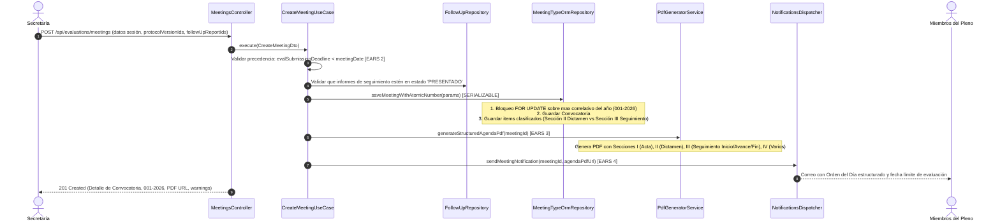
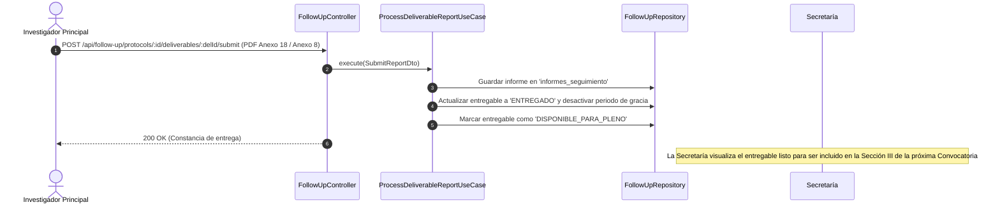
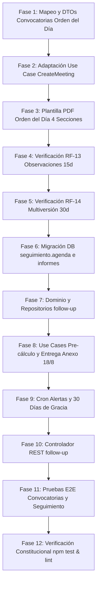

# Plan de Arquitectura y Diseño Técnico Brownfield: Flujo 003 — Convocatorias a Pleno, Subsanaciones y Seguimiento Post-Aprobación

**Código de Especificación:** `specs/003-flujo-mvp/spec.md` (v1.3.0)  
**Ubicación del Plan:** `specs/003-flujo-mvp/plan.md`  
**Estado:** Aprobado para Planificación Técnica  
**Documentos de Referencia:** `docs/doc_base/constitution_v2.md`, `specs/003-flujo-mvp/reconciliation.md`, `AGENTS.md`, `GEMINI.md`  
**Tipo de Plan:** PLAN DELTA (Evolución de Sistema Brownfield con Arquitectura Hexagonal y DDD)

---

## 1. Arquitectura Afectada

El Sprint 003 impacta a 6 bounded contexts interconectados bajo Arquitectura Hexagonal y DDD:
- `evaluations`: Convocatorias a sesiones del Pleno (`RF-09`), agendamiento clasificado en 4 secciones (Evaluaciones iniciales/subsanaciones vs. Informes de seguimiento), numeración atómica correlativa anual (`001-2026`) con estrategia Opción E (tabla `secuencias_convocatoria` + `UNIQUE` constraint + retry handler `23505`/`40001`), precedencia de 3 fechas normativas y generación del PDF oficial del Orden del Día.
- `reception`: Observaciones multilínea por requisito en checklist documental y despacho de notificación consolidada única de 15 días hábiles (`RF-13`).
- `protocols`: Modelado de checklist, cálculo de plazos de subsanación y metadatos de versiones.
- `resolutions`: Ciclo multiversión v1.0 ➔ v2.0 tras dictamen "Requiere Subsanación", congelamiento inmutable (🔒) de requisitos aprobados y plazo de 30 días hábiles (`RF-14`).
- `follow-up`: Módulo de seguimiento post-aprobación (`RF-15`), pre-llenado de agenda sugerida editable por Presidencia, recepción de Informes de Inicio, Avances periódicos (Anexo 18) y Cierre Final (Anexo 8), elevación a Pleno y auditoría de 30 días de gracia.
- `notifications`: Plantillas HTML y envío de correos vía `IEmailServicePort`.

```text
src/
├── shared/
│   ├── utils/
│   │   ├── pdf-generator.service.ts         # [MODIFICAR] Plantilla Orden del Día clasificado
│   │   └── deadline-calculator.service.ts   # [REUTILIZAR] Cálculo de 15 y 30 días hábiles
│   └── enums/
│       └── agenda-section.enum.ts           # [CREAR] Enumerador de secciones del Orden del Día
└── modules/
    ├── evaluations/
    │   ├── domain/
    │   │   ├── value-objects/
    │   │   │   ├── meeting-number.vo.ts     # [REUTILIZAR] Formateo correlativo 001-2026
    │   │   │   └── meeting-dates.vo.ts      # [REUTILIZAR] Validación dura evalDate < meetingDate
    │   │   ├── ports/
    │   │   │   ├── meeting-repository.port.ts # [MODIFICAR] Soporte de items de seguimiento
    │   │   │   └── meeting-pdf-generator.port.ts # [ADAPTAR] Firma de generación de PDF
    │   │   └── entities/
    │   │       ├── meeting.entity.ts        # [MODIFICAR] Entidad de dominio Convocatoria
    │   │       └── meeting-protocol.entity.ts # [MODIFICAR] Agendamiento con discriminador de tipo
    │   ├── application/
    │   │   ├── dtos/
    │   │   │   ├── create-meeting.dto.ts    # [MODIFICAR] Soporte para followUpReportIds
    │   │   │   └── calculate-eval-date.dto.ts # [REUTILIZAR] Pre-cálculo de jueves previo
    │   │   └── services/
    │   │       ├── create-meeting.use-case.ts # [MODIFICAR] Inclusión de puntos de seguimiento
    │   │       └── calculate-meeting-dates.service.ts # [REUTILIZAR] Lógica de jueves previo
    │   └── infrastructure/
    │       ├── database/entities/
    │       │   ├── convocatoria.orm-entity.ts # [REUTILIZAR] Mapeo a evaluacion.convocatorias
    │       │   ├── convocatoria-protocolo.orm-entity.ts # [MODIFICAR] Mapeo a tipo_punto e informe_id
    │       │   └── lugar.orm-entity.ts      # [REUTILIZAR] Mapeo a evaluacion.lugares
    │       ├── repositories/
    │       │   └── meeting-typeorm.repository.ts # [MODIFICAR] Transacción SERIALIZABLE clasificada
    │       └── controllers/
    │           └── meetings.controller.ts   # [REUTILIZAR / ADAPTAR] Endpoint /api/evaluations/meetings
    ├── reception/
    │   ├── application/
    │   │   ├── dtos/
    │   │   │   └── validate-document.dto.ts # [REUTILIZAR] Soporta observations multilínea
    │   │   └── services/
    │   │       └── reception.service.ts     # [REUTILIZAR / VERIFICAR] Consolidación de observaciones (15d)
    │   └── infrastructure/
    │       └── controllers/
    │           └── reception.controller.ts  # [REUTILIZAR] Endpoint /api/reception/protocols/:id/finalize
    ├── resolutions/
    │   ├── application/
    │   │   └── services/
    │   │       └── resolutions.service.ts   # [REUTILIZAR / VERIFICAR] Creación de v2.0 con 30 días hábiles
    │   └── infrastructure/
    │       └── controllers/
    │           └── resolutions.controller.ts # [REUTILIZAR] Endpoint /api/resolutions
    └── follow-up/                           # [DELTA REAL BROWNFIELD: Implementación del módulo]
        ├── domain/
        │   ├── entities/
        │   │   ├── deliverable-schedule.entity.ts # [CREAR] Agenda de entregables
        │   │   └── deliverable-report.entity.ts   # [CREAR] Informes presentados
        │   ├── enums/
        │   │   ├── milestone-type.enum.ts         # [CREAR] Tipos de hito (INICIO, AVANCE, FIN)
        │   │   └── deliverable-status.enum.ts     # [CREAR] Estados (PENDIENTE, ENTREGADO, VENCIDO)
        │   └── ports/
        │       └── follow-up-repository.port.ts   # [CREAR] Puerto de persistencia de seguimiento
        ├── application/
        │   ├── dtos/
        │   │   ├── configure-schedule.dto.ts      # [CREAR] DTO de personalización Presidencia
        │   │   ├── submit-report.dto.ts           # [CREAR] DTO de entrega Anexo 18 / Anexo 8
        │   │   └── schedule-response.dto.ts       # [CREAR] DTO de salida
        │   ├── services/
        │   │   ├── generate-schedule.use-case.ts  # [CREAR] Pre-cálculo sugerido post-aprobación
        │   │   ├── update-schedule.use-case.ts    # [CREAR] Ajuste manual Presidencia
        │   │   ├── process-deliverable.use-case.ts # [CREAR] Registro y marcado para Pleno
        │   │   └── audit-deliverable-grace.service.ts # [CREAR] Cron de alertas y 30 días de gracia
        │   └── mappers/
        │       └── follow-up.mapper.ts            # [CREAR] Mapeador de Dominio <-> ORM <-> DTO
        └── infrastructure/
            ├── database/entities/
            │   ├── agenda-entregable.orm-entity.ts # [CREAR] Mapeo a seguimiento.agenda_entregables
            │   └── informe-seguimiento.orm-entity.ts # [CREAR] Mapeo a seguimiento.informes_seguimiento
            ├── repositories/
            │   └── follow-up-typeorm.repository.ts # [CREAR] Implementación TypeORM
            └── controllers/
                └── follow-up.controller.ts        # [CREAR] Controlador REST /api/follow-up
```

---

## 2. Flujo Actual (As-Is)

1. **Convocatorias (`RF-09`)**:
   - `MeetingsController` y `CreateMeetingUseCase` crean sesiones asignando número correlativo `001-2026` mediante transacción `SERIALIZABLE` y validan `fecha_entrega_evaluacion < fecha_reunion`.
   - Sin embargo, el endpoint únicamente recibe una lista plana de IDs de protocolos (`protocolVersionIds`) y no distingue si el protocolo entra para dictamen ético inicial, subsanación, o conocimiento de un informe de seguimiento (Inicio, Avance, Cierre).
   - El PDF generado no segmenta el Orden del Día en las 4 secciones normativas reglamentarias.
2. **Observaciones Multilínea (`RF-13`)**:
   - La tabla `public.protocolo_requisitos` y `recepcion.validaciones_documento` ya disponen de la columna `observaciones text`.
   - `ReceptionService.finalizarRevision` compila las observaciones en la notificación de faltantes/observados calculando el plazo hábil.
3. **Ciclo Multiversión (`RF-14`)**:
   - `ResolutionsService.createResolution()` genera la nueva versión `numero_version + 1` en `evaluacion.versiones_protocolo` al emitir resolución de "Requiere Subsanación", congela los requisitos aprobados y asigna 30 días hábiles.
4. **Seguimiento Post-Aprobación (`RF-15`)**:
   - El módulo `src/modules/follow-up/` se encuentra como scaffolding vacío. No existen tablas en PostgreSQL para `seguimiento.agenda_entregables` ni `seguimiento.informes_seguimiento`.
   - La entrega de Informes de Inicio, Avance (Anexo 18) y Cierre Final (Anexo 8) no se procesa de forma estructurada ni se conecta con la bandeja de convocatorias de la Secretaría.

---

## 3. Flujo Objetivo (To-Be Delta)

### 3.1 Diagrama de Secuencia: Agendamiento de Convocatoria con Orden del Día Clasificado (RF-09 & RF-15)



### 3.2 Diagrama de Secuencia: Carga de Entregables de Seguimiento y Elevación a Pleno (RF-15)



---

## 4. Clasificación de Componentes Brownfield

### Matriz de Decisiones: REUTILIZAR / MODIFICAR / ADAPTAR / CREAR

| Componente / Archivo | Clasificación | Responsabilidad Actual | Cambio Requerido / Motivo |
|---|---|---|---|
| `src/modules/evaluations/domain/value-objects/meeting-number.vo.ts` | **REUTILIZAR** | Formateo y validación de `001-2026`. | Ninguno. Totalmente probado y conforme a spec. |
| `src/modules/evaluations/domain/value-objects/meeting-dates.vo.ts` | **REUTILIZAR** | Validación dura `fecha_entrega_evaluacion < fecha_reunion`. | Ninguno. Totalmente probado y conforme a spec. |
| `src/modules/evaluations/application/services/calculate-meeting-dates.service.ts` | **REUTILIZAR** | Auto-cálculo del jueves previo a las 23:59:59. | Ninguno. Cubre los requisitos de fecha sugerida. |
| `src/modules/evaluations/domain/ports/meeting-repository.port.ts` | **MODIFICAR** | Define contrato de persistencia de convocatorias. | Extender la interfaz `CreateMeetingParams` para incluir `followUpReportIds: number[]` opcionales. |
| `src/modules/evaluations/application/dtos/create-meeting.dto.ts` | **MODIFICAR** | DTO de entrada para agendamiento. | Añadir validación para `followUpReportIds` (array de enteros opcional). |
| `src/modules/evaluations/application/services/create-meeting.use-case.ts` | **MODIFICAR** | Orquestación de creación de convocatoria. | Procesar tanto protocolos de evaluación (Sección II) como reportes de seguimiento (Sección III). |
| `src/modules/evaluations/infrastructure/database/entities/convocatoria-protocolo.orm-entity.ts` | **MODIFICAR** | Mapea ítems de agenda a la convocatoria. | Añadir columnas `tipo_punto_agenda` (Enum) e `informe_seguimiento_id` (FK nullable). |
| `src/modules/evaluations/infrastructure/repositories/meeting-typeorm.repository.ts` | **MODIFICAR** | Persistencia TypeORM con `SERIALIZABLE`. | Persistir items clasificados de evaluación y de seguimiento en la misma transacción atómica. |
| `src/shared/utils/pdf-generator.service.ts` | **MODIFICAR** | Generación de PDFs del sistema. | Añadir método `generateMeetingAgendaPdf()` estructurado en las 4 secciones normativas. |
| `src/modules/reception/application/services/reception.service.ts` | **REUTILIZAR / VERIFICAR** | Recepción y auditoría de checklist. | Validar que el despacho de correo consolidado incluya lista estructurada y 15 días hábiles. |
| `src/modules/resolutions/application/services/resolutions.service.ts` | **REUTILIZAR / VERIFICAR** | Emisión de resolución y generación v2.0. | Confirmar congelamiento inmutable (🔒) de aprobados y 30 días hábiles. |
| `src/modules/follow-up/` (Todo el submódulo) | **CREAR** | Scaffolding vacío. | Implementar entidades de dominio, DTOs, Use Cases, entidades ORM y controlador para RF-15. |

---

## 5. Cambios Detallados por Capa

### 5.1 Cambios de Dominio

#### 1. Enumeradores y Value Objects
- **`src/shared/enums/agenda-section.enum.ts`** [CREAR]:
  ```typescript
  export enum AgendaSectionType {
    ACTA_ANTERIOR = 'ACTA_ANTERIOR',             // Sección I
    EVALUACION_DICTAMEN = 'EVALUACION_DICTAMEN',   // Sección II
    SEGUIMIENTO_INFORMES = 'SEGUIMIENTO_INFORMES', // Sección III (Inicio, Avance Anexo 18, Fin Anexo 8)
    ASUNTOS_VARIOS = 'ASUNTOS_VARIOS',             // Sección IV
  }
  
  export enum AgendaItemType {
    EVALUACION_INICIAL = 'EVALUACION_INICIAL',
    SUBSANACION = 'SUBSANACION',
    INFORME_INICIO = 'INFORME_INICIO',
    INFORME_AVANCE = 'INFORME_AVANCE',
    INFORME_FIN = 'INFORME_FIN',
  }
  ```

- **`src/modules/follow-up/domain/enums/follow-up-enums.ts`** [CREAR]:
  ```typescript
  export enum DeliverableMilestoneType {
    INFORME_INICIO = 'INFORME_INICIO',
    INFORME_AVANCE_TRIMESTRAL = 'INFORME_AVANCE_TRIMESTRAL',
    INFORME_AVANCE_SEMESTRAL = 'INFORME_AVANCE_SEMESTRAL',
    INFORME_AVANCE_ANUAL = 'INFORME_AVANCE_ANUAL',
    RENOVACION_AVAL = 'RENOVACION_AVAL',
    INFORME_FINAL_CIERRE = 'INFORME_FINAL_CIERRE',
  }

  export enum DeliverableStatus {
    PENDIENTE = 'PENDIENTE',
    PRESENTADO = 'PRESENTADO',
    APROBADO_PLENO = 'APROBADO_PLENO',
    OBSERVADO_PLENO = 'OBSERVADO_PLENO',
    VENCIDO = 'VENCIDO',
    SUSPENDIDO = 'SUSPENDIDO',
  }
  ```

#### 2. Entidades de Dominio
- **`src/modules/follow-up/domain/entities/deliverable-schedule.entity.ts`** [CREAR]:
  - Representa cada hito programado en la agenda de entregables post-aprobación.
- **`src/modules/follow-up/domain/entities/deliverable-report.entity.ts`** [CREAR]:
  - Representa el informe cargado formalmente por el Investigador (Anexo 18 o Anexo 8).

#### 3. Puertos de Dominio
- **`src/modules/follow-up/domain/ports/follow-up-repository.port.ts`** [CREAR]:
  - Define contratos para `saveSchedule()`, `getScheduleByProtocolId()`, `submitReport()`, `findPendingAlerts()`, `findExpiredGraceDeliverables()`.

---

### 5.2 Cambios de Aplicación

#### 1. Casos de Uso y Servicios
- **`src/modules/evaluations/application/services/create-meeting.use-case.ts`** [MODIFICAR]:
  - Recibe `CreateMeetingParams` con `protocolVersionIds` y `followUpReportIds`.
  - Coordina la creación transaccional serializable y solicita al generador de PDF el Orden del Día estructurado en 4 secciones.
- **`src/modules/follow-up/application/services/generate-schedule.use-case.ts`** [CREAR]:
  - Pre-calcula la agenda al emitirse la resolución de aprobación:
    - Inicio: +30 días calendario.
    - Avances periódicos: cada 6 o 12 meses según duración.
    - Cierre Final (Anexo 8): duración + 60 días.
    - Renovación de aval: vencimiento - 60 días.
- **`src/modules/follow-up/application/services/update-schedule.use-case.ts`** [CREAR]:
  - Permite a la Presidencia ajustar fechas límites o añadir hitos antes de la emisión final.
- **`src/modules/follow-up/application/services/process-deliverable.use-case.ts`** [CREAR]:
  - Procesa la carga de archivos PDF del Investigador, valida formato Anexo 18/Anexo 8, actualiza el estado a `PRESENTADO` y lo habilita para agendamiento en Pleno.
- **`src/modules/follow-up/application/services/audit-deliverable-grace.service.ts`** [CREAR]:
  - Cron ejecutado periódicamente que detecta fechas superadas, activa contador de 30 días de gracia, cambia a `SUSPENDIDO` y notifica a Secretaría y Presidencia.

#### 2. DTOs de Aplicación
- **`src/modules/evaluations/application/dtos/create-meeting.dto.ts`** [MODIFICAR]:
  - Añadir campo `@IsOptional() @IsArray() @IsInt({ each: true }) followUpReportIds?: number[]`.
- **`src/modules/follow-up/application/dtos/configure-schedule.dto.ts`** [CREAR]:
  - DTO para recibir ajustes manuales de Presidencia.
- **`src/modules/follow-up/application/dtos/submit-report.dto.ts`** [CREAR]:
  - DTO multipart para recibir metadatos y buffer del Anexo 18 / Anexo 8.

---

### 5.3 Cambios de Infraestructura y Base de Datos

#### 1. Entidades ORM TypeORM y Esquemas PostgreSQL
- **Esquema `evaluacion`**:
  - `evaluacion.convocatorias`: [REUTILIZAR] (`id`, `numero_convocatoria`, `anio_lectivo`, `tipo_session`, `fecha_reunion`, `fecha_entrega_evaluacion`, `lugar_id`, `estado`, `orden_dia_pdf_path`).
  - `evaluacion.convocatoria_protocolos`: [MODIFICAR]
    - Añadir columna `tipo_punto_agenda varchar(50) DEFAULT 'EVALUACION_INICIAL'`.
    - Añadir columna `informe_seguimiento_id integer NULL REFERENCES seguimiento.informes_seguimiento(id)`.
- **Esquema `seguimiento`** [NUEVAS TABLAS]:
  - `seguimiento.agenda_entregables`:
    - `id serial PRIMARY KEY`,
    - `protocolo_id integer NOT NULL REFERENCES public.protocolos(id)`,
    - `tipo_hito varchar(50) NOT NULL`,
    - `nombre_hito varchar(255) NOT NULL`,
    - `fecha_vencimiento timestamptz NOT NULL`,
    - `tipo_documento_requerido varchar(50) NOT NULL`, // 'ANEXO_18' | 'ANEXO_8'
    - `estado varchar(50) NOT NULL DEFAULT 'PENDIENTE'`,
    - `es_personalizado_presidencia boolean DEFAULT false`,
    - `inicio_periodo_gracia timestamptz NULL`,
    - `fin_periodo_gracia timestamptz NULL`,
    - `created_at timestamptz DEFAULT NOW()`,
    - `updated_at timestamptz DEFAULT NOW()`.
  - `seguimiento.informes_seguimiento`:
    - `id serial PRIMARY KEY`,
    - `agenda_entregable_id integer NOT NULL REFERENCES seguimiento.agenda_entregables(id)`,
    - `protocolo_id integer NOT NULL REFERENCES public.protocolos(id)`,
    - `tipo_informe varchar(50) NOT NULL`, // 'INFORME_INICIO' | 'INFORME_AVANCE' | 'INFORME_FIN'
    - `documento_id integer NOT NULL REFERENCES public.documentos(id)`,
    - `presentado_por_user_id integer NOT NULL REFERENCES catalogos.usuarios(id)`,
    - `fecha_presentacion timestamptz DEFAULT NOW()`,
    - `estado_dictamen_pleno varchar(50) NULL`, // 'APROBADO', 'OBSERVADO', 'CONVALIDADO'
    - `dictamen_fecha timestamptz NULL`,
    - `observaciones text NULL`,
    - `created_at timestamptz DEFAULT NOW()`,
    - `updated_at timestamptz DEFAULT NOW()`.

#### 2. Repositorios y Adaptadores
- **`src/modules/evaluations/infrastructure/repositories/meeting-typeorm.repository.ts`** [MODIFICAR]:
  - Adaptar la transacción `SERIALIZABLE` para registrar `ConvocatoriaProtocoloOrmEntity` con sus respectivos tipos de punto (Evaluación vs. Seguimiento).
- **`src/modules/follow-up/infrastructure/repositories/follow-up-typeorm.repository.ts`** [CREAR]:
  - Implementa `IFollowUpRepositoryPort` utilizando repositorios TypeORM inyectados para `AgendaEntregableOrmEntity` e `InformeSeguimientoOrmEntity`.

#### 3. Controladores REST
- **`src/modules/evaluations/infrastructure/controllers/meetings.controller.ts`** [REUTILIZAR / ADAPTAR]:
  - Endpoint `POST /api/evaluations/meetings` ya existente; recibe el DTO ampliado.
- **`src/modules/follow-up/infrastructure/controllers/follow-up.controller.ts`** [CREAR]:
  - `GET /api/follow-up/protocols/:id/schedule` (Consulta de agenda).
  - `PUT /api/follow-up/protocols/:id/schedule` (Personalización por Presidencia).
  - `POST /api/follow-up/protocols/:id/deliverables/:deliverableId/submit` (Carga de Anexo 18 / Anexo 8).
  - `GET /api/follow-up/pending-meetings-review` (Bandeja para que Secretaría seleccione entregables a agendar en Pleno).

---

## 6. Cambios de Presentación y Notificaciones

1. **Formateo de Versión en Respuestas (`vX.0`)**:
   - En la base de datos se mantiene `numero_version` entero (`1`, `2`, `3`).
   - En mappers y DTOs de salida se proyecta siempre como `v${versionNumber}.0` (ej. `v1.0`, `v2.0`).
2. **Plantilla PDF del Orden del Día**:
   - Genera documento PDF con encabezado oficial ESPOCH / CEISH, correlativo `001-2026`, lugar y fecha, estructurado en:
     - **I. Lectura y Aprobación del Acta Anterior**.
     - **II. Evaluación Ética y Dictamen de Protocolos de Investigación** (Código, Versión, Título, Investigador).
     - **III. Conocimiento y Pronunciamiento de Informes de Seguimiento** (Código, Título, Tipo de Informe: Inicio / Avance Anexo 18 / Cierre Anexo 8).
     - **IV. Asuntos Varios**.
3. **Notificaciones Consolidadas de Observaciones (RF-13)**:
   - Envío de un correo único al Investigador con lista formateada (Requisito + Observación), fecha límite a 15 días hábiles y enlace directo (`/reception/protocols/:id/remedy`).

---

## 7. Cambios de API REST

| Método | Ruta | Guard / Permisos | Request DTO | Response HTTP | Requisito |
|---|---|---|---|---|---|
| `POST` | `/api/evaluations/meetings/calculate-eval-date` | `JwtAuthGuard` | `CalculateEvalDateDto` | `200 OK` (jueves previo sugerido) | RF-09.1 |
| `POST` | `/api/evaluations/meetings` | `JwtAuthGuard`, `RolesGuard('SECRETARIA', 'ADMIN')` | `CreateMeetingDto` | `201 Created` (`001-2026`, PDF URL, warnings) | RF-09.1, RF-09.2 |
| `GET` | `/api/evaluations/meetings/:id` | `JwtAuthGuard` | N/A | `200 OK` (Convocatoria con 4 secciones) | RF-09.2 |
| `POST` | `/api/reception/protocols/:id/finalize` | `JwtAuthGuard`, `RolesGuard('SECRETARIA')` | `FinalizeReviewDto` | `200 OK` (Correo consolidado 15d) | RF-13.1 |
| `POST` | `/api/resolutions` | `JwtAuthGuard`, `RolesGuard('PRESIDENTE')` | `CreateResolutionDto` | `201 Created` (v2.0 generada, 30d) | RF-14.1 |
| `GET` | `/api/follow-up/protocols/:id/schedule` | `JwtAuthGuard` | N/A | `200 OK` (Agenda de entregables) | RF-15.1 |
| `PUT` | `/api/follow-up/protocols/:id/schedule` | `JwtAuthGuard`, `RolesGuard('PRESIDENTE')` | `ConfigureScheduleDto` | `200 OK` (Agenda actualizada) | RF-15.1 |
| `POST` | `/api/follow-up/protocols/:id/deliverables/:delId/submit` | `JwtAuthGuard`, `RolesGuard('INVESTIGADOR')` | Multipart (PDF Anexo 18/8) | `200 OK` (Entregado / habilitado Pleno) | RF-15.1, RF-15.2 |
| `GET` | `/api/follow-up/pending-meetings-review` | `JwtAuthGuard`, `RolesGuard('SECRETARIA')` | N/A | `200 OK` (Lista para Convocatoria) | RF-15.2 |

---

## 8. Estrategia de Pruebas (TDD)

Siguiendo el mandato de la Constitución (`npm test`, `npm run test:e2e`, `npm run lint`):

### 8.1 Pruebas Unitarias (`npm test`)
1. **Convocatorias (`evaluations`)**:
   - `meeting-dates.vo.spec.ts`: Validar error si `evalSubmissionDeadline >= meetingDate`.
   - `calculate-meeting-dates.service.spec.ts`: Validar cálculo de jueves previo a las 23:59:59.
   - `create-meeting.use-case.spec.ts`: Validar creación con items de evaluación (Sección II) y de seguimiento (Sección III), numeración `001-2026` y warnings si excede plazo normativo.
2. **Observaciones (`reception`)**:
   - `reception.service.spec.ts`: Validar que observaciones multilínea se consoliden en un solo payload para notificación con fecha límite a 15 días hábiles.
3. **Ciclo Multiversión (`resolutions`)**:
   - `resolutions.service.spec.ts`: Validar que dictamen "Requiere Subsanación" incremente a v2.0, congele requisitos aprobados y compute 30 días hábiles.
4. **Seguimiento (`follow-up`)**:
   - `generate-schedule.use-case.spec.ts`: Validar pre-cálculo sugerido para estudios de 12 y 24 meses.
   - `process-deliverable.use-case.spec.ts`: Validar recepción de Anexo 18 y cambio de estado a `PRESENTADO`.
   - `audit-deliverable-grace.service.spec.ts`: Validar cálculo de 30 días de gracia y cambio de estado a `SUSPENDIDO`.

### 8.2 Pruebas E2E (`npm run test:e2e`)
1. `meetings.e2e-spec.ts`:
   - Flujo completo de agendamiento con validación de correlativo atómico `001-2026`, inclusión de entregables de seguimiento en Sección III y verificación de rechazo HTTP 400 ante precedencia inválida.
2. `follow-up.e2e-spec.ts`:
   - Flujo de consulta de agenda, personalización por Presidencia, carga de Anexo 18 por Investigador y verificación en la bandeja de agendamiento de Secretaría.

---

## 9. Compatibilidad con Funcionalidades Existentes y No Regresión

1. **Preservación de Esquemas y Modelos**:
   - No se alteran claves primarias ni tipos existentes. `numero_version` permanece como `integer`.
   - Las convocatorias existentes mantienen total compatibilidad ya que `tipo_punto_agenda` posee valor por defecto `'EVALUACION_INICIAL'`.
2. **Aislamiento del Bounded Context `follow-up`**:
   - La creación del módulo `follow-up` no interfiere con el flujo de recepción ni evaluación inicial, sino que se engancha como consumidor post-resolución de aprobación.

---

## 10. Riesgos Técnicos y Mitigaciones

| Riesgo Técnico | Impacto | Mitigación Arquitectónica |
|---|---|---|
| **Concurrencia en Convocatorias** | Números duplicados (ej. dos `001-2026`). | Aislamiento transaccional `SERIALIZABLE` con bloqueo coercitivo `FOR UPDATE` en TypeORM `QueryRunner`. |
| **Pérdida de inmutabilidad en v2.0** | Investigador altera documentos ya aprobados. | Validación dura en `uploadDocument` y `createResolution` que bloquea la mutación de requisitos con estado `APROBADO` o `NO_APLICA`. |
| **Vencimiento inadvertido en Seguimiento** | Suspensión injustificada de investigaciones. | Cron automatizado con alertas preventivas por hito (7/1 días, 90/60/15 días) y periodo de gracia normativo de 30 días. |

---

## 11. Orden de Implementación y Dependencias entre Tareas



---

## 12. Criterios de Finalización del Plan (Definition of Done)

1. Trazabilidad completa de los 4 requerimientos (`RF-09`, `RF-13`, `RF-14`, `RF-15`) hacia componentes reales del backend.
2. Clasificación rigurosa de cada componente existente o a crear (`REUTILIZAR`, `MODIFICAR`, `ADAPTAR`, `CREAR`).
3. Estructuración del Orden del Día en 4 secciones y elevación de Informes de Inicio, Avance y Fin a Pleno.
4. Estrategia TDD con pruebas unitarias y E2E definidas sin mocks en código productivo.
5. Cero modificaciones de código fuente durante la presente fase de planificación.
